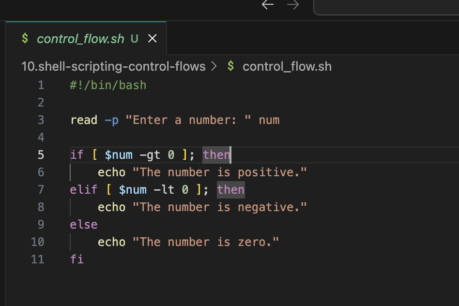
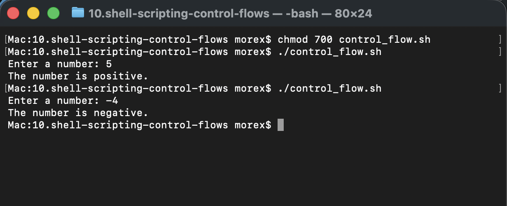
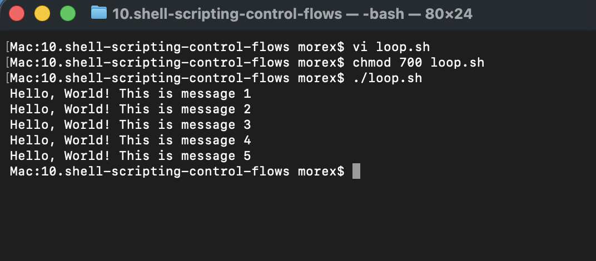
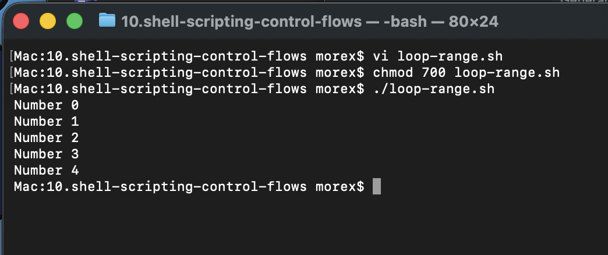

# Linux Shell Scripting: Control Flows

## Overview

Control flow statements are the backbone of making decisions in programming. In scripting, these statements let your scripts decide what to do or how to proceed based on conditions, loops or user inputs.

Bash and other shell interpreters provides control flow statements like:
* **if-else** statements
* **for** loops
* **while** loops
* **case** statements to control the flow of execution in your scripts.

Most likely you will get to use if-else and for loops more than the others. Therefore, at this level we will focus only on those two control flows.

### What is Control Flow?

In simple terms, control flow directs the order in which commands or instructions are executed in a script. It's like a roadmap that decides which path to take based on certain conditions or how many times to visit a place

## Example: Using `if-else` Statements

Our example script asks the user for a number and determines if that number is positive, negative, or zero.

### Task

Create a script named `control_flow.sh` containing the code below:

```bash
#!/bin/bash

read -p "Enter a number: " num

echo "You have entered the number $num"

if [ $num -gt 0 ]; then
    echo "The number is positive."
elif [ $num -lt 0 ]; then
    echo "The number is negative."
else
    echo "The number is zero."
fi
```


### Steps

1. Create the file `control_flow.sh`.
2. Add the script content above.
3. Make it executable:

   ```bash
   chmod +x control_flow.sh
   ```
4. Run it:

   ```bash
   ./control_flow.sh
   ```

---

### Understanding the Script

| Code                                      | Explanation                                                     |
| ----------------------------------------- | --------------------------------------------------------------- |
| `#!/bin/bash`                             | Shebang line that tells the system to use the Bash interpreter. |
| `read -p "Enter a number: " num`          | Prompts the user for input and stores it in the variable `num`. |
| `echo "You have entered the number $num"` | Displays the entered number.                                    |
| `if [ $num -gt 0 ]; then`                 | Tests if the entered number is greater than zero.               |
| `elif [ $num -lt 0 ]; then`               | Tests if the number is less than zero.                          |
| `else`                                    | Executes when the number is neither greater nor less than zero. |
| `fi`                                      | Marks the end of the if-else block.                             |

---


### if statement
The if statement in Bash scripts allows you to execute commands based on conditions. The basic syntax is:

```bash
if [ condition ]; then
    commands
fi
```

- `if`: This keyword starts the conditional statement.
- `[condition ]`: The condition to evaluate. Brackets [ ] are used to enclose the condition being tested.
- `then`: If the condition is true, execute the commands that follow this keyword.
- `fi`: Ends the `if` statement. It's basically `if` spelled backward, indicating the conclusion of the conditional block.

Now lets bring it into our code

```bash
if [ $num -gt 0 ]; then
    echo "The number is positive."
fi
```
The part above tests if the value in `$num `is greater than 0, then most likely you have entered a positive number.

Notice the keyword `-gt` in the condition. These are called operators that are used within the condition block to perform numeric comparisons between values.
Run the code and experience the output.
> 💡 Tip: Always read your shell script line by line to get a sense of what it is doing.

### elif statement

After understanding the if statement, we move on to the elif part of control flow in Bash scripts. elif stands for `else if` allowing you to test additional conditions if the previous if conditions were not met. It helps you add more layers of decision-making to your script. The basic syntax for using elif is as follows:

```bash
if [ condition1 ]; then
    commands1
elif [ condition2 ]; then
    commands2
fi
```

- `elif`: This keyword is used right after an if or another elif block. It allows you to specify an alternative condition to test if the previous conditions were false.
- `[condition2 ]`: The new condition you want to evaluate. Like the if statement, this condition is enclosed in square brackets [1.
- `then`: If the elif condition is true, execute the commands that follow this keyword.

Now, let's apply elif to our script to handle a scenario where the entered number might be negative:

```bash
#!/bin/bash
read -p "Enter a number: " num
echo "You have entered the number $num"
if [ $num -gt 0 ]; then
    echo "The number is positive."
elif [ $num -lt 0 ]; then
    echo "The number is negative."
fi
```

In this updated version of the script:
- The i`f [ $num -gt 0 ];`then part checks if num is greater than 0 and prints "The number is positive." if true.
- If the first condition isn't met (i.e., the number is not greater than O), the `elif [ $num -It 0 ];` then checks if num is less than O. If this condition is true, it prints "The number is negative."
- This way, the script can differentiate between positive and negative numbers, providing specific feedback based on the value of num.
- Notice the `-lt` "less than" operator in the `elif` section.


## Loops in Bash
Moving forward in our journey through Bash scripting, we encounter loops. Loops are fundamental constructs that allow us to repeat a set of commands multiple times.

Loops empower us to automate and repeat tasks without writing the same code over and over again. Imagine having to perform a task, like sending a greeting message to each of your friends by name. Without loops, you'd have to write a separate command for each friend, which is not only tedious but also inefficient.

Loops streamline this process by allowing you to write a single set of instructions that can be executed as many times as needed, making your script both cleaner and more powerful.


### Real-World Use Cases
- `Batch Processing`: Suppose you have a folder full of photos you want to resize or edit in some way. Instead of editing each photo individually, a loop can automate this task, applying the same code to each photo in the folder.,

- `Data Analysis`: If you're analyzing data, you might need to perform the same calculations on numerous data sets. A loop can iterate through each data set, apply the same code to do calculations, and collect the results.
- `Automated Testing`: In software development, loops are invaluable for running through numerous test cases. You can use a loop to automatically test different inputs for your program and verify that it behaves as expected using the same code.

In Bash scripting, there are three primary types of loops that are commonly used to repeat a set of commands multiple times based on certain conditions.
1. **for loop**
2. **while loop**
3. **until loop**

Lets go through each with examples.

## The `for` Loop
The `for` loop is used to iterate over a list of values or a range of numbers. It is particularly useful when you know in advance how many times you need to execute the loop body.

The for loop has two main forms:

### 1. List Form: 
Iterates over a list of items:
Here is a basic syntax;

```bash
for item in item1 item2 item3; do
    echo $item
done
```

| Keyword | Description                                    |
| ------- | ---------------------------------------------- |
| `for`   | This keyword initiates the loop, signaling the start of a block of code that will repeat.                               |
| `item`  | This is a variable that temporarily holds the value of each item in the list as the loop iterates. For each iteration of the loop, item takes on the value of the next item in the list, allowing the commands inside the loop to act on this value. |
| `in`    | he in keyword is followed by a list of items that the loop will iterate over. This list can be a series of values, an array, or the output of a command. The loop executes once for each item in this list.           |
| `do`    | This keyword precedes the block of commands that will be executed for each item in the list. The block can contain one or multiple commands, and it can perform a wide range of actions, from simple echoes to complex conditional logic.                      |
| `;`  | A semicolon is used here to separate the list of items from the do keyword that follows. If you place the do keyword on the next line, the semicolon is optional.                                 |
| `done`  | This keyword marks the end of the loop. It signifies that all commands in the loop have been executed for each item in the list, and the loop is complete.                                 |


Lets examine a real example:

1. Create a new script file and name it [loop.sh](./scripts/loop.sh) and paste the code below

```bash
#!/bin/bash

for i in 1 2 3 4 5
do
    echo "Hello, World! This is message $i"
done
```

2. Make the script executable and run - `chmod +x loop-script.sh`



In this example:
- The loop starts with for i in 1 2 3 4 5, meaning the variable i will take each value in the list (1, 2, 3, 4, 5) in turn.
- For each value of i, the loop executes the commands between do and done.
- The command echo `Hello, World! This is message $i` prints a greeting along with the current value of i. Once i has taken each value in the list, the loop ends.

### 2. Ranges

[Loop Range Script](./scripts/loop-range.sh)
```bash
for i in {1..5}
do
    echo "Counting... $i"
done
```


### 3. The C-Style `for` Loop

This form allows specifying an initializer, condition, and increment similar to C programming.

[C-style script](./scripts/loop-cstyle.sh)

```bash
#!/bin/bash

for (( i=0; i<5; i++ ))
do
    echo "Number $i"
done
```


### Breakdown

* `for (( ... ))`: This is the syntax that starts a C-style for loop in Bash. It's distinguished from the list form by the double parentheses "(( ... ))", which enclose the three parts of the loop: "initialization, condition, and increment/decrement".
* `((i=0))`: This is the initialization part. Before the loop starts, "i" is set to "0". This typically sets up a counter variable to start from a certain value. In this case, i starts from 0.
* `((i<5))`: This is the condition for the loop to continue running. After each iteration of the loop, Bash checks this condition. If it's true, the loop continues; if it's false, the loop ends. Here, the loop will continue as long as **i** is less than "5"
* `((i++))`: IThis is the increment expression. It's executed at the end of each loop iteration. i++ is shorthand for incrementing i by 1 (i = i + 1). This step ensures that the loop will eventually end by changing the value of i so that the condition i<5 will not always be true.

* `"do ... done"`: Encloses the commands to be executed in each iteration of the loop. Here, the command inside the loop is `echo "Number $i"`, which prints the current value of `i` to the console.


### How It Works

- Initialization: Before the first iteration, "i" is set to "0".
- Condition Check: Before each iteration, including the first, Bash checks if i is less than 5.
    - If the condition is true, Bash executes the commands inside the loop.
    - If the condition is false, Bash exits the loop.

- Execute Commands: The command(s) inside the "do ... done" block are executed. In this case, it prints the current value of "i".
- "Increment:" After executing the commands, "i" is incremented by "1" using the syntax "(i++)".
- **Repeat:** Steps 2 through 4 are repeated until the condition in step 2 is false.

**Lets take a Walkthrough to further expand on your understanding**

- "First Iteration:" i=0, condition 0<5 is true, prints "Number 0", increments i to 1.
- "Second Iteration:" i=1, condition 1<5 is true, prints "Number 1", increments i to 2.
- "Continues iteration" ...
- "Fifth Iteration:" i=4, condition 4<5 is true, prints "Number 4", increments i to 5.
- "Sixth Check:" i=5, condition 5<5 is false, loop ends.


## Summary

* **If-Else** statements control execution based on conditions.
* **Elif** adds additional decision-making paths.
* **For loops** automate repetitive tasks efficiently.

These control flow concepts are the foundation of Bash scripting, enabling you to create smart, efficient, and reusable scripts for automation and system management.


