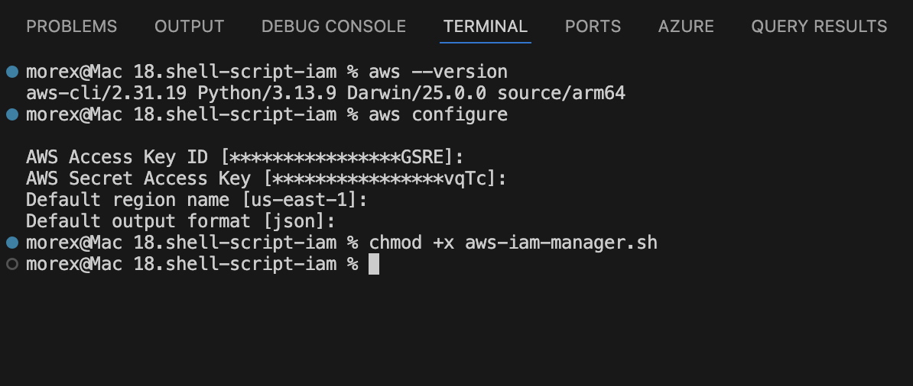
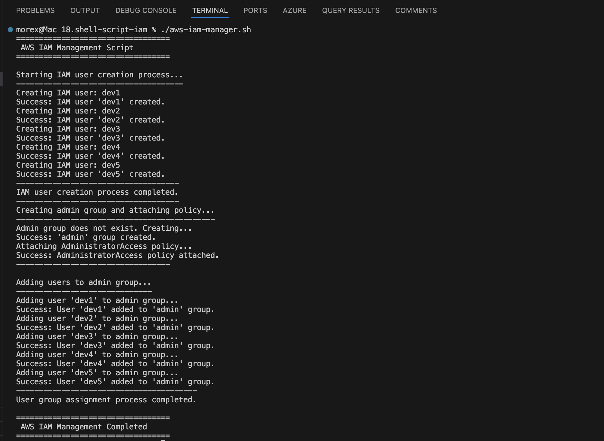
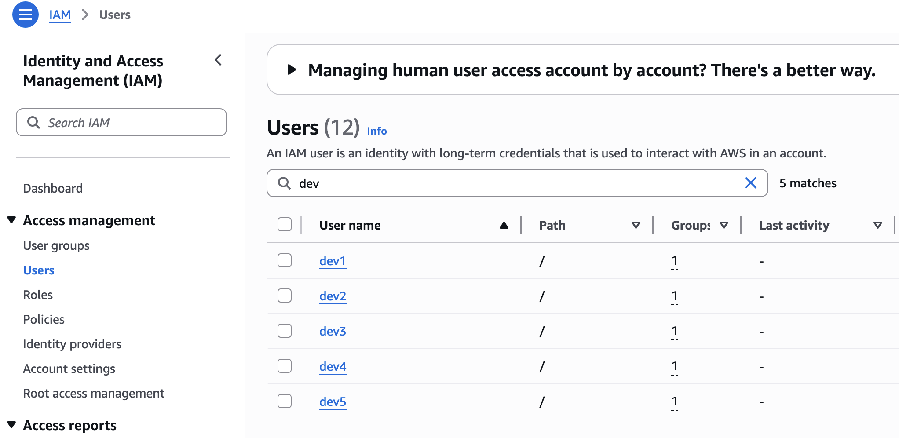
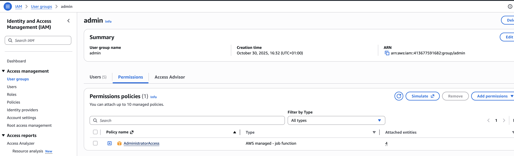
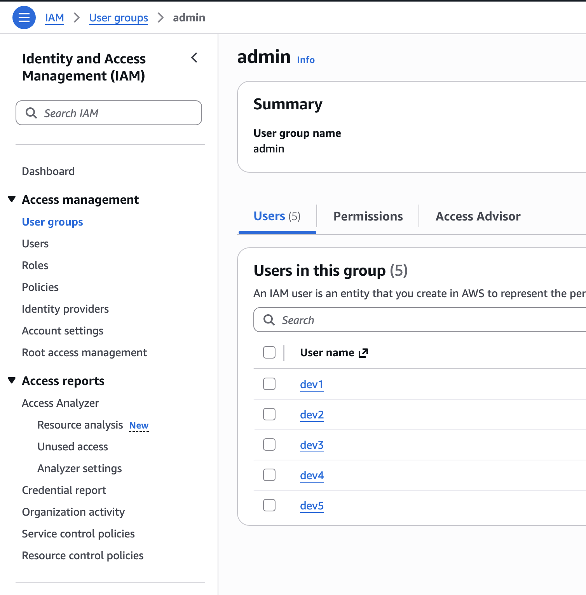

# Shell Script for AWS IAM Management

## Project Scenario
CloudOps Solutions is a growing company that recently adopted AWS to manage its cloud infrastructure. As the company scales, they have decided to automate the process of managing AWS Identity and Access Management (IAM) resources. This includes the creation of users, user groups, and the assignment of permissions for new hires, especially for their DevOps team.

## Purpose
We will extend our shell scripting capabilities by creating more functions inside the `aws-iam-manager.sh` script to fulfill the objectives below. Ensure that you have already configured AWS CLI in your terminal and the configured AWS Account have the appropriate permissions to manage IAM resources.

## Objectives:
Extend the provided script to include IAM management by:
1. Defining IAM User Names Array to store the names of the five IAM users in an array for easy iteration during user creation.
2. Create the IAM Users as you iterate through the array using AWS CLI commands.
3. Define and call a function to create an IAM group named "admin" using the AWS CLI commands.
4. Attach an AWS-managed administrative policy (e.g., "AdministratorAccess") to the "admin" group to grant administrative privileges.
5. Iterate through the array of IAM user names and assign each user to the "admin" group using AWS CLI commands.

Pre-requisite
- Ensure that you have already configured AWS CLI in your terminal and the configured AWS Account have the appropriate permissions to manage IAM resources.
- Completion of Linux foundations with Shell Scripting mini projects

## Solution

**Starter Script**

```bash
#!/bin/bash

# AWS IAM Manager Script for CloudOps Solutions
# This script automates the creation of IAM users, groups, and permissions

# Define IAM User Names Array
IAM_USER_NAMES=()

# Function to create IAM users
create_iam_users() {"\n    echo \"Starting IAM user creation process...\"\n    echo \"-------------------------------------\"\n    \n    echo \"---Write the loop to create the IAM users here---\"\n    \n    echo \"------------------------------------\"\n    echo \"IAM user creation process completed.\"\n    echo \"\"\n"}

# Function to create admin group and attach policy
create_admin_group() {"\n    echo \"Creating admin group and attaching policy...\"\n    echo \"--------------------------------------------\"\n    \n    # Check if group already exists\n    aws iam get-group --group-name \"admin\" >/dev/null 2>&1\n    echo \"---Write this part to create the admin group---\"\n    \n    # Attach AdministratorAccess policy\n    echo \"Attaching AdministratorAccess policy...\"\n    echo \"---Write the AWS CLI command to attach the policy here---\"\n        \n    if [ $? -eq 0 ]; then\n        echo \"Success: AdministratorAccess policy attached\"\n    else\n        echo \"Error: Failed to attach AdministratorAccess policy\"\n    fi\n    \n    echo \"----------------------------------\"\n    echo \"\"\n"}

# Function to add users to admin group
add_users_to_admin_group() {"\n    echo \"Adding users to admin group...\"\n    echo \"------------------------------\"\n    \n    echo \"---Write the loop to handle users addition to the admin group here---\"\n    \n    echo \"----------------------------------------\"\n    echo \"User group assignment process completed.\"\n    echo \"\"\n"}

# Main execution function
main() {"\n    echo \"==================================\"\n    echo \" AWS IAM Management Script\"\n    echo \"==================================\"\n    echo \"\"\n    \n    # Verify AWS CLI is installed and configured\n    if ! command -v aws &> /dev/null; then\n        echo \"Error: AWS CLI is not installed. Please install and configure it first.\"\n        exit 1\n    fi\n    \n    # Execute the functions\n    create_iam_users\n    create_admin_group\n    add_users_to_admin_group\n    \n    echo \"==================================\"\n    echo \" AWS IAM Management Completed\"\n    echo \"==================================\"\n"}

# Execute main function
main

exit 0
```

Here is the completed script

[Iam Script](./aws-iam-manager.sh)

Lets break down the script block by block

**UserName Array**
- Defines an array variable containing five IAM usernames.
- Arrays make it easy to loop through multiple items — here, each value (dev1, dev2, etc.) represents one IAM user.

```bash
IAM_USER_NAMES=("dev1" "dev2" "dev3" "dev4" "dev5")
```

**Function to create IAM users**

Defines a function that creates IAM users using the AWS CLI.

- `for user in ${IAM_USER_NAMES[@]}` — loops through every name in the array.
- `aws iam create-user --user-name "$user"` — AWS CLI command that creates a new IAM user.
- `>/dev/null 2>&1` — hides command output and errors (to keep logs clean).
- `$?` — stores the exit code of the last command (0 means success).
- Based on `$?`, it prints success or warning messages.


```bash
for user in "${IAM_USER_NAMES[@]}"; do
    echo "Creating IAM user: $user"
    aws iam create-user --user-name "$user" >/dev/null 2>&1
    if [ $? -eq 0 ]; then
        echo "Success: IAM user '$user' created."
    else
        echo "Warning: Could not create user '$user' (it may already exist)."
    fi
done
```

**Function to create admin group and attach policy**

1. Check if the “admin” group exists:
    - Uses `aws iam get-group` to check if the group is already in IAM.
    - If it doesn’t exist `($? -ne 0)`, it creates it with `aws iam create-group`.

2. Attach an AWS Managed Policy:
    - `aws iam attach-group-policy` attaches the built-in `AdministratorAccess` policy to the “admin” group.
    - The ARN (`arn:aws:iam::aws:policy/AdministratorAccess`) is the unique identifier of the policy.

3. Error Handling:
    - `$?` checks if the command succeeded.
    - Displays friendly messages for success or failure.

```bash
aws iam get-group --group-name "admin" >/dev/null 2>&1
    if [ $? -ne 0 ]; then
        echo "Admin group does not exist. Creating..."
        aws iam create-group --group-name "admin" >/dev/null 2>&1
        if [ $? -eq 0 ]; then
            echo "Success: 'admin' group created."
        else
            echo "Error: Failed to create 'admin' group."
            exit 1
        fi
    else
        echo "Group 'admin' already exists."
    fi

    # Attach AdministratorAccess policy
    echo "Attaching AdministratorAccess policy..."
    aws iam attach-group-policy \
        --group-name "admin" \
        --policy-arn arn:aws:iam::aws:policy/AdministratorAccess >/dev/null 2>&1
        
    if [ $? -eq 0 ]; then
        echo "Success: AdministratorAccess policy attached."
    else
        echo "Error: Failed to attach AdministratorAccess policy."
    fi
```


**Function to add users to admin group**

This funtion grants all users from the list admin permissions.

- Iterates through all users again.
- Adds each to the `admin` group using: `aws iam add-user-to-group --user-name "$user" --group-name "admin"`
- Checks the command result `($?)` for success.
- Provides feedback for each user.

```bash
for user in "${IAM_USER_NAMES[@]}"; do
    echo "Adding user '$user' to admin group..."
    aws iam add-user-to-group --user-name "$user" --group-name "admin" >/dev/null 2>&1
    if [ $? -eq 0 ]; then
        echo "Success: User '$user' added to 'admin' group."
    else
        echo "Warning: Failed to add user '$user' to 'admin' group (may already be a member)."
    fi
done
```

**Main Function**
This function call the other three functions sequentially

```bash
# Execute the functions
create_iam_users
create_admin_group
add_users_to_admin_group
```

**Main Function Execution**

- Calls the main function to start execution.
- `exit 0` — explicitly signals that the script completed successfully (0 = success).

```bash
main
exit 0
```


## Running the script

To run the script, ensure AWS CLI is setup with the command `aws --version`

Ensure you’re authenticated/configured `aws configure`

Grant executable permission on the script `chmod +x aws-iam-manager.sh`



Run the script `./aws-iam-manager.sh`



Verify Users in the AWS Console



Verify Group creation and its permissions & Users






## Learning Summary

This project provided hands-on experience in automating AWS Identity and Access Management (IAM) operations using Bash scripting and the AWS Command Line Interface (CLI). Through the script, I learned how to efficiently manage IAM users, groups, and permissions by leveraging shell constructs such as arrays, loops, and functions. Defining an array to store multiple IAM usernames simplified the creation process, while using loops allowed for scalable user management without repetitive code. Additionally, incorporating conditional checks and exit codes improved error handling, ensuring that operations like user creation and group setup execute reliably.

Beyond Bash fundamentals, the project deepened my understanding of AWS IAM administration. I gained practical knowledge of creating and managing IAM entities through commands such as aws iam create-user, create-group, and attach-group-policy. Automating the attachment of the AdministratorAccess policy to a group and assigning users to that group reinforced key IAM concepts, such as policy inheritance and least-privilege management. Overall, the exercise demonstrated how scripting can transform repetitive cloud management tasks into efficient, reusable automation workflows — a vital skill for DevOps and cloud operations roles.


