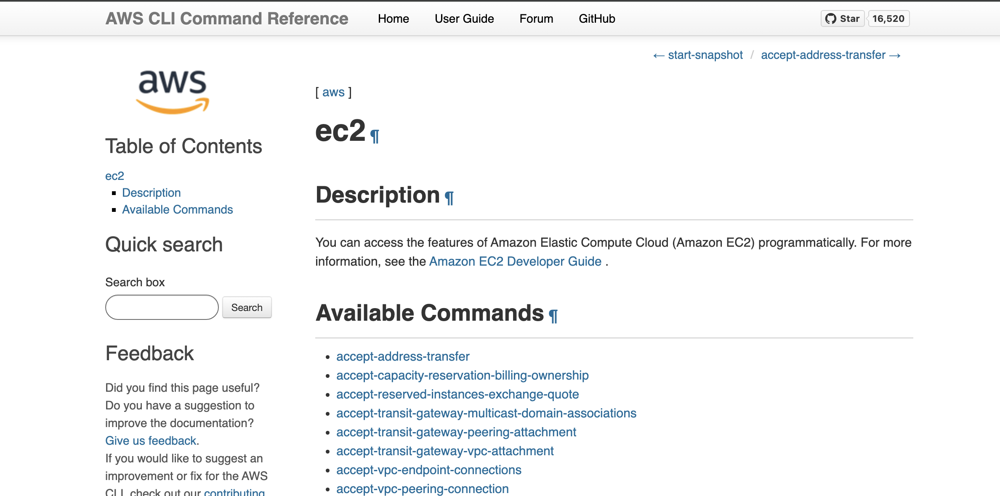
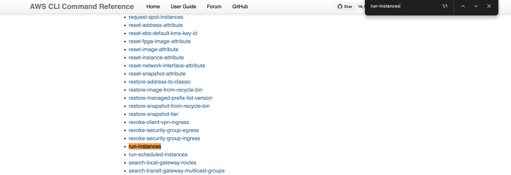
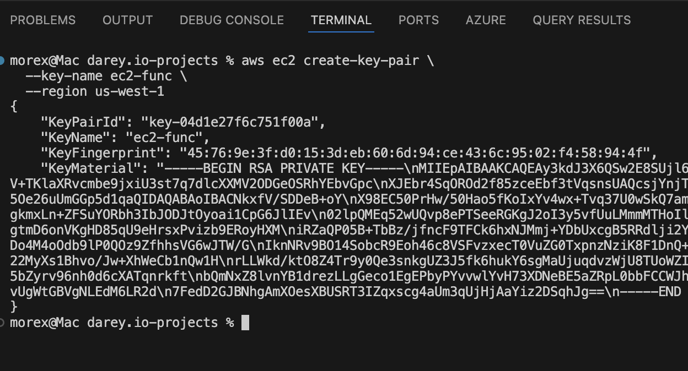
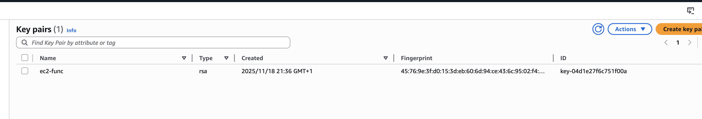
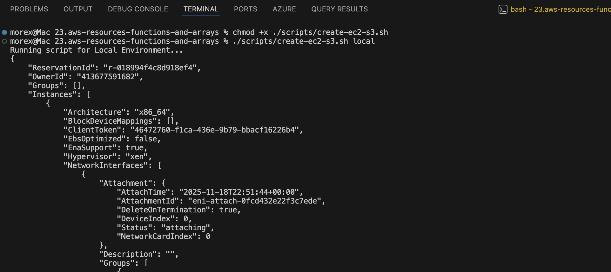
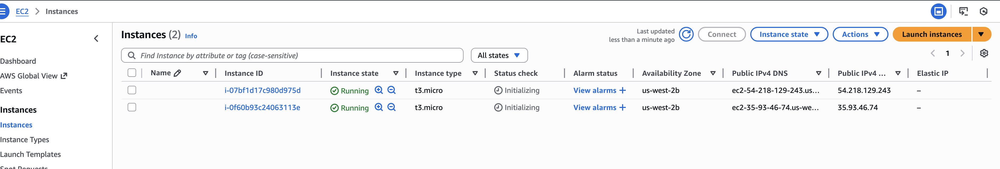
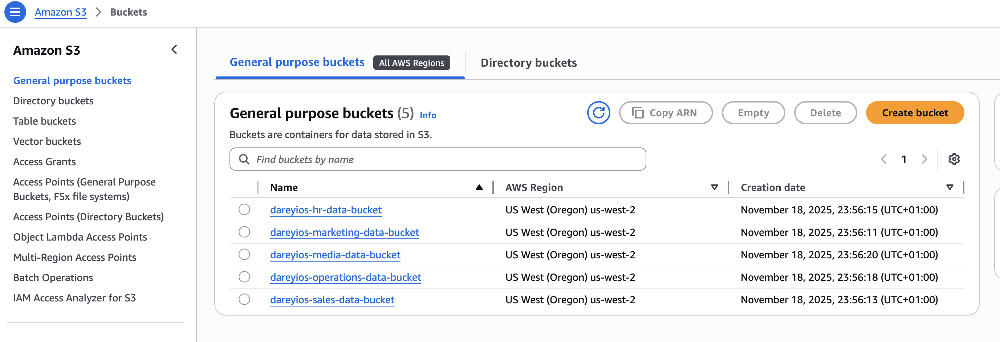
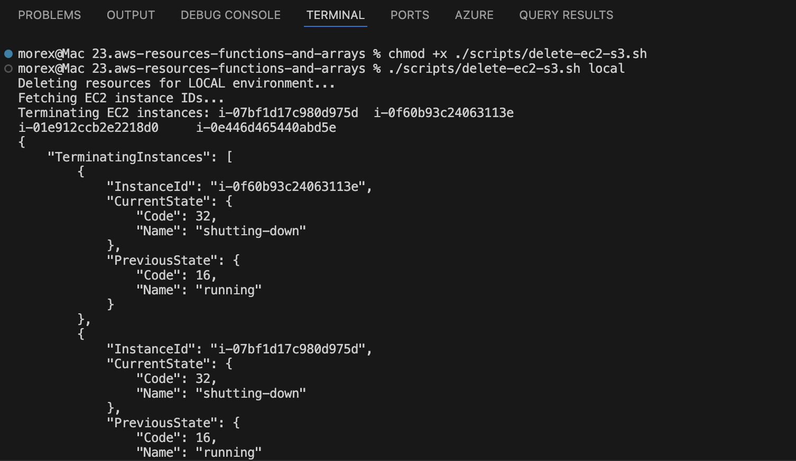
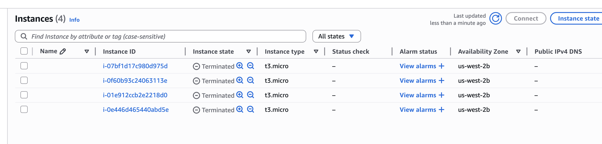
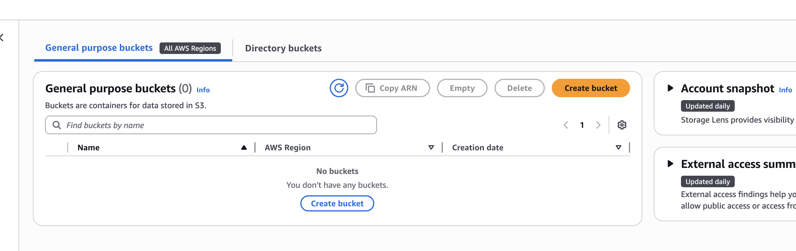

# Creating AWS resources with functions & introducing Arrays

We'll begin this project by creating two functions:
1. One for provisioning EC2 instances and
2. Another for setting up S3 buckets.

These functions will streamline the process of resource creation and enable us to automate tasks effectively.

## Function to provision EC2 instances

To programmatically create EC2 instances, you must use the [official documentation](https://docs.aws.amazon.com/cli/latest/reference/ec2/) to understand how to use the `aws cli` to create instances.
From the Available Commands, you will be able to interact with AWS programmatically.



If you search for `run-instances` on the page with `Control F` on your key board, click on it and it will take you to the detailed documentation on the sub-command to create EC2 instances.



Here is an example of how you would create EC2 instances using the command line.

```bash
aws ec2 run-instances \
    --image-id "ami-0cd59ecaf368e5ccf" \
    --instance-type "t2.micro" \
    --count 5 \
    --key-name MyKeyPair \
    --region eu-west-2
```
> Note: Make sure you have a key pair created in your aws console. The you can replace the 'MyKeyPair' with you key pair name.

On the same page, if you search for one of the arguments, you will be able to read more about how to pass different arguments to the cli. 


For the command to work: A keypair must already exist. You can create a keypair using the cli as well. To create a new key pair use the command below

```bash
aws ec2 create-key-pair \
  --key-name ec2-func \
  --region us-west-2
```


We can confirm the key-pair created on the aws console



Now, lets update the shell script and create a function that will be responsible for creating EC2 instances.

```bash
#!/bin/bash

# Function to create EC2 instances
create_ec2_instances() {

    # Specify the parameters for the EC2 instances
    instance_type="t2.micro"
    ami_id="ami-024e4b8b6ef78434a"
    count=2  # Number of instances to create
    region="us-west-2" # Region to create cloud resources

    # Create the EC2 instances
    aws ec2 run-instances \
        --image-id "$ami_id" \
        --instance-type "$instance_type" \
        --count $count \
        --key-name MyKeyPair \
        --region "$region"

    # Check if the EC2 instances were created successfully
    if [ $? -eq 0 ]; then
        echo "EC2 instances created successfully."
    else
        echo "Failed to create EC2 instances."
    fi
}

# Call the function to create EC2 instances
create_ec2_instances

```

Lets highlight some new areas

- `$?`: This is a special variable that holds the exit status of the last executed command. In this case, it checks if the aws ec2 run-instances command was successful. exit status that equals 0 is interpreted as succesful. Therefore if exit code is `0`, then echo the message to confirm that the previous command was successful.

- We have once again used environment variables to hold the value of `ami_id`, `count` and `region` and replaced with their respective values with `$ami_id`, `$count` and `$region`


## Define function to create S3 buckets & learn about Arrays

The [AWS CLI reference for S3 can be found here](https://docs.aws.amazon.com/cli/latest/reference/s3api/). We will be using it in the script.

In this section, our objective is to create five distinct S3 buckets, each designated for storing data related to Marketing, Sales, HR, Operations, and Media.

To achieve this, we'll utilize a fundamental data structure in shell scripting known as an `array.` this is because, we need one single variable holding all the data, and then have the capability to loop through them.

### Arrays in Shell Scripting

An array is a versatile data structure that allows you to store multiple values under a single variable name. Particularly in shell scripting, arrays offer an efficient means of managing collections of related data, making them seem invaluable for our task ahead.

Below is what the function woould look like.

```bash
# Function to create S3 buckets for different departments
create_s3_buckets() {

    # Define a company name as prefix
    company="datawise"

    # Array of department names
    departments=("Marketing" "Sales" "HR" "Operations" "Media")
    
    # Loop through the array and create S3 buckets for each department
    for department in "${departments[@]}"; do
        bucket_name="${company}-${department}-data-bucket"

        # Create S3 bucket using AWS CLI
        aws s3api create-bucket --bucket "$bucket_name" --region your-region

        if [ $? -eq 0 ]; then
            echo "S3 bucket '$bucket_name' created successfully."
        else
            echo "Failed to create S3 bucket '$bucket_name'."
        fi
    done
}

# Call the function to create S3 buckets for different departments
create_s3_buckets
```

Lets break down each part of the code.
- This line begins the definition of a shell function named `create_s3_buckets`.

```bash
# Function to create S3 buckets for different departments
create_s3_buckets() {

    # Here, we define a variable named company and assign it the value "datawise".
    # This variable will serve as the prefix for all S3 bucket names, ensuring uniqueness.
    # You can replace "datawise" with any company name or unique identifier.
    company="datawise"

    # This is where we define an array named 'departments',
    # containing the names of different departments.
    # Each department name will be used to construct an S3 bucket name.
    departments=("Marketing" "Sales" "HR" "Operations" "Media")

    # This line starts a loop that iterates through each department in the array.
    # For each iteration, the value of the current department is stored in 'department'.
    for department in "${departments[@]}"; do
        :
    done
}
```
``` bash
    The syntax ${departments[@]} in Bash refers to all elements in the array departments.

    [@]: This is an index or slice syntax specific to arrays in Bash. It signifies that we want to access all elements of the array.

    If you were interested in accessing a single element from the array, you would still use the syntax $departments[index]}, where index is the position of the element you want to access. Remember that array indexing in Bash starts from 0.
```

An example is;

```bash
departments=("Marketing" "Sales" "HR" "Operations" "Media")

# Accessing the fourth element (Operations) from the array
echo "#{departments [3]}"
```

Output:

```bash 
Operations
```

- Within the loop, we construct the name of the S3 bucket using the `company prefix`, the current `department` name, and the suffix `-Data-Bucket`. This ensures that each bucket name is unique.

```bash
bucket_name="${ company}-${department}-Data-Bucket"
```

- Using the AWS CLI (aws s3api), we create an S3 bucket with the specified name from the variable ($bucket_name), in the specified AWS region (your-region). Make sure to replace "your-region" with the actual AWS region where you want to create the buckets.

```bash
# Create S3 bucket using AWS CLI
aws 53api create-bucket —bucket "sbucket name" —-region your-region
```

- This line checks the exit status of the previous command (aws sapi create-bucket). A value of O indicates success, while non-zero values indicate failure.

```bash
if [$? -eq 0 ]; then
```

- Based on the exit status of the aws s'api command, we print a corresponding message indicating whether the bucket creation was successful or not.

```bash
echo "S3 bucket '$bucket_name' created successfully."
else
echo "Failed to create S3 bucket '$bucket_name'."
fi
done
```

- This line marks the end of the create_s3_buckets function definition.

```bash
}
```

The Complete Script till this stage will look like this

```bash
#!/bin/bash

# Environment variables
ENVIRONMENT=$1

# Function to check the number of arguments
check_num_of_args() {
    # Checking the number of arguments
    if [ "$#" -ne 1 ]; then
        echo "Usage: $0 <environment>"
        exit 1
    fi
}

# Function to activate infra based on environment argument
activate_infra_environment() {
    if [ "$ENVIRONMENT" == "local" ]; then
        echo "Running script for Local Environment..."
    elif [ "$ENVIRONMENT" == "testing" ]; then
        echo "Running script for Testing Environment..."
    elif [ "$ENVIRONMENT" == "production" ]; then
        echo "Running script for Production Environment..."
    else
        echo "Invalid environment specified. Please use 'local', 'testing', or 'production'."
        exit 2
    fi
}

# Function to check if AWS CLI is installed
check_aws_cli() {
    if ! command -v aws &> /dev/null; then
        echo "AWS CLI is not installed. Please install it before proceeding."
        return 1
    fi
}

# Function to check if AWS profile is set
check_aws_profile() {
    if [ -z "$AWS_PROFILE" ]; then
        echo "AWS profile environment variable is not set."
        return 1
    fi
}

# Function to create EC2 Instances
create_ec2_instances() {

    # Specify the parameters for the EC2 instances
    instance_type="t2.micro"
    ami_id="ami-024e4b8b6ef78434a"
    count=2  # Number of instances to create
    region="us-west-2" # Region to create cloud resources

    # Create the EC2 instances
    aws ec2 run-instances \
        --image-id "$ami_id" \
        --instance-type "$instance_type" \
        --count $count \
        --key-name ec2-func \  
        --region "$region"

    # Check if the EC2 instances were created successfully
    if [ $? -eq 0 ]; then
        echo "EC2 instances created successfully."
    else
        echo "Failed to create EC2 instances."
    fi
}

# Function to create S3 buckets for different departments
create_s3_buckets() {

    # Define a company name as prefix
    company="datawise"

    # Array of department names
    departments=("marketing" "sales" "hr" "operations" "media")

    # Loop through the array and create S3 buckets for each department
    for department in "${departments[@]}"; do
        bucket_name="${company}-${department,,}-data-bucket"

        # Create S3 bucket using AWS CLI
        aws s3api create-bucket --bucket "$bucket_name" --region $region 

        if [ $? -eq 0 ]; then
            echo "S3 bucket '$bucket_name' created successfully."
        else
            echo "Failed to create S3 bucket '$bucket_name'."
        fi
    done
}

# Call functions
check_num_of_args "$#"
activate_infra_environment
check_aws_cli
check_aws_profile
create_ec2_instances
create_s3_buckets

```

## Testing the script

1. Save the script in a file [Script file](./scripts/create-ec2-s3.sh)

2. Make it excecutable - `chmod +x /scripts/create-ec2-s3.sh`

3. Run the script - `./scripts/create-ec2-s3.sh local`



4. Verify Resource creation in the console




> Optionally, we can delete the resourses created with a similar [script](./scripts/delete-ec2-s3.sh) which uses functions and Arrays to loop through the resources and delete them

5. Make the delete script executable - `chmod +x ./scripts/delete-ec2-s3.sh`

6. Run the script - `./scripts/delete-ec2-s3.sh local`



7. We can confirm on the console that the instances are being terminated and the buckets deleted





## Learning summary

### Objective: 
Automate provisioning of EC2 instances and S3 buckets using a single Bash script while applying core shell‑scripting skills: functions, arrays, environment variables, command‑line arguments and error handling.

### Concepts practiced:
- Functions: modularized tasks (create_ec2_instances, create_s3_buckets, checks, delete/rollback).
- Arrays: store and iterate departmental names and created resource IDs for reporting and rollback.
- Environment variables: use AWS_REGION, AWS_PROFILE, DEFAULT_AMI, DEFAULT_INSTANCE_TYPE, DEFAULT_KEY_NAME to avoid hardcoding and protect credentials.
- Command‑line arguments: accept environment/dry‑run/overrides so the script is flexible and testable.
- Error handling: check exit codes, trap errors, validate prerequisites and resource compatibility, and provide rollback or safe failure modes.


