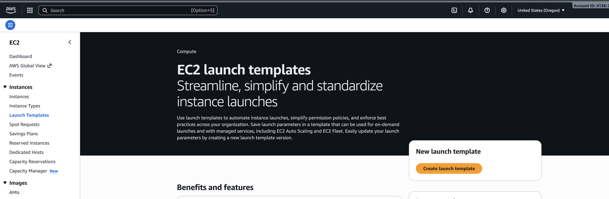
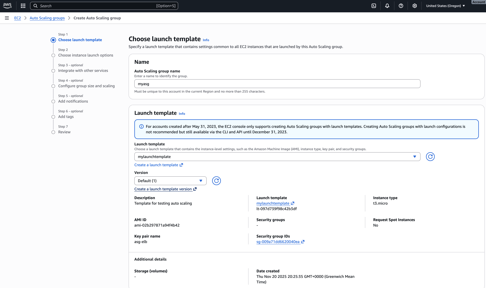
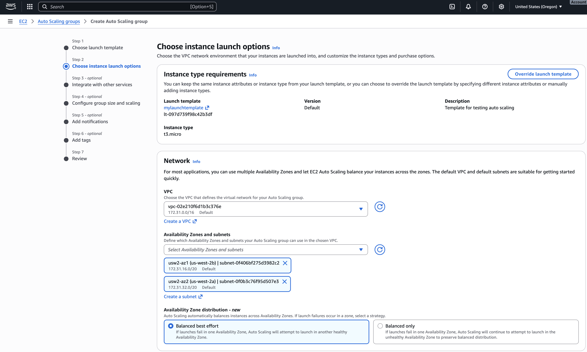
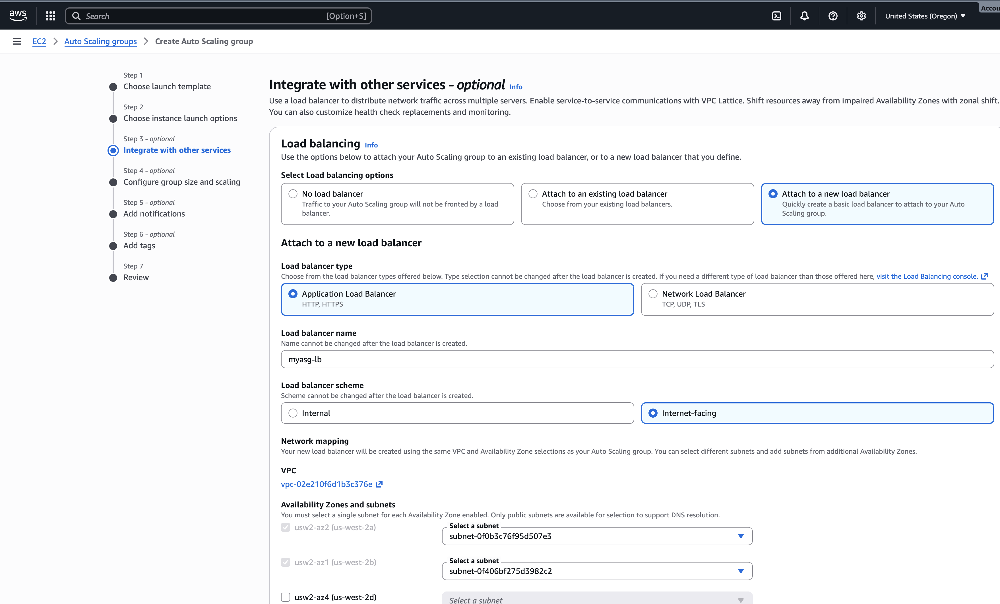
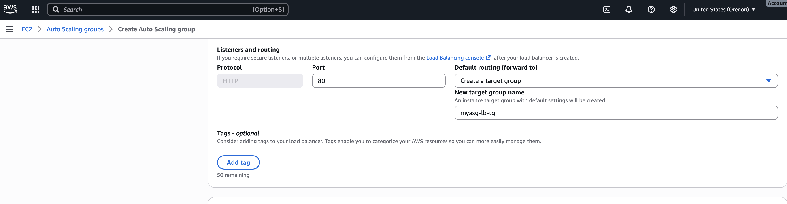
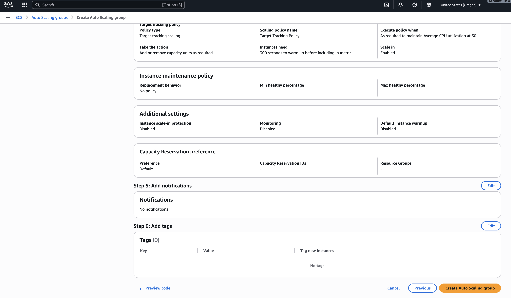
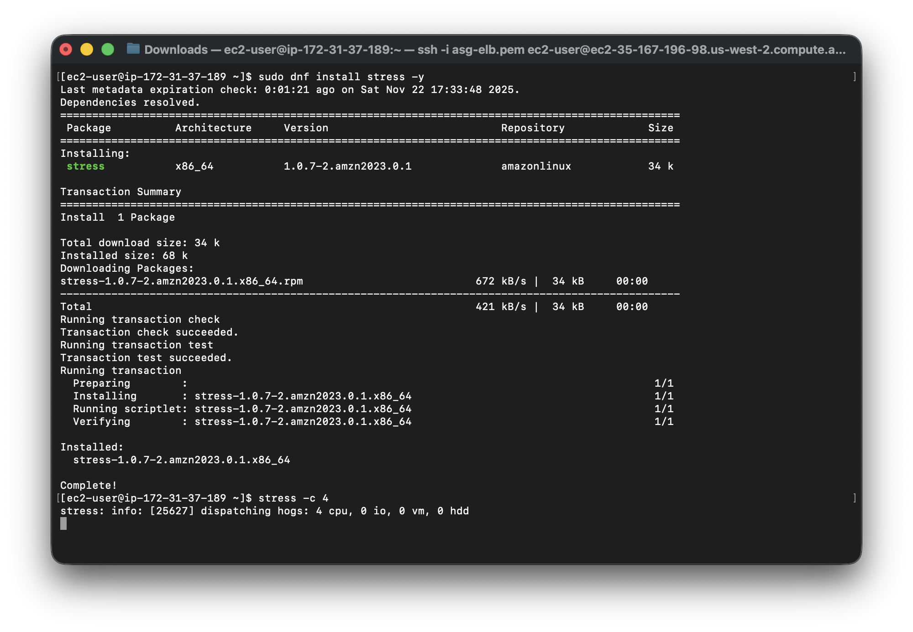
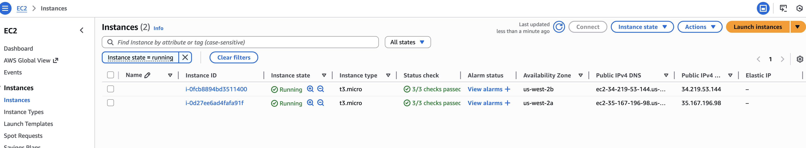

# Load Balancer and Auto Scaling Group in AWS

## Configuring Auto Scaling with ALB using Launch Template

In this mini project, you will learn how to configure Auto Scaling in AWS with an Application Load Balancer (ALB) using a Launch Template. The project aims to demonstrate the automatic scaling of EC2 instances based on demand, while leveraging the benefits of a Launch Template.

### Objectives:
1. Create Launch Template:
    - Learn how to create a Launch Template with the required specifications.

2. Set Up Auto Scaling Group:
    - Configure an Auto Scaling group to manage the desired number of EC2 instances using the Launch Template.

3. Configure Scaling Policies:
    - Set up scaling policies to adjust the number of instances based on demand.

4. Attach ALB to Auto Scaling Group:
    - Connect the Auto Scaling group to an existing ALB.

5. Test Auto Scaling:
    - Verify that the Auto Scaling group adjusts the number of instances in response to changes in demand.
---

## Project Tasks:
### Task 1: Create Launch Template

1. Log in to the AWS Management Console.
2. Navigate to the EC2 service.
3. In the left navigation pane, click on "Launch Templates."
4. Click the "Create launch template" button.

    

5. Configure the launch template settings, including the AMI, instance type, and user data.

    

### Task 2: Set Up Auto Scaling Group
1. In the AWS Management Console, navigate to the EC2 service.
   - In the left navigation pane, click on "Auto Scaling Groups."

    

2. Click the "Create Auto Scaling group" button.
3. Choose "Use Launch Template" and select the Launch Template you created then click next

    

4. On the choose instance launch options, choose the desired vpc, subnets and availability zones then click next.

    

5. On the integrate with other services page 
    - Load Balancing - `Attach to a new load balancer`
    - Load Balancer type - `Application Load Balancer`
    - Load Balancer scheme - `Internet facing`

    

    - Listeners and Routing - `Create new target Group`
    - click next

    

6. On the Configure group size and scaling page
    - Set `Min desired capacity` as 1 and `Max desired capacity` as 2
    - Click Target tracking scaling policy under Automatic scaling
    - Metric Type - `Average CPU Utilization`
    - Target value `50`


7. Click skip to review and click create Auto Scaling Group




### Task 5: Test Auto Scaling

1. On the Instances page, we can see one instance running 


2. SSH into the instance 

```bash
# Make sure to cd to the folder where the private key was downloaded
# Ensure your security group is configured to allow traffic on port 22
chmod 400 "asg-elb.pem"
ssh -i "asg-elb.pem" ec2-user@ec2-35-167-196-98.us-west-2.compute.amazonaws.com
```


3. Generate traffic to trigger scaling policies.

```bash
sudo dnf install stress -y 
stress -c 4
```



2. Monitor the Auto Scaling group and verify that the number of instances adjusts based on demand.

    

3. When we check the activity history of the the ASG, We can see whenand why it triggered adding new instance

    

> Ensure to Delete resources upon completion to avoid incurring unwanted charges

## Learning Summary

**Objective**: Automate horizontal scaling of EC2 workloads using a Launch Template, an Auto Scaling Group (ASG), and an Application Load Balancer (ALB) to maintain availability and respond to demand.

### Key concepts practiced:

- **Launch Template:** immutable instance configuration (AMI, instance type, user data, key pair, IAM role).
- **Auto Scaling Group**: desired/min/max capacity, lifecycle of instances, and integration with Launch Templates.
- **ALB integration**: target groups, health checks, listener rules and routing of traffic to ASG instances.
- **Scaling policies**: target‑tracking (Average CPU Utilization) and how metric thresholds trigger scale out/in actions.
- **Testing & verification**: SSH into instances, generate load (stress), monitor ASG activity history and instance lifecycle events.
