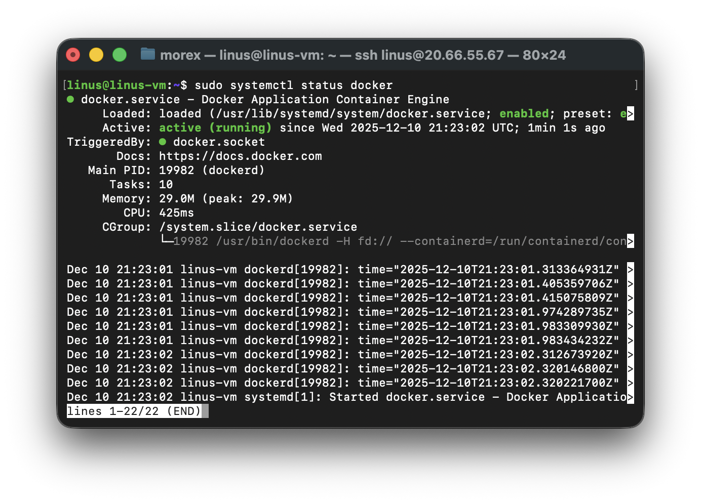
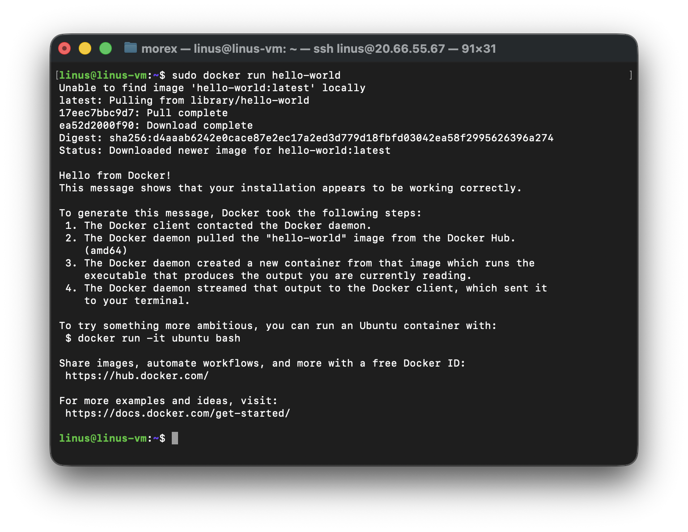
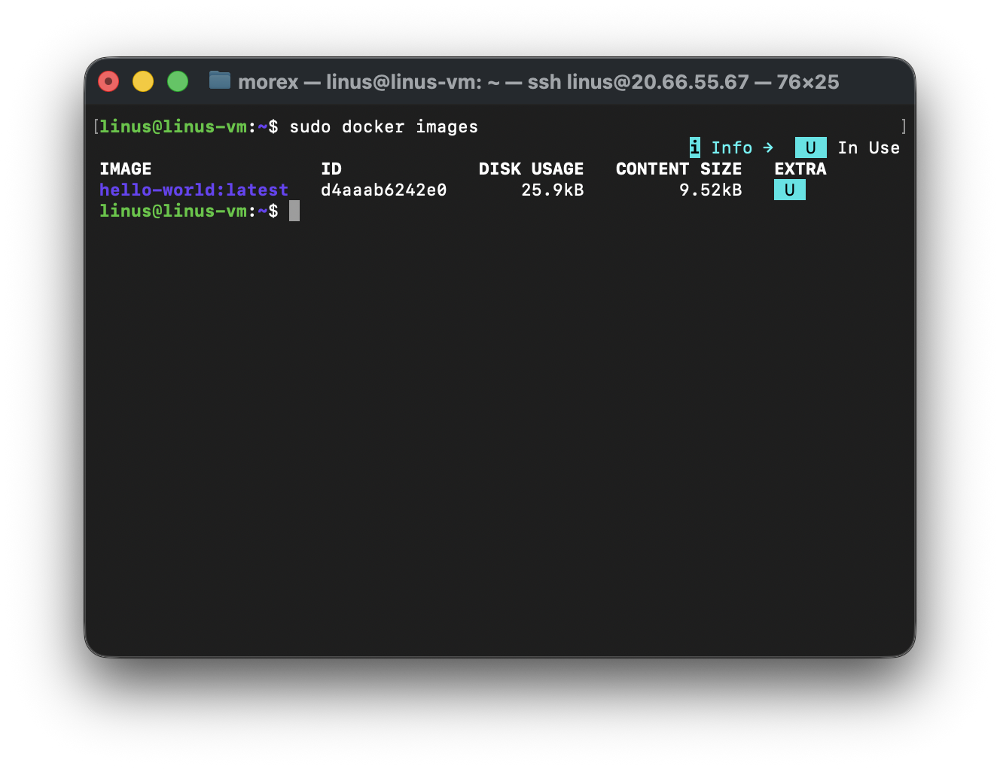
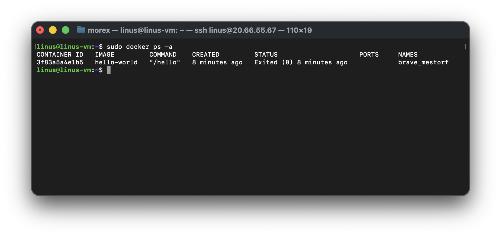
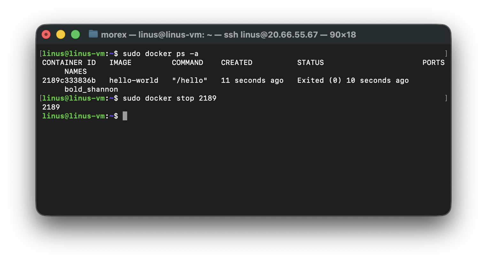
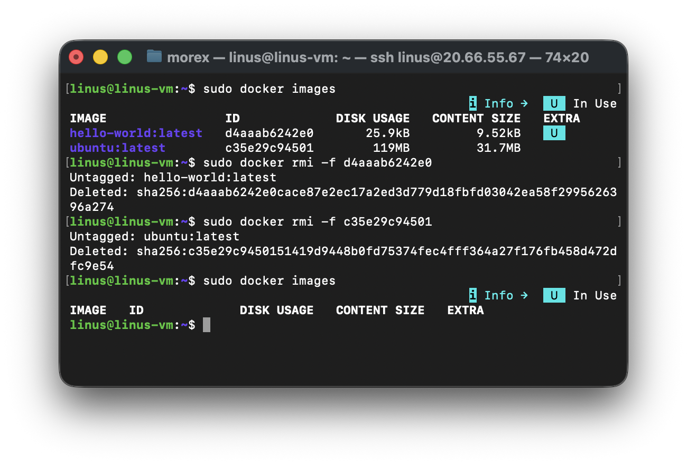

# Introduction to Docker and Containers

## What are Containers?
In realm of software development and deployment, professionals used to face a dilemma. They crafted brilliant code on their local machines, only to find that when deployed to other environments, it sometimes does not work. The culprit? The notorious "it works on my machine" phenomenon.

## Advantages of Containers
- **Portability Across Different Environments**: In the past, deploying applications was akin to navigating a treacherous maze, with compatibility issues lurking at every turn. Docker's containers, however, encapsulate the entire application along with its dependencies and configurations. This magical package ensures that your creation dances gracefully across different platforms, sparing you from the woes of the "it works on my machine" curse.

- **Resource Efficiency Compared to Virtual Machines**: Docker containers share the underlying host's operating system kernel, making them lightweight and nimble.
This efficiency allows you to run multiple containers on a single host without the extravagant resource demands of traditional virtual machines.

- **Rapid Application Deployment and Scaling**: Docker containers can be effortlessly spun up or torn down, facilitating the swift deployment of applications.

## Comparison of Docker Container with Virtual Machines
Docker and virtual machines (VMs) are both technologies used for application deployment, but they differ in their approach to virtualization. Virtual machines emulate entire operating systems, resulting in higher resource overhead and slower performance. In contrast, Docker utilizes containerization, encapsulating applications and their dependencies while sharing the host OS's kernel. This lightweight approach reduces resource consumption, provides faster startup times, and ensures portability across different environments. Docker's emphasis on microservices and standardized packaging fosters scalability and efficiency, making it a preferred choice for modern, agile application development, whereas virtual machines excel in scenarios requiring stronger isolation but at the cost of increased resource usage. The choice between Docker and VMs depends on specific use 
cases and the desired balance between performance and isolation.


## Getting started with Doker

### Installing Docker

We need to launch an ubuntu 20.04 LTS instance and connect to it, then follow the steps below

Before installing Docker Engine for the first time on a new host machine, it is necessary to configure the Docker repository. Following this setup, we can proceed to install and update Docker directly from the repository.

1. Set up Docker's apt repository.

```bash
# Add Docker's official GPG key:
sudo apt update
sudo apt install ca-certificates curl
sudo install -m 0755 -d /etc/apt/keyrings
sudo curl -fsSL https://download.docker.com/linux/ubuntu/gpg -o /etc/apt/keyrings/docker.asc
sudo chmod a+r /etc/apt/keyrings/docker.asc

# Add the repository to Apt sources:
sudo tee /etc/apt/sources.list.d/docker.sources <<EOF
Types: deb
URIs: https://download.docker.com/linux/ubuntu
Suites: $(. /etc/os-release && echo "${UBUNTU_CODENAME:-$VERSION_CODENAME}")
Components: stable
Signed-By: /etc/apt/keyrings/docker.asc
EOF

sudo apt update
```

2. Install the Docker packages.
```bash
sudo apt install docker-ce docker-ce-cli containerd.io docker-buildx-plugin docker-compose-plugin # Install latest version of docker
sudo usermod -aG docker ubuntu # Run docker with superuser priviledges
sudo systemctl status docker # verify that docker has been successfully  installed
```




### Running the "Hello World" Container

Using the `docker run` Command

The `docker run` command is the entry point to execute containers in Docker. It allows you to create and start a container based on a specified Docker image.
The most straightforward example is the "Hello World" container, a minimalistic container that prints a greeting message when executed.

```bash
docker run hello-world ## Run the "Hello World" container
```



When you execute this command, Docker performs the following steps:

1. **Pulls Image (if not available locally)**: Docker checks if the `hello-world` image is available locally. If not, it automatically pulls it from the Docker Hub, a centralized repository for Docker images.

2. **Creates a Container**: Docker creates a container based on the `hello-world` image. This container is an instance of the image, with its own isolated filesystem and runtime environment.

3. **Starts the Container**: The container is started, and it executes the predefined command in the `hello-world` image, which prints a friendly message.

### Understanding the Docker Image and Container Lifecycle

**Docker Image**: A Docker image is a lightweight, standalone, and executable package that includes everything needed to run a piece of software, including the code, runtime, libraries, and system tools. Images are immutable, meaning they cannot be modified once created. Changes result in the creation of a new image.

- Container Lifecycle: Containers are running instances of Docker images.
  - They have a lifecycle: 'create, start, stop, and delete.
  - Once a container is created from an image, it can be started, stopped, and restarted.

**Verifying the Successful Execution**

You can check if the images is now in your local environment with Example Output:

### Docker images



If you encounter any issues, ensure that Docker is properly installed and that your user has the necessary permissions to run Docker commands.

This simple `Hello World` example serves as a basic introduction to running containers with Docker. It helps verify that your Docker environment is set up correctly and provides insight into the image and container lifecycle. As you progress in this course, you'll explore more complex scenarios and leverage Docker for building, deploying and managing diverse applications.

## Basic Docker Commands

### Docker Run
The `docker run` command is fundamental for executing containers. It creates and starts a container based on a specified image.
```bash
# Run a container based on the "nginx" image
docker run hello-world
```

This example pulls the "nginx" image from Docker Hub (if not available locally) and starts a container using that image.

### Docker PS
The `docker ps` command displays a list of running containers. This is useful for monitoring active containers and obtaining information such as container IDs, names, and status.
```bash
# List running containers
docker ps
```

To view all containers, including those that have stopped, add the '-a' option:

```bash
# List all containers (running and stopped)
docker ps -a
```



### Docker Stop
The 'docker stop' command halts a running container.

```bash
# Stop a running container (replace CONTAINER_ID with the actual container ID)
docker stop CONTAINER_ID
```



### Docker Pull
The 'docker pull' command downloads a Docker image from a registry, such as Docker Hub, to your local machine.

```bash
# Pull the latest version of the "ubuntu" image from Docker Hub
docker pull ubuntu
```


### Docker Push
The 'docker push' command uploads a local Docker image to a registry, making it available for others to pull.

```bash
# Push a local image to Docker Hub
docker push your-username/image-name
```

> Ensure you've logged in to Docker Hub using 'docker login' before pushing images.

### Docker Images

The 'docker images' command lists all locally available Docker images.
```bash
# List all local Docker images
docker images
```

### Docker RMI
The 'docker rmi' command removes one or more images from the local machine.

```bash
# Remove a Docker image (replace IMAGE_ID with the actual image ID
docker rmi IMAGE ID
```



## Learning Summary
These basic Docker commands provide a foundation for working with containers. Understanding how to run, list, stop, pull, push, and manage Docker images is crucial for effective containerization and orchestration. As you delve deeper into Docker, you'll discover additional commands and features that enhance your ability to develop, deploy, and maintain containerized applications.


