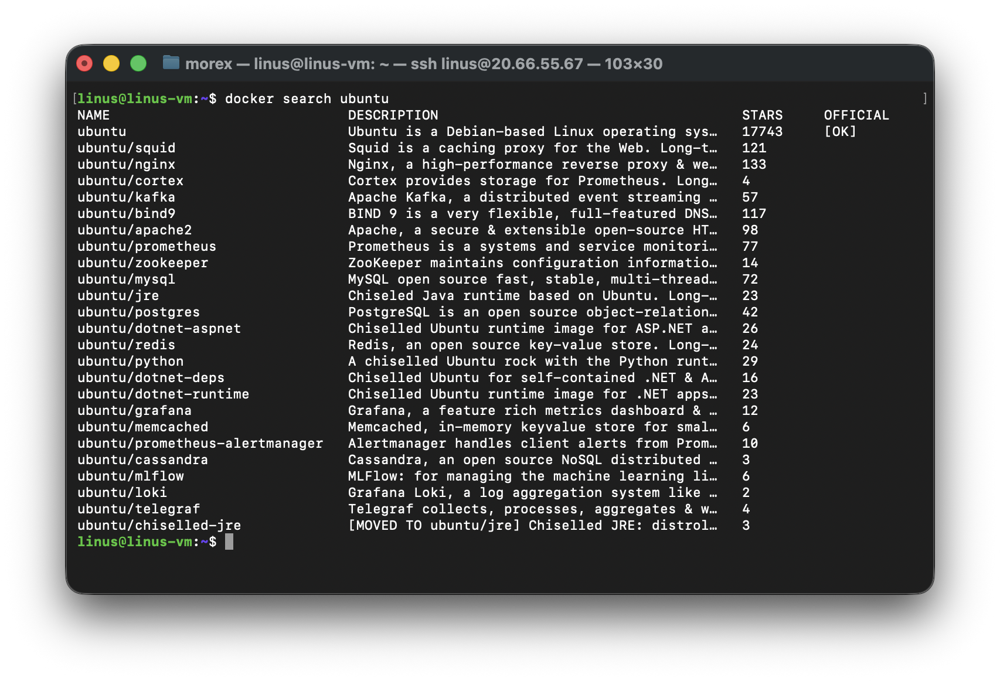
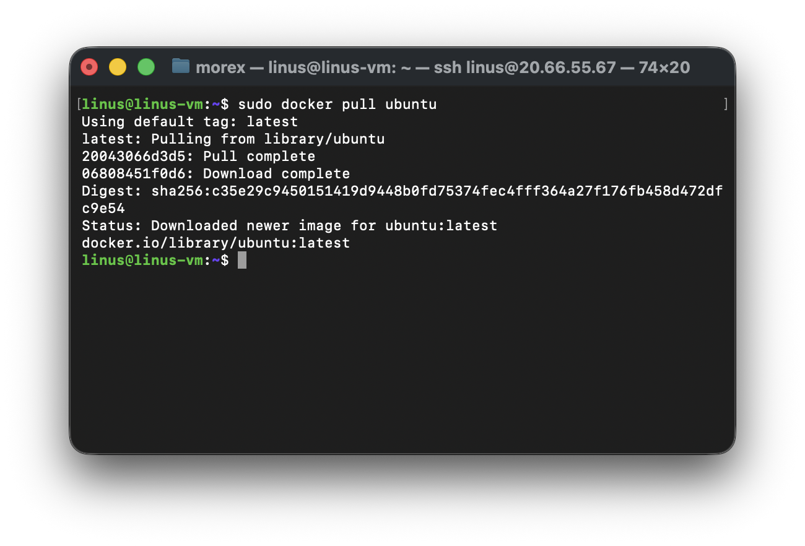
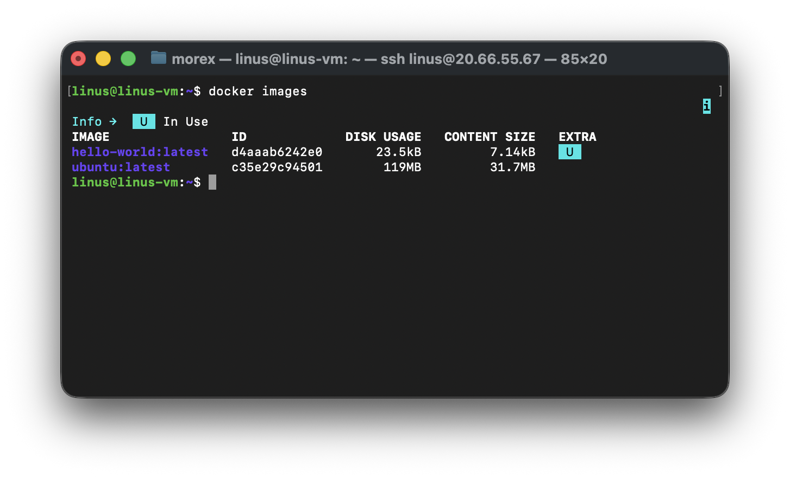
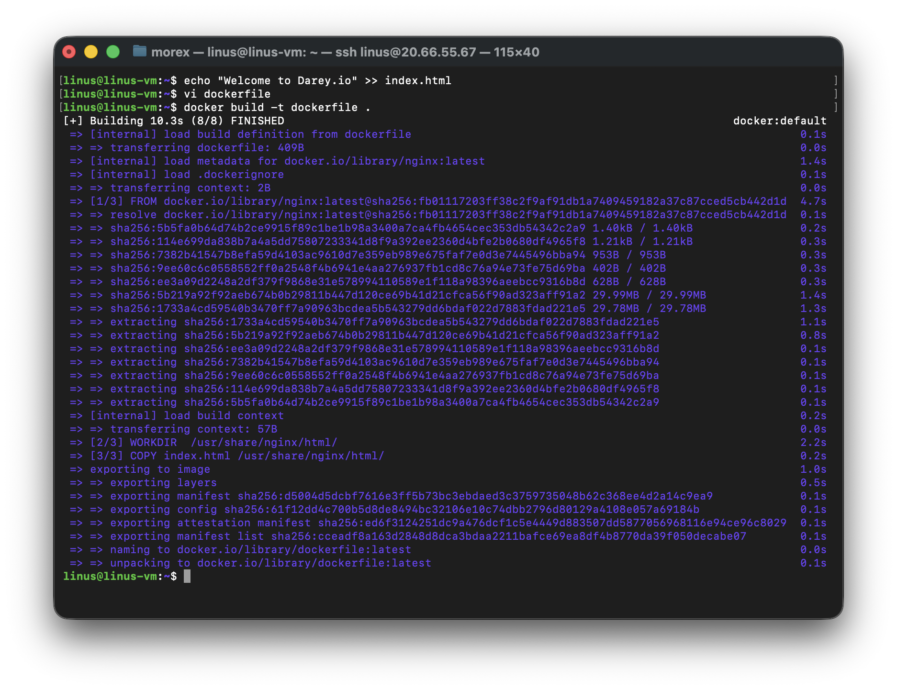
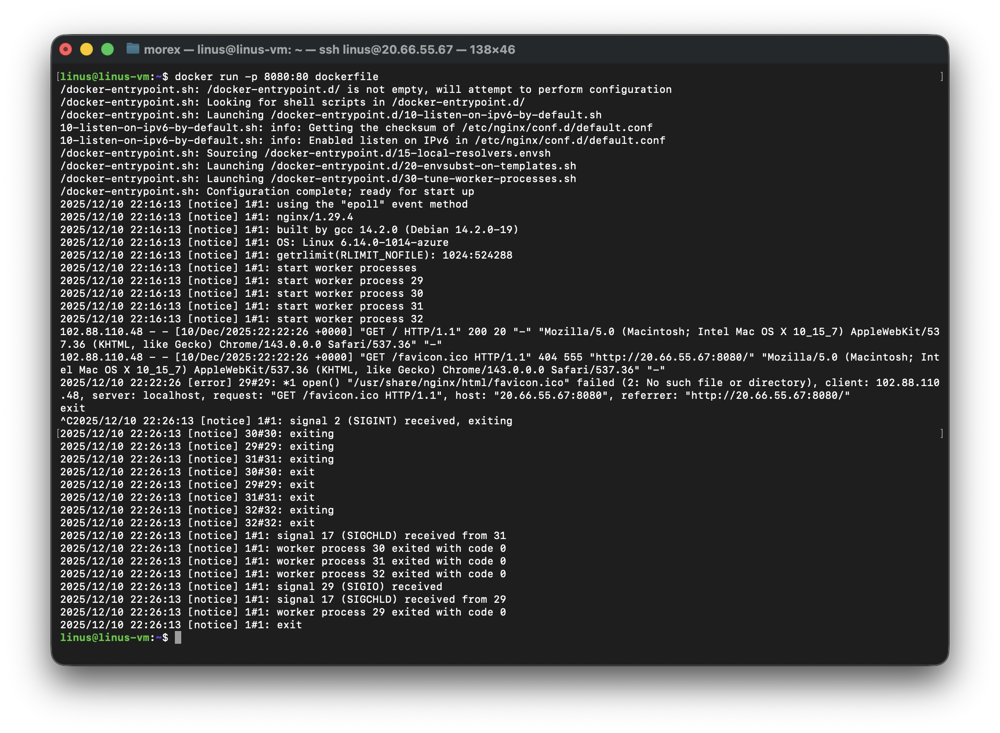
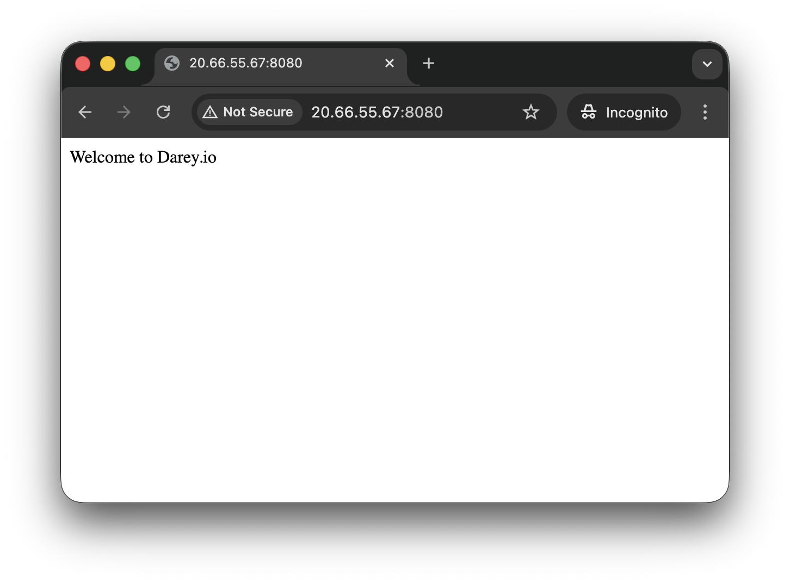
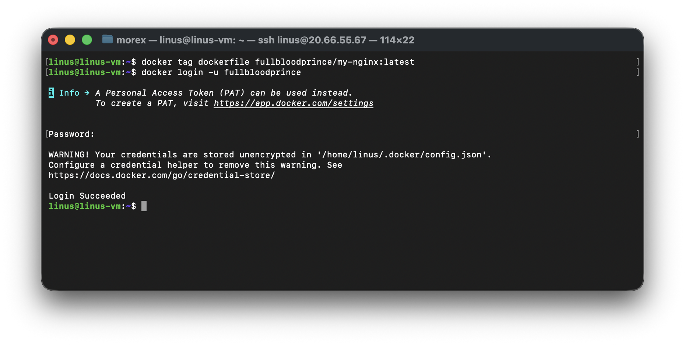
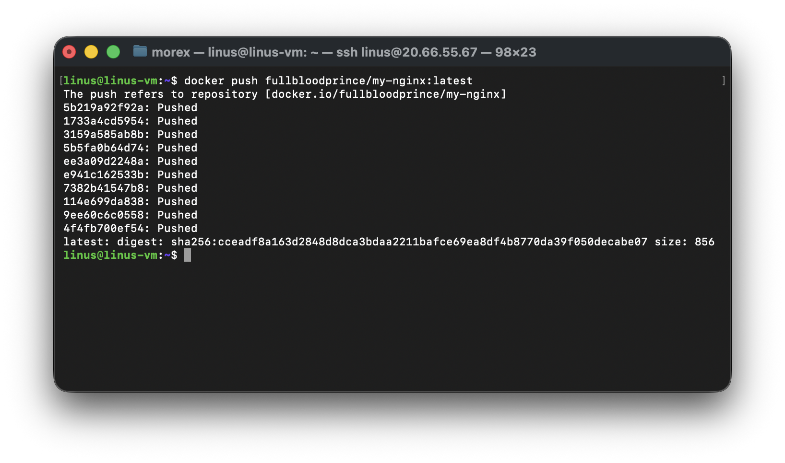
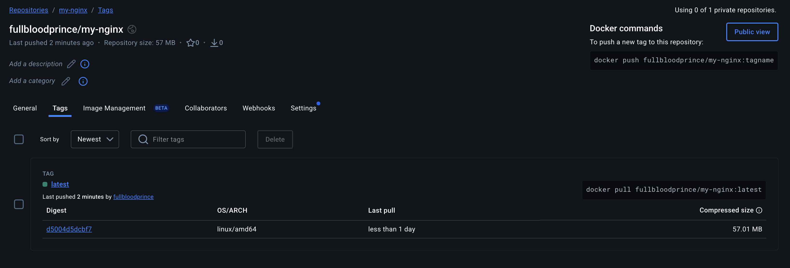

# Working with Docker Images

## Introduction to Docker Images

Docker images are the building blocks of containers. They are lightweight, portable, and self-sufficient packages that contain everything needed to run a software application, including the code, runtime, libraries, anc system tools. Images are created from a set of instructions known as a Dockerfile, which specifies the environment and configuration for the application.

## Pulling Images from Docker Hub

Docker Hub is a cloud-based registry that hosts a vast collection of Docker images. You can pull images from Docker Hub to your local machine using the 'docker pull' commano
To explore available images on Docker Hub, the docker command provides a search subcommand. For instance, to find the Ubuntu image, you can execute:

```bash
docker search ubuntu
```

This command allows you to discover and explore various images hosted on Docker Hub by providing relevant search results. In this case, the output will be similar to this



In the "OFFICIAL" column, the "OK" designation signifies that an image has been constructed and is officially supported by the organization responsible for the project. Once you have identified the desired image, you can retrieve it to your local machine using the "pull" subcommand.

To download the official Ubuntu image to your computer, use the following command:

```bash
docker pull ubuntu
```

Executing this command will fetch the official Ubuntu image from Docker Hub and store it locally on your machine, making it ready for use in creating containers.



Once an image has been successfully downloaded, you can proceed to run a container using that downloaded image by employing the "run" subcommand. Similar to the hello-world example, if an image is not present locally when the 'docker run' subcommand is invoked, Docker will automatically download the required image before initiating the container.

To view the list of images that have been downloaded and are available on your local machine, enter the following command:

```bash
docker images
```

Executing this command provides a comprehensive list of all the images stored locally, allowing you to verify the presence of the downloaded image and gather information about its size, version, and other relevant details.



## Dockerfile

A Dockerfile is a plaintext configuration file that contains a set of instructions for building a Docker image. It serves as a blueprint for creating a reproducible and consistent environment for your application. Dockerfiles are fundamental to the containerization process, allowing you to define the steps to assemble an image that encapsulates your application and its dependencies.

## Creating a Dockerfile
In this dockerfile file, we will be using an nginx image. 'Nginx' is an open source software for web serving, reverse proxying, caching, load balancing, media streaming, and more. It started out as a web server designed for maximum performance and stability. It is recommended you read more on Nginx here

To create a Dockerfile, use a text editor of your choice, such as vim or nano. Start by specifying a base image, defining the working directory, copying files, installing dependencies, and configuring the runtime environment.

Here's a simple example of a Dockerfile for a html file: Let's create an image with using a dockerfile. Paste the code snippet below in a file named 'dockerfile' This example assumes you have a basic HTML file named
`index.html` in the same directory as your Dockerfile.

```docker
# Use the official NGINX base image
FROM nginx:latest

# Set the working directory in the container
WORKDIR  /usr/share/nginx/html/

# Copy the local HTML file to the NGINX default public directory
COPY index.html /usr/share/nginx/html/

# Expose port 80 to allow external access
EXPOSE 80

# No need for CMD as NGINX image comes with a default CMD to start the server
```

Explanation of the code snippet above

1. FROM nginx:latest: Specifies the official NGINX base image from Docker Hub.
2. WORKDIR /usr/share/nginx/html/: Specifies the working directory in the container
3. COPY index.html /usr/share/nginx/html/: Copies the local 'index.html' file to the NGINX default public directory, which is where NGINX serves static content from.
4. EXPOSE 80: Informs Docker that the NGINX server will use port 80. This is a documentation feature and doesn't actually publish the port.
5. CMD: NGINX images come with a default CMD to start the server, so there's no need to specify it explicitly
HTML file named `index.html` in the same directory as your dockerfile.

```bash
echo "Welcome to Darey.io" >> index.html
```

To build an image from this Dockerfile, navigate to the directory containing the file and run:

```bash
docker build -t dockerfile •
```



To run a container based on the custom NGINX image we created with a dockerfile, run the command

```bash
docker run -p 8080:80 dockerfile
```



Running the command above will create a container that listens on port 8080 using the nginx image you created earlier. So you need to create a new rule in security group of the EC2 instance

Let's recall the hands-on project we did in [AWS VPC Security Group Project](../21.security-groups-and-nacls/) Following the steps in the project, We willl add a new security group rule to allow traffic on port 8080.

Now that the container is running, we can access the content on our web browser with `http://publicip_adderss:8080`



## Pushing Docker Images To Docker Hub

Let's recall our git project, where we push changes made on our local computer to a remote repository (github) so everyone can track the chages we made and also collaborate on it. Now that we have created a docker images on our own computer, we need to think about how to reuse this image in the future or how do people in other region make use of this image and possibly collaborate on it. This is where Docker Hub comes in. Let's go ahead and push our image to docker hub

- Create an account on Docker Hub if you don't have one.
- Create a repository on docker hub
- Tag Your Docker Image Before pushing, ensure that your Docker image is appropriately tagged. You typically tag your image with your Docker Hub username and the repository name.

```bash
docker tag <your-image-name> <your-dockerhub-username>/<your-repository-name>:<tag>
```

- Login to Docker hub

```bash
docker login -u ≤your-docker-hub-username>
```

Running the command above will prompt you for a password. Authenticate using your docker hub password



- Push you image to docker hub

```bash
docker push <your-dockerhub-username>/<your-repository-name>:<tag>
```



- Verify the image is in Docker Hub repo



---

## Learning Summary

*   **Docker Images**: Lightweight, portable packages containing everything needed to run an application (code, runtime, libraries, etc.).
*   **Docker Hub**: A cloud-based registry for hosting searching, and sharing Docker images.
*   **Dockerfile**: A text document containing all the commands a user could call on the command line to assemble an image.

## Commands

| Command | Description |
| :--- | :--- |
| `docker search <term>` | Search for images on Docker Hub. |
| `docker pull <image>` | Download an image from Docker Hub to the local machine. |
| `docker images` | List all images stored locally on the machine. |
| `docker build -t <name> .` | Build a Docker image from a Dockerfile in the current directory. |
| `docker run -p <host_port>:<container_port> <image>` | Run a container from an image, mapping ports. |
| `docker tag <image> <repo>/<image>:<tag>` | Tag an image into a target repository/tag (required for pushing). |
| `docker login` | Authenticate with a Docker registry (like Docker Hub). |
| `docker push <repo>/<image>:<tag>` | Upload an image to a registry. |

## Practical Implementation

### 1. Working with Existing Images
*   Searched for and pulled the official `ubuntu` image from Docker Hub.
*   Verified the image download using `docker images`.

### 2. Building a Custom Nginx Image
*   Created a `Dockerfile` using `nginx:latest` as the base image.
*   The Dockerfile configuration:
    *   Set the working directory to `/usr/share/nginx/html/`.
    *   Copied a local `index.html` file into the container.
    *   Exposed port 80.
*   Built the custom image using `docker build`.

### 3. Running and Testing
*   Ran the custom container mapping port `8080` on the host to port `80` on the container.
*   (If on AWS) Configured Security Groups to allow inbound traffic on port 8080.
*   Verified the web server was running by accessing the public IP on port 8080.

### 4. Distribution
*   Tagged the custom image for Docker Hub.
*   Logged into Docker Hub via the CLI.
*   Pushed the tagged image to a public repository for sharing and collaboration.

