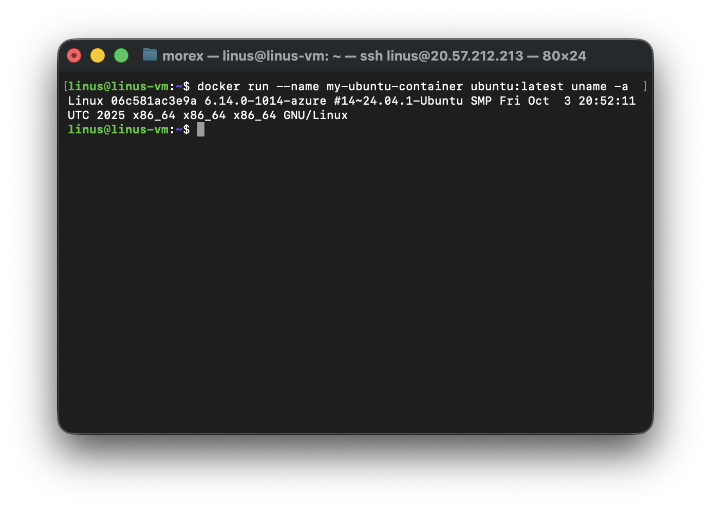
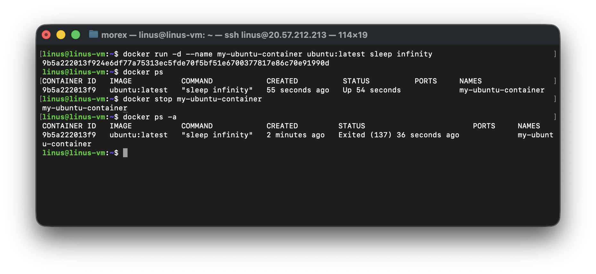
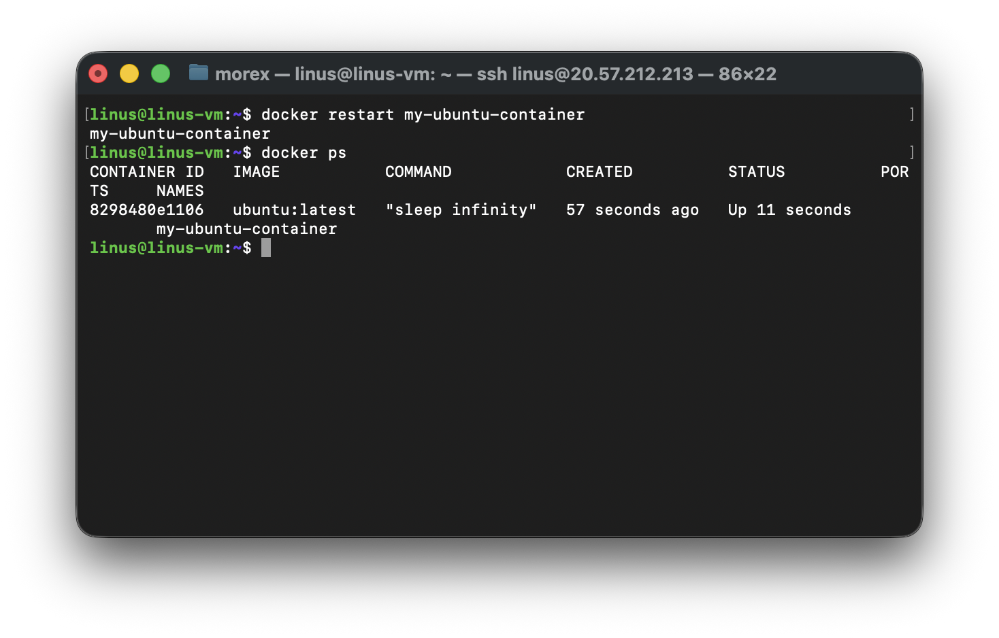
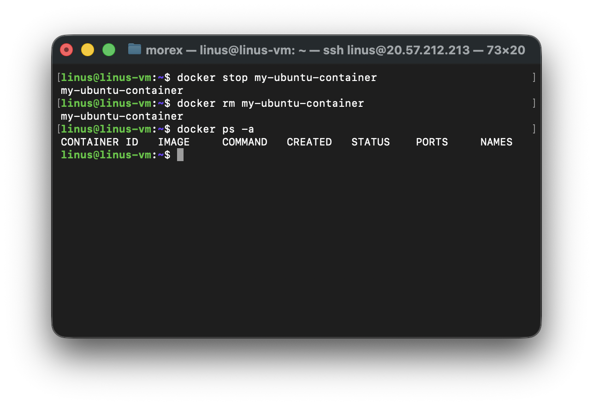
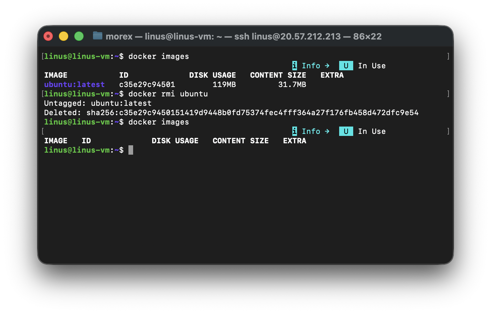

### Running Containers
To run a container, you use the `docker run` command followed by the name of the image you want to use.
Reacall that we pulled an ubuntu image from the official ubuntu repository on docker hub. Let's create a container from the ubuntu image. This command launches a container based on the Ubuntu image.

```bash
docker run ubuntu
docker ps -a
```


```bash
docker start CONTAINER_ID
```
### Launching Containers with Different Options

Docker provides various options to customize the behavior of containers. For example, you can specify environment variables, map ports, and mount volumes. Here's an example of running a container with a specific environment variable:

```bash
docker run -e "MY_VARIABLE=my-value" ubuntu
```
Running Containers in the Background
By default, containers run in the foreground, and the terminal is attached to the container's standard input/output. To run a container in the background, use the `-d` option:

```bash
docker run -d ubuntu
```

This command starts a container in the background, allowing you to continue using the terminal.

### Container Lifecycle

Containers have a lifecycle that includes creating, starting, stopping, and restarting. Once a container is created, it can be started and stopped multiple times.

### Starting, Stopping, and Restarting Containers

- To start a stopped container:

    ```bash
    docker start container_name
    ```
- To stop a running container:

    ```bash
    docker stop container_name
    ```

- To restart a container:

    ```bash
    docker restart container_name
    ```

### Removing Containers

To remove a container, you use the `docker rm` command followed by the container's ID or name

```bash
docker rm container_name
```

This deletes the container, but keep in mind that the associated image remains on your system.

To delete the image we run `docker rmi` command

---


## Task 1: Start a Container and Run a Simple Command

### Start a Container and Display System Information

1. Start a Container and Run a Simple Command: 
    - Use an official Ubuntu image to start a container. If you don't have the image, you can pull it from docker hub 
    - Run a simple command within the container, such as displaying the system information

```bash
# Run a container and execute the 'uname -a' command to display system information
docker run --name my-ubuntu-container ubuntu:latest uname -a
```



## Task 2: Stop the Container and Verify Its Status

### Start a Long-Running Container

First, let's start a container that stays running so we can practice stopping it:

```bash

# Start a container with a long-running process
docker run -d --name my-ubuntu-container ubuntu:latest sleep infinity
```

**Command breakdown:**
- `-d`: Run in detached mode (background)
- `sleep infinity`: Keeps the container running indefinitely

### Verify the Container is Running

```bash
# List running containers
docker ps
# Stop the running container
docker stop my-ubuntu-container
### Verify the Container is Stopped
docker ps -a
```



**Key observations:**
- **STATUS column**: Shows `Exited (137)` indicating the container was stopped
- Exit code 137 = 128 + 9 (SIGKILL signal sent by Docker)
- The container still exists but is not running


## Task 3: Restart the Container and Observe Changes

### Restart the Stopped Container

```bash
# Restart the container
docker restart my-ubuntu-container

# Check running containers
docker ps
```



### Key Observations After Restart:

1. **Container ID remains the same** - The container identity is preserved
2. **Created time doesn't change** - Shows original creation time
3. **Status shows new uptime** - Starts counting from restart
4. **Same command is executed** - `sleep infinity` continues as before
5. **Process ID (PID) may change** - Internal processes get new PIDs


## Task 4: Remove the Container

### Stop the Running Container (if still running)

```bash
# Stop the container
docker stop my-ubuntu-container
# Remove the stopped container
docker rm my-ubuntu-container
# Verify the Container is Removed
docker ps -a
```



Optionally delete the image by running:

```bash
docker rmi ubuntu
```



---

## Summary of Commands

| Operation | Command | Description |
|-----------|---------|-------------|
| Pull image | `docker pull ubuntu:latest` | Download Ubuntu image from Docker Hub |
| Run container | `docker run --name my-ubuntu-container ubuntu uname -a` | Start container and run command |
| Run detached | `docker run -d --name my-ubuntu-container ubuntu sleep infinity` | Start container in background |
| List running | `docker ps` | Show only running containers |
| List all | `docker ps -a` | Show all containers (including stopped) |
| Stop container | `docker stop my-ubuntu-container` | Stop a running container |
| Start container | `docker start my-ubuntu-container` | Start a stopped container |
| Restart container | `docker restart my-ubuntu-container` | Restart a container |
| Remove container | `docker rm my-ubuntu-container` | Remove a stopped container |

---
