# Introduction to Jenkins

## Introduction To CICD

Continuous Integration and Continuous Delivery (CI/CD) is a set of best practices and methodologies that revolutionize the software development lifecycle by enhancing efficiency, reliability, and speed. CI/CD represents a seamless integration of automation and collaboration throughout the development process, aiming to deliver high-quality software consistently and rapidly. In the realm of Cl, developers regularly integrate their code changes into a shared repository, triggering automated builds and tests to detect integration issues early. On the other hand, CD encompasses both Continuous Delivery and Continuous Deployment, ensuring that software is always in a deployable state and automating the deployment process for swift and reliable releases. The CI/CD pipeline fosters a culture of continuous improvement, allowing development teams to iterate quickly, reduce manual interventions, and deliver software with confidence.

## What is Jenkins
Jenkins is widely employed as a crucial CI/CD tool for automating software development processes. Teams utilize Jenkins to automate building, testing, and deploying applications, streamlining the development lifecycle. With Jenkins pipelines, developers can define, version, and execute entire workflows as code, ensuring consistent and reproducible builds. Integration with version control systems allows Jenkins to trigger builds automatically upon code changes, facilitating early detection of issues and enabling teams to deliver high-quality software at a faster pace. Jenkins' flexibility, extensibility through plugins, and support for various tools make it a preferred choice for organizations aiming to implement efficient and automated DevOps practices.

## Project Pre-requisites
- Linux Environment

## Project Goals
By the end of this project, learners should have;
- Developed a foundational understanding of Continuous Integration (CI) and Continuous Delivery (CD) principles, and articulate their role in improving software development processes.
- Acquired proficiency in using Jenkins by mastering installation, configuration, and navigation through the Jenkins user interface, and gain hands-on experience in creating and managing Jenkins jobs.
- Learned the end-to-end process of automating software builds, running automated tests, and deploying applications using Jenkins, fostering a practical understanding of CI/CD pipelines. -Apply best practices in CI/CD processes, including parameterized builds, integration with external tools, and leveraging containerization technologies like Docker

## Project Highlight
- [Introduction To CICD](#introduction-to-cicd)
    - [What is Jenkins](#what-is-jenkins)
- [Project Pre-requisites](#project-pre-requisites)
- [Project Gaols](#project-goals)
- [Getting Started With Jenkins](#getting-started-with-jenkins)
    - [Install Jenkins](#install-jenkins)
    - [Set up Jenkins on the console](#set-up-jenkins-on-the-web-console)
- [Jenkins Job](#jenkins-job)
- [Creating a Freestyle Project](#creating-a-freestyle-project)
- [Connecting Jenkins To Our Source Code Management](#connecting-jenkins-to-our-source-code-management)
- [Configuring Build Trigger](#configuring-build-trigger)
- [Creating a Pipeline Job](#creating-a-pipeline-job)
- [Configuring Build Trigger](#configuring-build-trigger)
- [Writing Jenkins Pipeline Script](#writing-jenkins-pipeline-script)
- [Installing Docker](#installing-docker)
- [Building Pipeline Script](#building-pipeline-script)
- [Compltete Pipeline Configuration](#complete-pipeline-configuration)
- [Learning Summary](#learning-summary)

## Getting Started With Jenkins

### Install Jenkins

Now that we have an idea what jenkins, let's dive in to installing jenkins by running theses commands
```bash
# Update Package Repositories
sudo apt update

# Install JDK
sudo apt install default-jdk-headless

# Install Jenkins
wget -q -O - https://pkg.jenkins.io/debian-stable/jenkins.io.key | sudo apt-key add -
sudo sh -c 'echo deb https://pkg.jenkins.io/debian-stable binary/ > \
/etc/apt/sources.list.d/jenkins.list'
sudo apt update
sudo apt-get install jenkins

# Check if Jenkins is installed and running
sudo systemctl status jenkins
```


Let's recall the hands-on project we did in [AWS VPC Security Group Project](../21.security-groups-and-nacls/) Following the steps in the project, We willl add a new security group rule to allow traffic on port 8080.

### Set up Jenkins On The Web Console
1. Input your Jenkins Instance ip address on your web browser i.e. http://public_ip_address:8080
    

2. On your Jenkins instance, check `/var/lib/jenkins/secrets/initialAdminPassword` to know your password.

    

3. Install suggested Plugins

    

4. Create User Account

    

5. Login to jenkins console

    

## Jenkins Job

In Jenkins, a job is a unit of work or a task that can be executed by the Jenkins automation server.

A Jenkins job represents a specific task or set of tasks that needs to be performed as part of a build or deployment process. Jobs in Jenkins are created to automate the execution of various steps such as compiling code, running tests, packaging applications, and deploying them to servers. Each Jenkins job is configured with a series of build steps, post-build actions, and other settings that define how the job should be executed.


## Creating a Freestyle Project

Let's create our first build job

1. From the dashboard menu on the left side, click on new item

2. Create a freestyle project and name it `my-first-job`

    


## Connecting Jenkins To Our Source Code Management

Now that we have created a freestyle project, let connect jenkins with github.
1. Create a new github repository called `jenkins-scm` with a README.ma file

    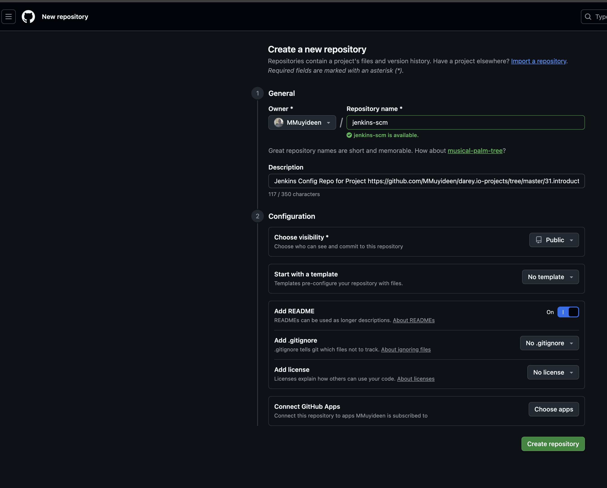

2. Connect `jenkins` to `jenkins-scm` repository by pasting the repository url in the area selected below. Make sure your current branch is `main`

    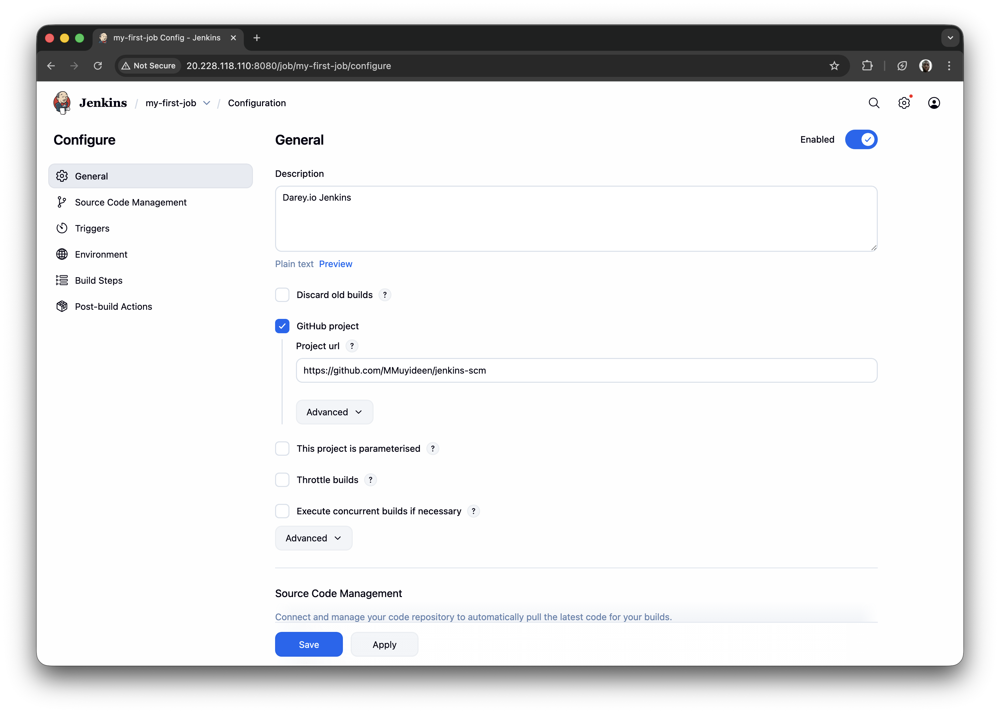

3. Save configuration and run `build now` to connect jenkins to our repository

    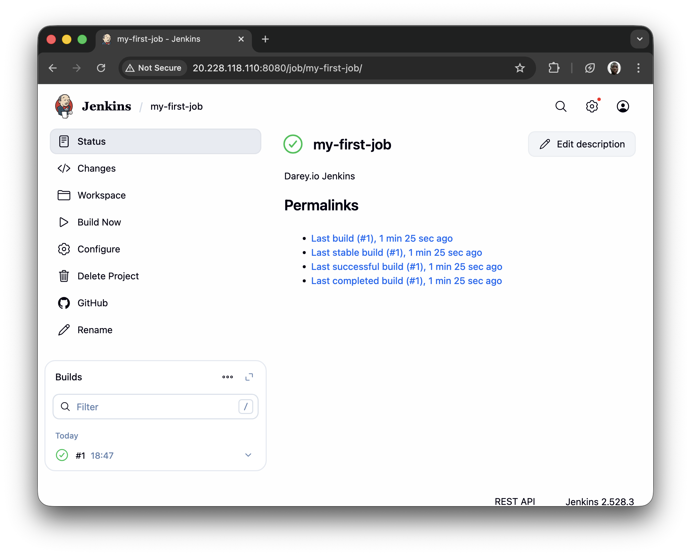

We have successfully connected jenkins with our github repository (jenkins-scm)

## Configuring Build Trigger

As a engineer, we need to be able to automate things and make our work easier in possible ways. We have connected `jenkins` to `jenkins-scm`, but we cannot run a new build with clicking on 'Build Now'. To eliminate this, we need to conflure a build trigger to our jenkins job. With this, jenkins will run a new build anytime a change is made to our github repository

1. Click "Configure" your job and add this configurations
2. Click on build trigger to configure triggering the job from GitHub webhook

    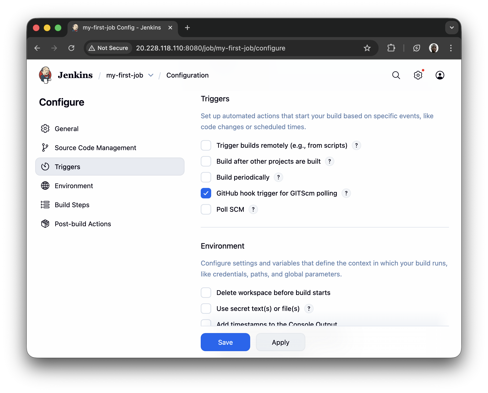

3. Create a github webhook using jenkins ip address and port

    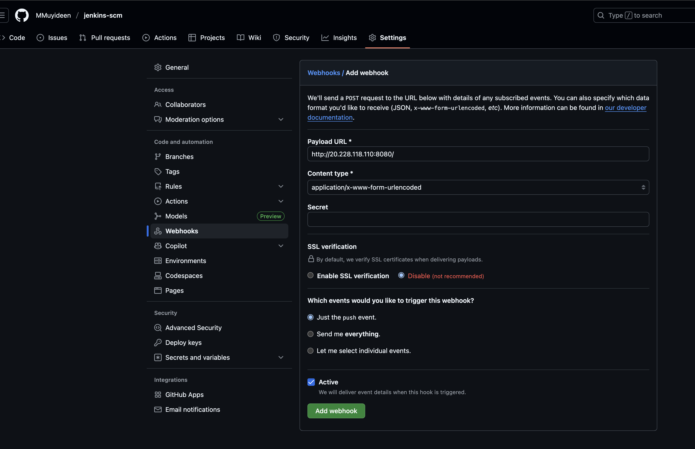
Now, go ahead and make some change in any file in your GitHub repository (e.g. README.MD file) and push the changes to the main branch.

## Creating a Pipeline Job

A Jenkins pipeline job is a way to define and automate a series of steps in the software delivery process. It allows you to script and organize your entire build, test, and deployment. Jenkins pipelines enable organizations to define, visualize, and execute intricate build, test, and deployment processes as code. This facilitates the seamless integration of continuous integration and continuous delivery (CI/CD) practices into software development.

Let's recall our [docker foundations project](../29.working-with-docker-images/README.md) when we created a dockerfile and made a docker image and container with it. Now let's automate the same process with jenkins pipeline code.

Let's create our first pipeline job

1. From the dashboard menu on the left side, click on new item
2. Create a pipeline job and name it `darey-jenkins-pipeline`

    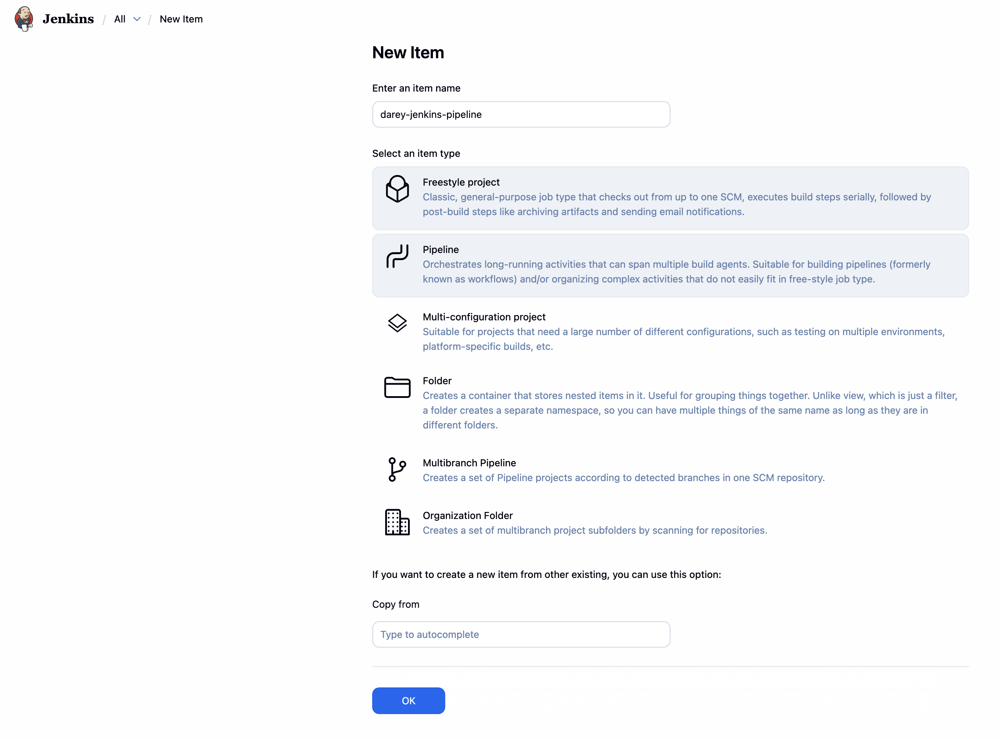


## Writing Jenkins Pipeline Script

A jenkins pipeline script refers to a script that defines and orchestrates the steps and stages of a continuous integration and continuous delivery (CI/CD) pipeline. Jenkins pipelines can be defined using either declarative or scripted syntax. 

Declarative syntax is a more structured and concise way to define pipelines. It uses a domain-specific language to describe the pipeline stages, steps, and other configurations while scripted syntax provides more flexibility and is suitable for complex scripting requirements

Let's write our pipeline script

```groovy
pipeline {
    agent any

    stages {
        stage('Connect To Github') {
            steps {
                checkout scmGit(branches: [[name: '*/main']], extensions: [], userRemoteConfigs: [[url: 'https://github.com/mmuyideen/jenkins-scm.git']])
            }
        }
        
        stage('Build Docker Image') {
            steps {
                script {
                    sh 'docker build -t dockerfile .'
                }
            }
        }
        
        stage('Run Docker Container') {
            steps {
                script {
                    sh 'docker run -itd -p 8081:80 dockerfile'
                }
            }
        }
    }
}

```

### Explanation of the script above

The provided Jenkins pipeline script defines a series of stages for a continuous integration and continuous delivery (CI/CD) process. Let's break down each stage:

**Agent  Configuration**: Specifies that the pipeline can run on any available agent (an agent can either be a jenkins master or node). This means the pipeline is not tied to a specific node type.

```
agent any
``` 

**Stages**: Defines the various stages of the pipeline, each representing a phase in the software delivery process.

```
stages {"
// Stages go here\n
"}
```

**Stage 1: Connect To Github:**: This stage checks out the source code from a GitHub repository `https://github.com/mmuyideen/jenkins-scm.git`. It specifies that the pipeline should use the `main` branch.

```
stage('Connect To Github') {"\n      steps {\n         checkout scmGit(branches: [[name: '*/main']], extensions: [], userRemoteConfigs: [[url: 'https://github.com/RidwanAz/jenkins-scm.git']])\n      "}
}
```


**Stage 2: Build Docker Image:**: 
- This stage builds a Docker image named 'dockerfile' using the source code obtained from the GitHub repository. 
- The `docker build` command is executed using the shell (`sh`).

```
stage('Build Docker Image') {"\n      steps {\n         script {\n            sh 'docker build -t dockerfile .'\n         "}
   }
}
```

**Stage 3: Run Docker Containers:**: 
- This stage runs a Docker container named `nginx` in detached mode (`-itd`).
- The container is mapped to port 8081 on the host machine (`-p 8081:80`).
- The Docker image used is the one built in the previous stage (`dockerfile`).

```
stage('Run Docker Container') {"\n      steps {\n         script {\n            sh 'docker run -itd --name nginx -p 8081:80 dockerfile'\n         "}
   }
}
```

Copy the pipeline script and paste it in the section below

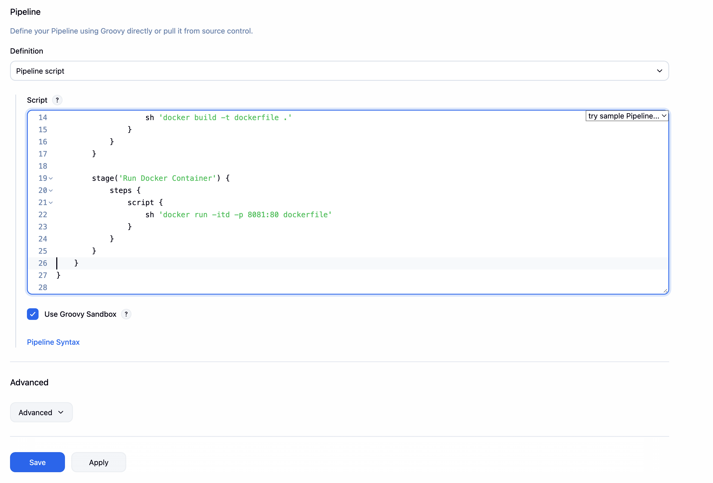

The stage 1 of the script connects jenkins to github repository. To generate syntax for your github repository, follow the steps below

1. Click on the pipeline syntax

2. Select the drop down to search for `checkout: Check out from version control`

    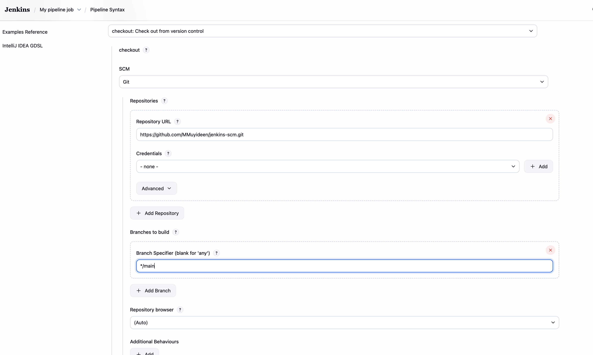

3. Paste the repository url and make sure your branch is main

4. Generate the pipeline script

    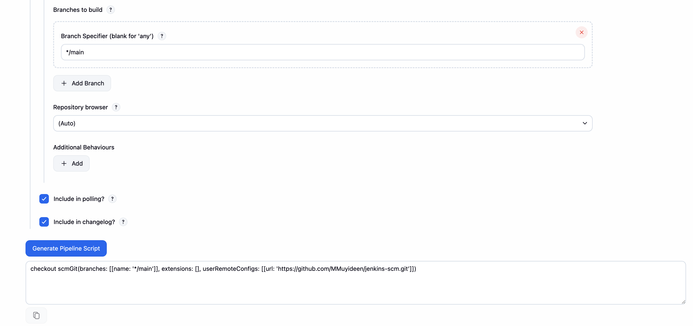

Now We can replace the generated script for connect jenkins with github.

## Installing Docker

Before jenkins can run docker commands, we need to install docker on the same instance jenkins was installed. From our shell scripting knownledge, let's install docker with shell script

1. Create a file named `docker.sh`
2. Open the file and paste the script below

```bash
# Add Docker's official GPG key:
sudo apt update
sudo apt install ca-certificates curl
sudo install -m 0755 -d /etc/apt/keyrings
sudo curl -fsSL https://download.docker.com/linux/ubuntu/gpg -o /etc/apt/keyrings/docker.asc
sudo chmod a+r /etc/apt/keyrings/docker.asc

# Add the repository to Apt sources:
sudo tee /etc/apt/sources.list.d/docker.sources <<EOF
Types: deb
URIs: https://download.docker.com/linux/ubuntu
Suites: $(. /etc/os-release && echo "${UBUNTU_CODENAME:-$VERSION_CODENAME}")
Components: stable
Signed-By: /etc/apt/keyrings/docker.asc
EOF

sudo apt update

# Install Docker
sudo apt install docker-ce docker-ce-cli containerd.io docker-buildx-plugin docker-compose-plugin # Install latest version of docker
sudo usermod -aG docker ubuntu # Run docker with superuser priviledges
sudo systemctl status docker # verify that docker has been successfully  installed
```
3. Save and close the file

4. Make the file executable

```bash
chmod u+x docker.sh
```

5. Execute the file

    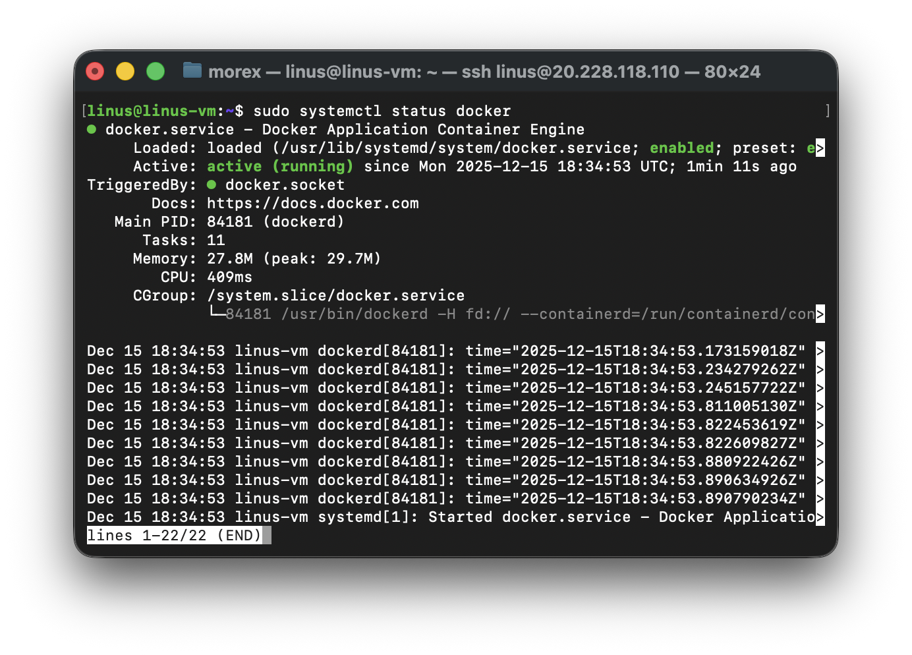

## Building Pipeline Script

Now that we have docker installed on the same instance with jenkins, we need to create a dockerfile before we can run our pipeline script. As we know, we cannot build a docker image without a dockerfile. 

1. Create a new file named 'dockerfile"
2. Paste the code snippet below in the file

```dockerfile
# Use the official NGINX base image
FROM nginx: latest
# Set the working directory in the container
WORKDIR /usr/share/nginx/html/
# Copy the local HTML file to the NGINX default public directory
CoPY index.html /usr/share/nginx/html/
# Expose port 80 to allow external access
EXPOSE 80
```

3. Create an `index.html` file and paste the content below

```
Congratulations, You have successfully run your first pipeline code.
```
4. Put the pipeline script in a file named `Jenkinsfile` and save in the `jenkins-scm` repo

## Complete Pipeline Configuration

1. Click configure on the pipeline page

2. Under triggers, click on `GitHub hook trigger for GITScm polling`

    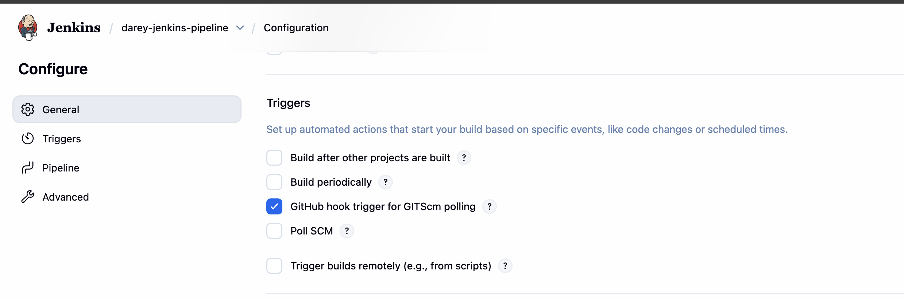

3. Change Pipeline definition to `Pipeline script from scm`
    - choose git under scm
    - put the jenkins-scm repo url under Repository URL

4. click on save

    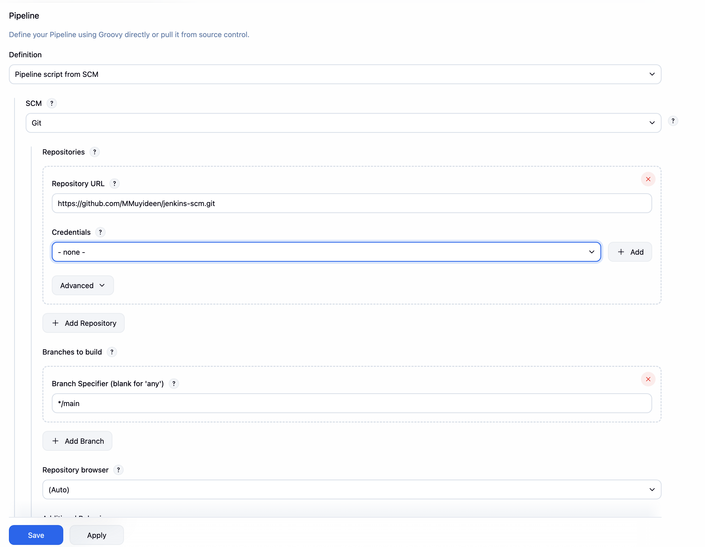

Pushing to the remote `jenkins-scm` repo will use the webhook to send a request to jenkins to automatically run new build for our pipeline.

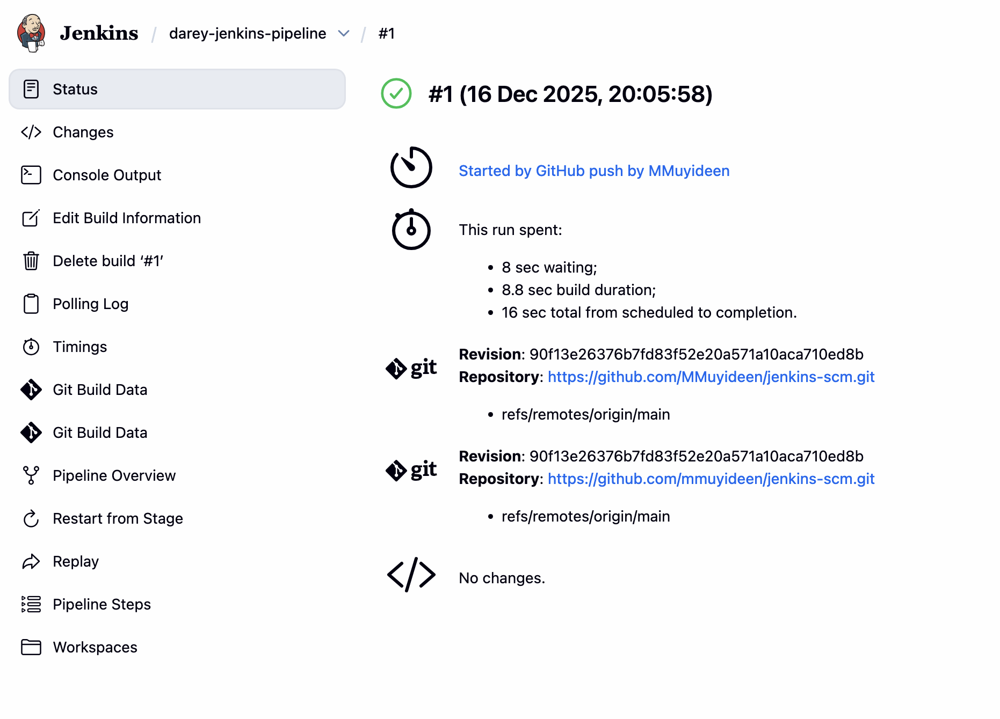

We can try to access our App by navigating to `http://<server ip>:8081`
> 💡 Ensure the Port 8081 is open on the instance security group


## Learning Summary

In this module, We have learned the core concepts of Continuous Integration and Continuous Delivery (CI/CD) and how to implement them using Jenkins. Key takeaways include:

- **CI/CD Fundamentals**: Understanding how CI/CD pipelines automate software delivery, improve code quality, and accelerate release cycles.
- **Jenkins Setup**: Installing and configuring Jenkins on a Linux server, setting up the web console, and managing plugins and users.
- **Job Management**: Creating and configuring both Freestyle projects and Pipeline jobs to execute build tasks.
- **Pipeline-as-Code**: Writing declarative Jenkins pipelines (`Jenkinsfile`) to define build stages, including checking out code from GitHub, building Docker images, and running containers.
- **Integration & Automation**: Connecting Jenkins to GitHub via webhooks to trigger builds automatically on code changes, and integrating Docker for containerized builds.
- **Practical Implementation**: Successfully built an end-to-end pipeline that automates the deployment of a simple web application using Nginx and Docker.
