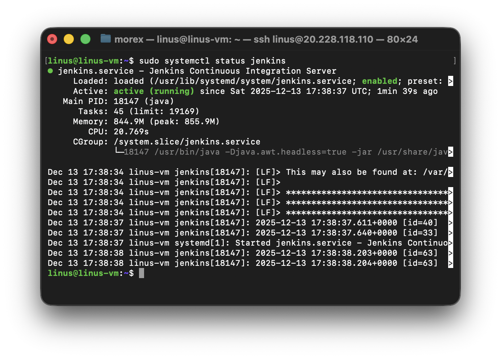
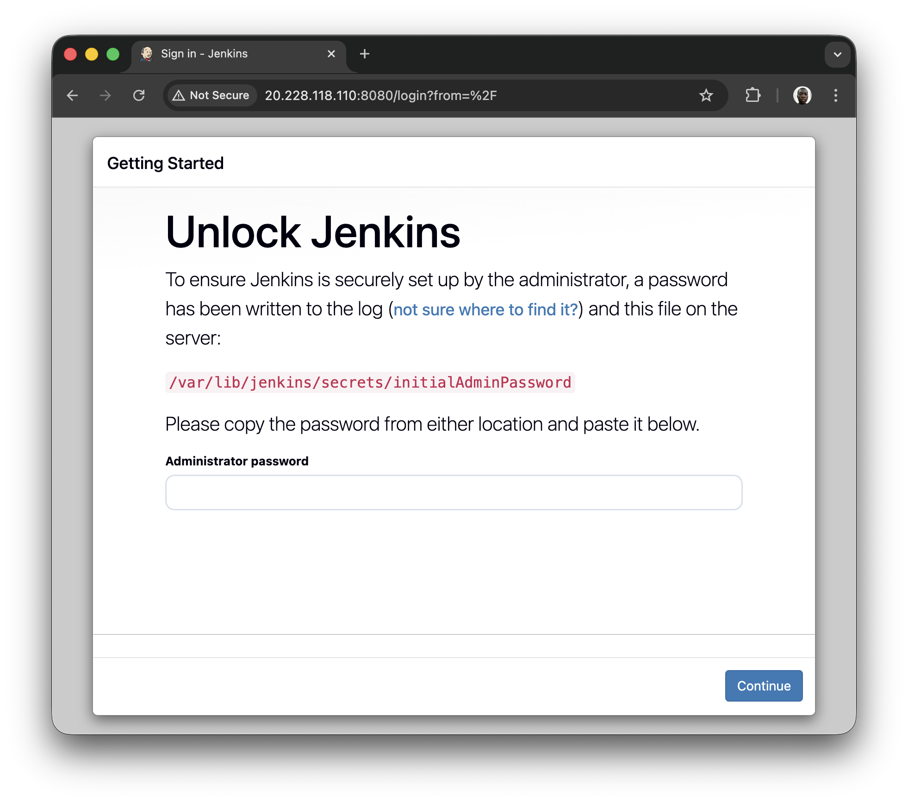
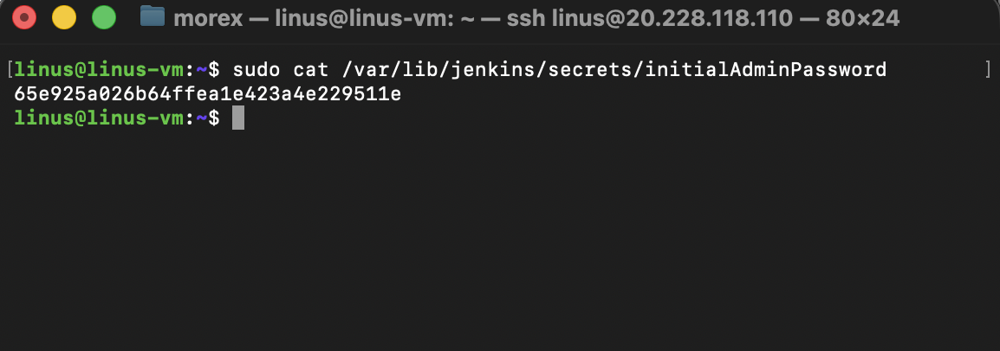
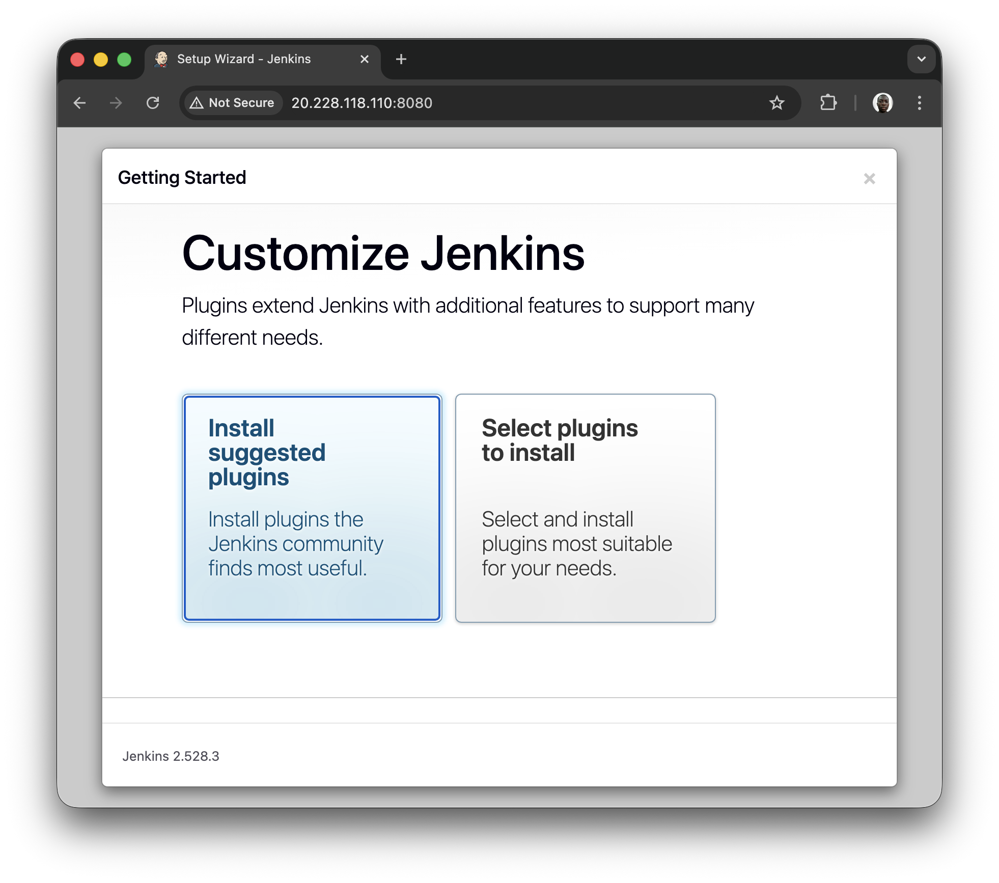
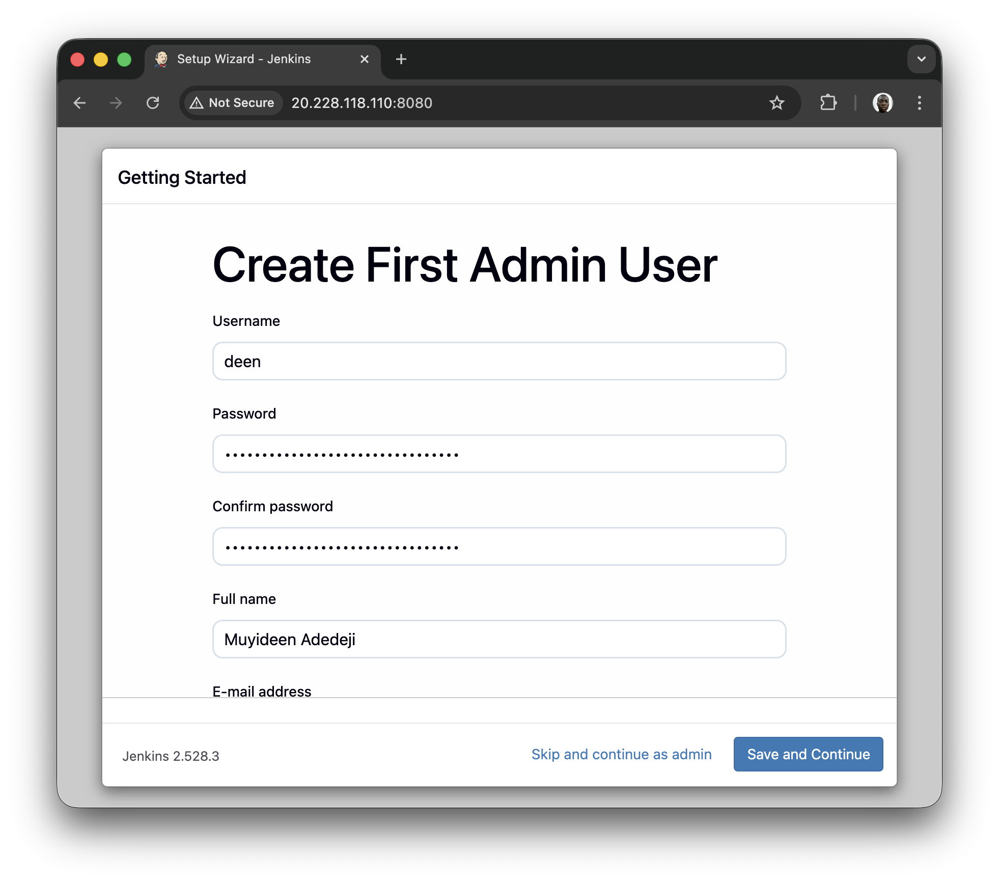
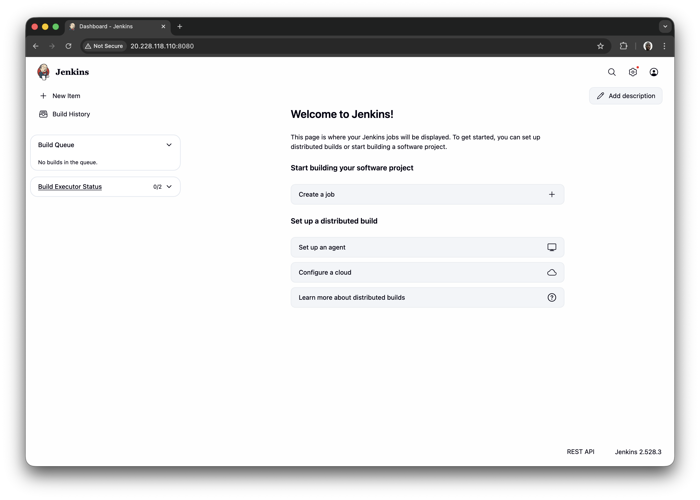

# Introduction to Jenkins

## Introduction To CICD

Continuous Integration and Continuous Delivery (CI/CD) is a set of best practices and methodologies that revolutionize the software development lifecycle by enhancing efficiency, reliability, and speed. CI/CD represents a seamless integration of automation and collaboration throughout the development process, aiming to deliver high-quality software consistently and rapidly. In the realm of Cl, developers regularly integrate their code changes into a shared repository, triggering automated builds and tests to detect integration issues early. On the other hand, CD encompasses both Continuous Delivery and Continuous Deployment, ensuring that software is always in a deployable state and automating the deployment process for swift and reliable releases. The CI/CD pipeline fosters a culture of continuous improvement, allowing development teams to iterate quickly, reduce manual interventions, and deliver software with confidence.

## What is Jenkins
Jenkins is widely employed as a crucial CI/CD tool for automating software development processes. Teams utilize Jenkins to automate building, testing, and deploying applications, streamlining the development lifecycle. With Jenkins pipelines, developers can define, version, and execute entire workflows as code, ensuring consistent and reproducible builds. Integration with version control systems allows Jenkins to trigger builds automatically upon code changes, facilitating early detection of issues and enabling teams to deliver high-quality software at a faster pace. Jenkins' flexibility, extensibility through plugins, and support for various tools make it a preferred choice for organizations aiming to implement efficient and automated DevOps practices.

## Project Pre-requisites
- Linux Environment

## Project Goals
By the end of this project, learners should have;
- Developed a foundational understanding of Continuous Integration (CI) and Continuous Delivery (CD) principles, and articulate their role in improving software development processes.
- Acquired proficiency in using Jenkins by mastering installation, configuration, and navigation through the Jenkins user interface, and gain hands-on experience in creating and managing Jenkins jobs.
- Learned the end-to-end process of automating software builds, running automated tests, and deploying applications using Jenkins, fostering a practical understanding of CI/CD pipelines. -Apply best practices in CI/CD processes, including parameterized builds, integration with external tools, and leveraging containerization technologies like Docker

## Project Highlight
- [Introduction To CICD](#introduction-to-cicd)
    - [What is Jenkins](#what-is-jenkins)
- [Project Pre-requisites](#project-pre-requisites)
- [Project Gaols](#project-goals)
- [Getting Started With Jenkins](#getting-started-with-jenkins)
    - [Install Jenkins](#install-jenkins)
    - [Set up Jenkins on the console](#set-up-jenkins-on-the-web-console)
- [Jenkins Job](#jenkins-job)
- [Creating a Freestyle Project](#creating-a-freestyle-project)
- [Connecting Jenkins To Our Source Code Management](#connecting-jenkins-to-our-source-code-management)
- [Configuring Build Trigger](#configuring-build-trigger)
- [Creating a Pipeline Job](#creating-a-pipeline-job)
- [Configuring Build Trigger](#configuring-build-trigger)
- [Writing Jenkins Pipeline Script](#writing-jenkins-pipeline-script)
- [Installing Docker](#installing-docker)
- [Building Pipeline Script](#building-pipeline-script)


## Getting Started With Jenkins

### Install Jenkins

Now that we have an idea what jenkins, let's dive in to installing jenkins by running theses commands
```bash
# Update Package Repositories
sudo apt update

# Install JDK
sudo apt install default-jdk-headless

# Install Jenkins
wget -q -O - https://pkg.jenkins.io/debian-stable/jenkins.io.key | sudo apt-key add -
sudo sh -c 'echo deb https://pkg.jenkins.io/debian-stable binary/ > \
/etc/apt/sources.list.d/jenkins.list'
sudo apt update
sudo apt-get install jenkins

# Check if Jenkins is installed and running
sudo systemctl status jenkins
```


Let's recall the hands-on project we did in [AWS VPC Security Group Project](../21.security-groups-and-nacls/) Following the steps in the project, We willl add a new security group rule to allow traffic on port 8080.

### Set up Jenkins On The Web Console
1. Input your Jenkins Instance ip address on your web browser i.e. http://public_ip_address:8080
    

2. On your Jenkins instance, check `/var/lib/jenkins/secrets/initialAdminPassword` to know your password.

    

3. Install suggested Plugins

    

4. Create User Account

    

5. Login to jenkins console

    

## Jenkins Job

In Jenkins, a job is a unit of work or a task that can be executed by the Jenkins automation server.

A Jenkins job represents a specific task or set of tasks that needs to be performed as part of a build or deployment process. Jobs in Jenkins are created to automate the execution of various steps such as compiling code, running tests, packaging applications, and deploying them to servers. Each Jenkins job is configured with a series of build steps, post-build actions, and other settings that define how the job should be executed.


## Creating a Freestyle Project

Let's create our first build job

1. From the dashboard menu on the left side, click on new item

2. Create a freestyle project and name it `my-first-job`

    


## Connecting Jenkins To Our Source Code Management

Now that we have created a freestyle project, let connect jenkins with github.
1. Create a new github repository called `jenkins-scm` with a README.ma file
2. Connect `jenkins` to `jenkins-scm` repository by pasting the repository url in the area selected below. Make sure your current branch is `main`
ili. Save configuration and run "build now" to connect jenkins to our repository

## Creating a Pipeline Job
## Configuring Build Trigger
## Writing Jenkins Pipeline Script
## Installing Docker
## Building Pipeline Script