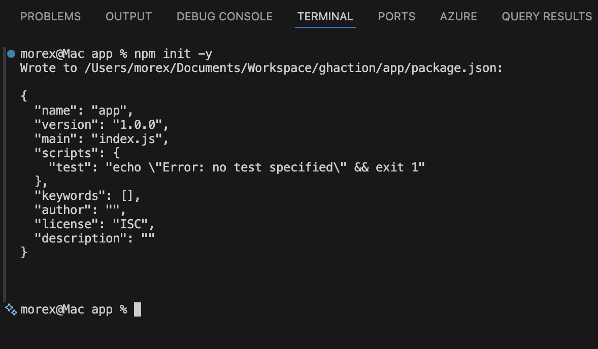
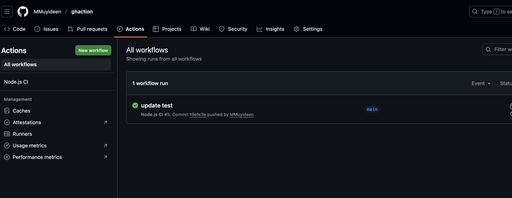
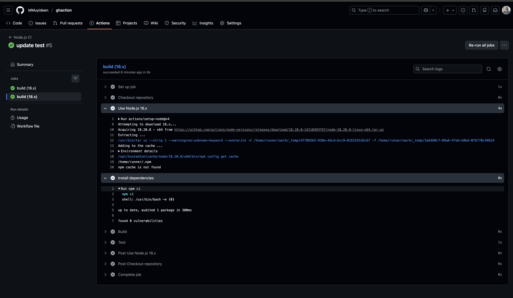

# Introduction to Continuous Integration and Continuous Delivery/Deployment

The project will involve setting up a simple web application (e.g., a Node.js application) and applying CI/CD practices using GitHub Actions. This application will have basic functionality, such as serving a static web page.

## Introduction to GitHub Actions and CI/CD Course Project

Welcome to our course on GitHub Actions and Continuous Integration/Continuous Deployment (CI/CD). This course is designed to provide a hands-on learning experience, guiding you through the essentials of automating software development processes using GitHub Actions. Whether you're a developer, a student, or just curious about CI/CD practices, this course will equip you with the practical skills and knowledge you need to implement these powerful automation techniques in your projects.

# Why is This Relevant for Learners?
Imagine you're a chef in a busy restaurant. Every dish you prepare is like a piece of software code. Without a systematic approach, you might end up with orders being mixed up, dishes taking too long to prepare, or worse, the quality of the food being inconsistent. This is where a well-organized kitchen, with clear processes and automation (like having appliances that precisely time and cook parts of the dishes), comes into play. In software development, CI/CD is akin to this efficient kitchen. It ensures that your 'dishes' (software builds) are consistently 'cooked' (built, tested, and deployed) with precision and efficiency. By learning GitHub Actions and CI/CD, you're essentially learning how to set up and manage your high-tech kitchen in the software world, allowing you to serve 'dishes' faster, with higher quality, and with fewer 'kitchen mishaps' (bugs and deployment issues).

This course will help you understand and implement these practices, making your software development process more efficient and error-free, much like a well-orchestrated kitchen. Whether you're working on personal projects, contributing to open source, or building enterprise-level applications, mastering CI/CD with GitHub Actions will be an invaluable skill in your development toolkit.

## PREREQUISITES

1. Basic Knowledge of Git and GitHub:
    - Understanding of version control concepts.
    - Familiarity with basic Git operations like clone, commit, push, and pull.
    - A GitHub account and knowledge of repository management on GitHub.

2. Understanding of Basic Programming Concepts:
    - Fundamental programming knowledge, preferably in JavaScript, as the example project uses Node.js.
    - Basic understanding of how web applications work.

3. Familiarity with Node.js and npm:
    - Basic knowledge of Node.js and npm (Node Package Manager).
    - Ability to set up a simple Node.js project and install dependencies using npm.

4. Text Editor or IDE:
    - A text editor or Integrated Development Environment (IDE) like Visual Studio Code, Atom, Sublime Text, or any preferred editor for writing and editing code.

5. Local Development Environment:
    - Node.js and npm installed on the local machine.
    - Access to the command line or terminal.

6. Internet Connection:
    - Stable internet connection to access GitHub and potentially other online resources or documentation.

7. Basic Understanding of CI/CD Concepts (Optional but Helpful):
    - General awareness of Continuous Integration and Continuous Deployment concepts.
    - This can be part of the learning in the course, but prior knowledge is beneficial.

## Lesson 1: Understanding Continuous Integration and Continuous Deployment

### Objectives:

1. Define CI/CD and understand its benefits.
2. Get familiar with the CI/CD pipeline.

### Lesson Details:
1. **Definition and Benefits of CI/CD:**

    - **Continuous Integration (CI)** is the practice of merging all developers' working copies to a shared mainline several times a day.
    - **Continuous Deployment (CD)** is the process of releasing software changes to production automatically and reliably.
    - **Benefits**: Faster release rate, improved developer productivity, better code quality, and enhanced customer satisfaction.

2. **Overview of the CI/CD Pipeline:**

    - **CI Pipeline** typically includes steps like version control, code integration, automated testing, and building the application.
    - **CD Pipeline** involves steps like deploying the application to a staging or production environment, and post-deployment monitoring.
    - **Tools**: Version control systems (e.g., Git), CI/CD platforms (e.g., GitHub Actions), testing frameworks, and deployment tools.

## Lesson 2: Introduction to GitHub Actions

### Objectives:

1. Understand what GitHub Actions is.
2. Learn key concepts and terminology.

### Lesson Details:

- **GitHub Actions**: A CI/CD platform integrated into GitHub, automating the build, test, and deployment pipelines of your software directly within your GitHub

- **Documentation Reference**: Explore the [GitHub Actions Documentation](https://docs.github.com/en/actions) for in-depth understanding.

Key Concepts and Terminology:

1. **Workflow**:
    - **Definition**: A configurable automated process made up of one or more jobs. Workflows are defined by a YAML file in your repository.
    - **Example**: A workflow to test and deploy a Node.js application upon a Git push.
    - **Documentation**: Learn more about workflows in the [GitHub Docs on Workflows](https://docs.github.com/en/actions/how-tos/write-workflows).

2. **Event**:
    - **Definition**: A specific activity that triggers a workflow. Events include activities like push, pull request, issue creation, or even a scheduled time.
    - **Example**: A 'push' event triggers a workflow that runs tests every time code is pushed to any branch in a repository.
    - **Documentation**: Review different types of events in the [Events that trigger workflows section](https://docs.github.com/en/actions/reference/workflows-and-actions/events-that-trigger-workflows).

3. **Job**:
    - **Definition**: A set of steps in a workflow that are executed on the same runner. Jobs can run sequentially or in parallel.
    - **Example**: A job that runs tests on your application.
    - **Documentation**: Understand jobs in detail in the [GitHub Docs on Jobs](https://docs.github.com/en/actions/how-tos/write-workflows/choose-what-workflows-do).

4. **Step**:
    - **Definition**: An individual task that can run commands within a job. Steps can run scripts or actions.
    - **Example**: A step in a job to install dependencies (`npm install`).
    - **Documentation**: Learn about steps in the [Steps section of GitHub Docs](https://docs.github.com/en/actions/reference/workflows-and-actions/workflow-syntax#jobsjob_idsteps).

5. **Action**:
    - **Definition**: Standalone commands combined into steps to create a job. Actions can be written by you or provided by the GitHub community.
    - **Example**: Using 'actions/checkout' to check out your repository code.
    - **Documentation**: Explore GitHub Actions in the [Marketplace](https://github.com/marketplace?type=actions) and learn how to create your own in the [Creating actions guide](https://docs.github.com/en/actions/how-tos/reuse-automations).

6. **Runner**:
    - **Definition**: A server that runs your workflows when they're triggered. Runners can be hosted by GitHub or self-hosted.
    - **Example**: A GitHub-hosted runner that uses Ubuntu.
    - **Documentation**: Delve into runners in the [GitHub Docs on Runners](https://docs.github.com/en/actions/how-tos/manage-runners/github-hosted-runners).

### Additional Resources:

- **GitHub Learning Lab**: Interactive courses to learn GitHub Actions. Visit [GitHub Learning Lab](https://github.com/apps/github-learning-lab).

- **GitHub Actions Quickstart**: For a hands-on introduction, check out the [Quickstart for GitHub Actions](https://docs.github.com/en/actions/get-started/quickstart).

- **Community Forums**: Engage with the GitHub community for questions and discussions at [GitHub Community Forums](https://github.com/orgs/community/discussions/).

## Practical Implementation

### Setting Up the Project:

1. Initialize a GitHub Repository:
   - Create a new repository on GitHub.
   - Clone it to your local machine.
   
   

2. Create a Simple Node.js Application:
    - Initialize a Node.js project `npm init` & `npm install express`
    - Create a simple server using Express.js to serve a static web page.
    - Add your code to the repository and push it to GitHub.

    ```javascript
    // Example: index.js
    const express = require('express');
    const app = express();
    const port = process.env.PORT || 3000;

    app.get('/', (req, res) => {"\n     res.send('Hello World!');\n   "});

    app.listen(port, () => {
    console.log(`App listening at http://localhost:${port}`);
    });
    ```
    

3. Writing Your First GitHub Action Workflow:
    - Create a `.github/workflows` directory in your repository.
    - Add a workflow file (e.g., `node-js.yml`).

```yml
# yaml-language-server: $schema=https://json.schemastore.org/github-workflow.json
# Name of the workflow
name: Node.js CI

# Specifies when the workflow should be triggered
on:
  # Trigger on push to main
  push:
    branches:
      - main

  # Trigger on pull requests targeting main
  pull_request:
    branches:
      - main

# Defines the jobs that the workflow will execute
jobs:
  build:
    # Runner environment
    runs-on: ubuntu-latest

    # Matrix strategy to test multiple Node versions
    strategy:
      matrix:
        node-version: [16.x, 18.x]

    # Steps executed in order
    steps:
      # Checkout the repository
      - name: Checkout repository
        uses: actions/checkout@v4

      # Setup Node.js
      - name: Use Node.js ${{ matrix.node-version }}
        uses: actions/setup-node@v4
        with:
          node-version: ${{ matrix.node-version }}
          cache: npm

      # Install dependencies
      - name: Install dependencies
        run: npm ci

      # Build the application (only if build script exists)
      - name: Build
        run: npm run build --if-present

      # Run tests
      - name: Test
        run: npm test

```

#### Explanation:

1. **name**: This simply names your workflow. It's what appears on GitHub when the workflow is running.
2. **on**: This section defines when the workflow is triggered. Here, it's set to activate on push and pull request events to the main branch.
3. **jobs**: Jobs are a set of steps that execute on the same runner. In this example, there's one job named `build`
4. **runs-on**: Defines the type of machine to run the job on. Here, it's using the latest Ubuntu virtual machine.
5. **strategy.matrix**: This allows you to run the job on multiple versions of Node.js, ensuring compatibility.
6. **steps**: A sequence of tasks executed as part of the job.
    - `actions/checkout@v2`: Checks out your repository under `$GITHUB_WORKSPACE`.
    - `actions/setup-node@v1`: Sets up the Node.js environment.
    - `npm ci`: Installs dependencies defined in `package-lock. json`.
    - `npm run build --if-present`: Runs the build script from `package. json` if it's present.
    - `npm test`: Runs tests specified in `package. json`


This workflow is a basic example for a Node.js project, demonstrating how to automate testing across different Node.js versions and ensuring that your code integrates and works as expected in a clean environment.


4. Testing and Deployment:

- Add automated tests for your application.

    - Install Test Dependencies

        ```bash
        npm install --save-dev jest supertest
        ```

    - Update `package.json`
        ```json
        {
        "scripts": {
            "start": "node index.js",
            "test": "jest"
        }
        }
        ```
    - Create `__tests__/app.test.js`
        ```javascript
        const request = require('supertest');
        const express = require('express');

        const app = express();
        app.get('/', (req, res) => res.send('Hello World!'));

        describe('GET /', () => {
        it('should return Hello World', async () => {
            const res = await request(app).get('/');
            expect(res.statusCode).toBe(200);
            expect(res.text).toBe('Hello World!');
        });
        });

        ```


- Create a workflow for deployment (e.g., to a cloud service like Heroku or AWS). 
    - Add the below snippet to the yaml file to deploy to Heroku. Ensure to save the API key securely in Github secret

    ```yaml
    - name: Install Heroku CLI # <- IMPORTANT!!! Make sure the cli is installed before using the action
    uses: actions/checkout@v2
    run: |
    curl https://cli-assets.heroku.com/install.sh | sh

    - name: Deploy to Heroku
        if: github.event_name == 'push' && github.ref == 'refs/heads/main'
        uses: akhileshns/heroku-deploy@v3.14.15 # This is the action
        with:
        heroku_api_key: ${{ secrets.HEROKU_API_KEY }}
        heroku_app_name: "your-unique-heroku-app-name" # must be unique in Heroku
        heroku_email: "your-email@example.com"
    ```

5. Experiment and Learn:

- Modify workflows to see how changes affect the CI/CD process.
- Try adding different types of tests (unit tests, integration tests).

    - Install ESLint for Code Quality checks
        ```bash
        npm install --save-dev eslint
        npx eslint --init
        ```

    - update `package.json` with lint script
        ```json
        "scripts": {
        "lint": "eslint ."
        }
        ```

    - update yaml script
        ```yaml
        - name: Run ESLint
          run: npm run lint
        ```

The full script can be found [here](./node.yaml) and here is the [Repository](https://github.com/MMuyideen/node-ci-cd-demo) which contains the full code


## Checking the Pipeline Run

After Pushing the code to remote repository on Github, we can see the Github Action run on Github



Clicking on the Run , we can see the steps being executed



## LEARNING SUMMARY

- **What we learned:** Core CI/CD concepts (Continuous Integration, Continuous Deployment), how GitHub Actions workflows run, and key terminology: workflows, events, jobs, steps, actions, and runners.

- **Hands-on skills acquired:** Creating a simple Node.js project, adding a `.github/workflows` workflow, running tests across Node versions using a matrix, and inspecting workflow runs and logs on GitHub.

- **Best practices introduced:** Keep workflows minimal and reproducible, cache dependencies, use the matrix strategy for compatibility testing.

- **Next steps to practice:** Add automated unit and integration tests, create deployment workflows (staging → production), explore environment protection rules and branch protection, and try self-hosted runners or deploying to a cloud provider.