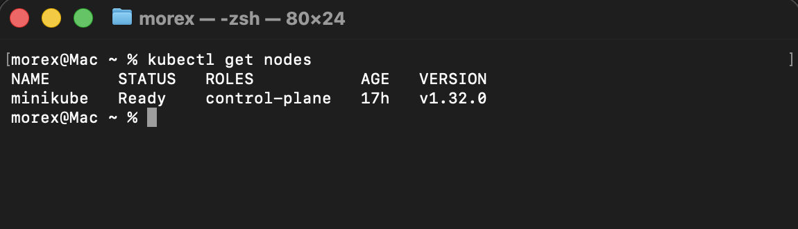

# Working with Kubernetes 

## Working with Kubernetes Nodes

### Kubernetes Nodes

Now that we have our minikube cluster setup, let's dive into nodes in kubernetes

### What Is a Node?

In Kubernetes, think of a node as a dedicated worker, like a dependable employee in an office, responsible for executing tasks and hosting containers to ensure seamless application performance. A **Kubernetes Node** is a physical or virtual machine that runs the Kubernetes software and serves as a worker machine in the cluster. Nodes are responsible for running Pods, which are the basic deployable units in Kubernetes. Each node in a kubernetes cluster typically represents a single host system.

#### Managing Nodes in kubernetes:

Minikube simplifies the management of Kubernetes for development and testing purposes. But in the context of minikube (a kubernetes cluster), we need to start it up before we can be able to access our cluster.

1. Start Minikube Cluster:
```bash
minikube start
```


This command starts a local Kubernetes cluster (minikube) using a single-node Minikube setup. It provisions a virtual machine (VM) as the Kubernetes node.

2. Stop Minikube Cluster:
```bash
minikube stop
```


Stops the running Minikube (local kubernetes cluster), preserving the cluster state.


3. Delete Minikube Cluster:
```bash
minikube delete
```


Deletes the Minikube kubernetes cluster and its associated resources.

4. View Nodes:
```bash
kubectl get nodes
```


Lists all the nodes in the kubernetes cluster along with their current status.

5. Inspect a Node:
```bash
kubectl describe node minikube
```


Provides detailed information about a specific node, including its capacity, allocated resources, and status.


#### Node Scaling and Maintenance:

Minikube, as it's often used for local development and testing, scaling nodes may not be as critical as in production environments. However, understanding the concepts is beneficial:

- **Node Scaling**: Minikube is typically a single-node cluster, meaning you have one worker node. For larger, production-like environments.

- **Node Upgrades**: Minikube allows you to easily upgrade your local cluster to a new Kubernetes version, ensuring that your development environment aligns with the target production version.

By effectively managing nodes in Minikube kubernetes cluster, we can create, test, and deploy applications locally, simulating a Kubernetes cluster without the need for a full-scale production setup. This is particularly useful for debugging, experimenting, and developing applications in a controlled environment.


## Working with Kubernetes Pods

### Pods in Kubernetes

#### Definition and Purpose:

A Pod in Kubernetes is like a small container for running parts of an application. It can have one or more containers inside it that work closely together. These containers share the same network and storage, which makes them communicate and cooperate easily. A Pod is the smallest thing you can create and manage in Kubernetes. In Minikube, which is a tool to run Kubernetes easily, Pods are used to set up, change the size, and control applications.

#### Creating and Managing Pods:

Interaction with Pods in Minikube involves using the powerful `kubectl` command-line tool. `kubectl` is the command-line interface (CLI) tool for interacting with Kubernetes clusters. It allows users to deploy and manage applications, inspect and manage cluster resources, and execute various commands against
Kubernetes clusters.

1. List Pods:
```bash
kubectl get po -A
```


This command provides an overview of the current status of Pods within the Minikube cluster.

2. Inspect a Pod:
```bash
kubectl describe pod <pod-name>
```

The command above can be used to gain detailed insights into a specific Pod, including events, container information, and overall configuration.

3. Delete a Pod:
```bash
kubectl delete pod <pod-name>
```
Removing a Pod from the Minikube cluster is as simple as issuing this command.


## Containers in Kubernetes

#### Definition and Purpose:

From our knowledge of docker, we know **Container** represents a lightweight, standalone, and executable software package that encapsulates everything needed to run a piece of software, including the code, runtime, libraries, and system tools. Containers are the fundamental units deployed within Pods, which are orchestrated by Kubernetes. In Minikube, containers play a central role in providing a consistent and portable environment for applications, ensuring they run reliably across various stages of the development lifecycle.

#### Integrating Containers into Pods:

**Pod Definition with Containers**: In the Kubernetes world, containers come to life within Pods. Developers define a Pod YAML file that specifies the containers to run, their images, and other configuration details. This Pod becomes the unit of deployment, representing a cohesive application.

Using `kubectl`, we can deploy Pods and, consequently, the containers within them to the Minikube cluster. This process ensures that the defined containers work
in concert within the shared context of a Pod.


