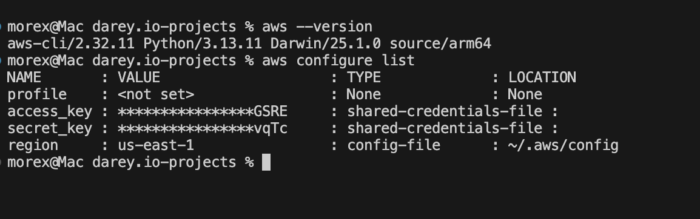
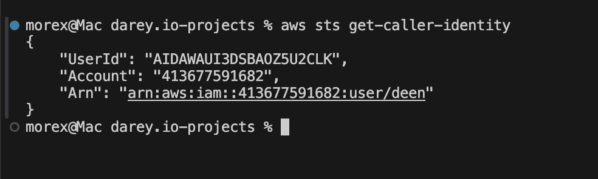
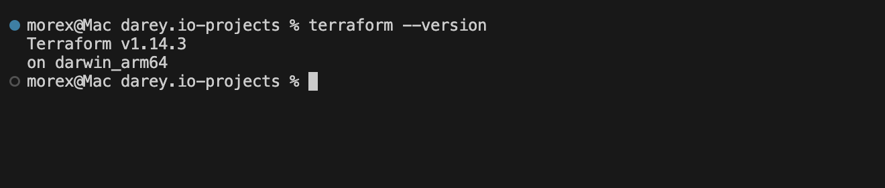
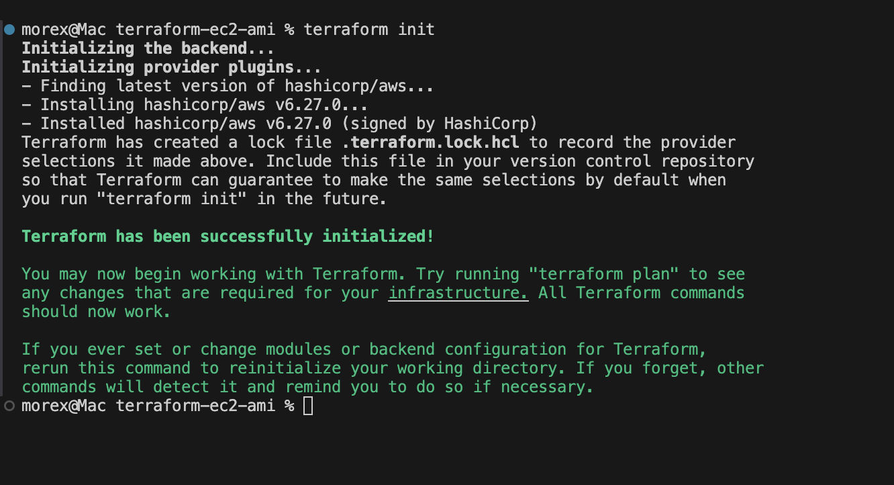
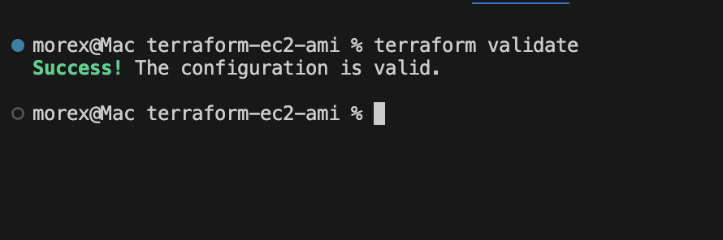
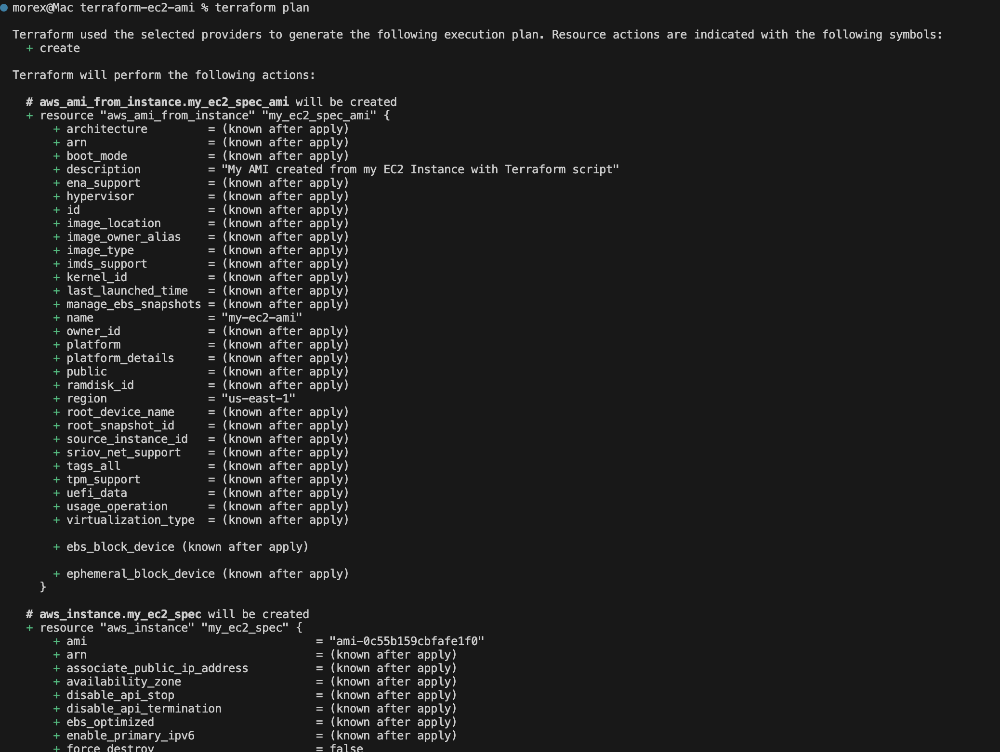
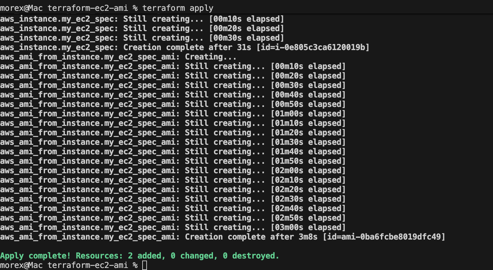
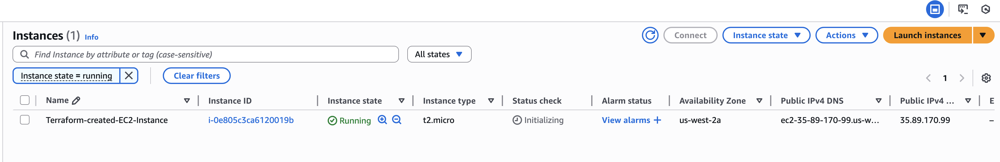
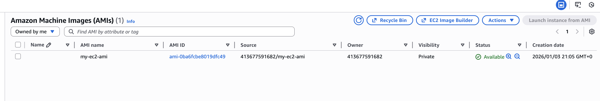
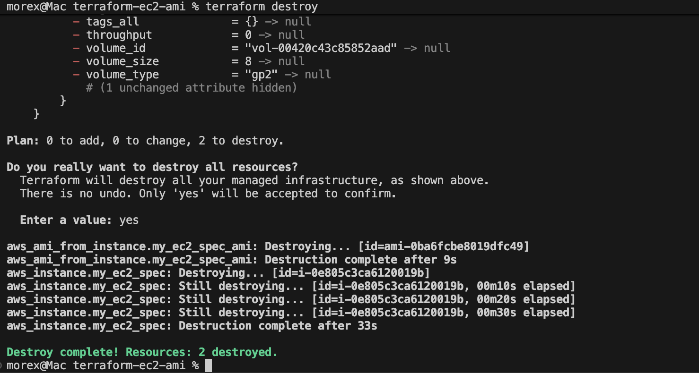

# Terraform EC2 Instance and AMI Creation

## Mini Project - Terraform EC2 Instance and AMI Creation
In this mini project, you will use Terraform to automate the creation of an EC2 instance on AWS and then create an Amazon Machine Image (AMI) from that instance.

### Objectives

- Learn how to write basic Terraform configuration files.
- Learn how to write Terraform script to automate creation of an EC2 instance on AWS.
- Learn how to use Terraform script to automate the creation of an AMI from an already created EC2 instance on AWS.

### Prerequisites
This project requires you to have an AWS Account and the AWS CLI configured to it locally. This setup will be used by the Terraform script you are going to write. From your local command line interface, Terraform will use the configured AWS CLI credential to communicate with your AWS Account when executing the script.

- Ensure you have an AWS Account created and functional. You may see a guide [here](https://docs.aws.amazon.com/accounts/latest/reference/manage-acct-creating.html) to create a new AWS account.
- Ensure you have the AWS CLI installed and configured with the credentials of your AWS Account. You may see a guide [here](https://docs.aws.amazon.com/cli/latest/userguide/getting-started-install.html)
- Ensure you have Terraform installed on your computer. You may see a guide

### Tasks Outline
1. Confirm the Prerequisites
2. Write the Script
3. Execute the Script
    1. Initialize
    2. Validate 
    3. Plan 
    4. Apply
4. Confirm Resources
5. Clean up
    1. Destroy 

### Project Tasks

### Task 1 - Confirm the Prerequisites
1. Login into your AWS Account to confirm it is functional.

2. Run `aws —version` on your terminal to confirm the AWS CLI is installed. 
3. Run `aws configure list` to confirm the AWS CLI is configured. You should see an output similar to this


4. Run `aws sts get-caller-identity` to verify that the AWS CLI can successfully authenticate to your AWS Account. You should see an output similar to this


5. Run `terraform --version` to confirm Terraform is installed. You should see an output similar to this


### Task 2 - Developing the Terraform Script to create EC2 Instance and AMI from it

1. Create a new directory for this Terraform project: `mkdir terraform-ec2-ami` and `cd terraform-ec2-ami`

2. Inside this directory, create a Terraform configuration file: `nano main.tf`

3. Inside this file, write the script to create an EC2 instance specifying instance type, ami, and tags. Extend this script to include the creation of an AMI from the created EC2 Instance. (See sample below)

```terraform
provider "aws" {
  region = "us-east-1"  # Change this to your AWS Account region
}

resource "aws_instance" "my_ec2_spec" {
  ami           = "ami-0c55b159cbfafe1f0"  # Specify your desired AMI ID
  instance_type = "t2.micro"

  tags = {
    Name = "Terraform-created-EC2-Instance"
  }
}

resource "aws_ami_from_instance" "my_ec2_spec_ami" {
  name                 = "my-ec2-ami"
  description          = "My AMI created from my EC2 Instance with Terraform script"
  source_instance_id   = aws_instance.my_ec2_spec.id
}
```

#### Script Explanation

This script creates an EC2 instance and then creates an AMI from that instance.

1. Provider Block
    1. `provider "aws"` tells Terraform to use AWS as the cloud provider
    2. `region = "us-east-1"` specifies which AWS region to use

2. EC2 Instance Creation
    1. `resource "aws_instance" "my_ec2_spec"` creates an EC2 Instance
    2. `ami = ami-0c55b159cbfafelf0` specifies the Amazon Machine Image ID to use for the instance
    3. `instance_type = "t2.micro"` defines the EC2 Instance type
    4. The `tag` block adds a name tag to the instance for identification
3. AMI Creation from the EC2 Instance
    1. `resource "aws_ami_from_instance" "my_ec2_spec_ami` creates an AMI from the EC2 Instance
    2. `name = "my-ec2-ami"` names the new AMI
    3. `source_instance_id = aws_instance.my_ec2_spec.id` uses the EC2 Instance to create the AMI

### Task 3 - Executing the Terraform Script

1. Initialize the Terraform project using `terraform init`


2. Validate the correctness of this script using `terraform validate`


3. Confirm the resources that will be created by the execution of this script using `terraform plan`


4. Apply the Terraform configuration using `terraform apply`, Enter yes at the prompt


### Task 4 - Confirm Resources

Confirm the creation of the EC2 Instance and its AMl in your AWS Account according to the specified details.




### Task 5 - Clean up

Execute command `terraform destroy` to clean up the resources created by the script.



##  LEARNING SUMMARY

- Key takeaways:
  - Terraform declares cloud infrastructure as code; provider and resource blocks map to real cloud APIs.
  - Avoid hard-coding AMI IDs — use data sources or region-specific variables to find valid AMIs.
  - aws_instance provisions EC2; aws_ami_from_instance creates an AMI from a running instance.

- Challenges
    - InvalidAMIID.NotFound: occurred because the sample AMI ID did not exist in the chosen region. Fixed by using a data source to look up a valid AMI.

- Hands-on skills:
  - terraform init / validate / plan / apply / destroy.
  - Use data sources: `data "aws_ami" { ... }` and reference `data.aws_ami.NAME.id`.
  - Troubleshoot failures with Terraform output, `aws ec2 describe-images`, and the AWS Console.

- Best practices:
  - Parameterize region and AMI via variables; use a remote backend (S3+DynamoDB) for state and locking.
  - Tag resources, use small test instance types, and secure credentials.
  - Clean up with `terraform destroy` to avoid unexpected charges.
