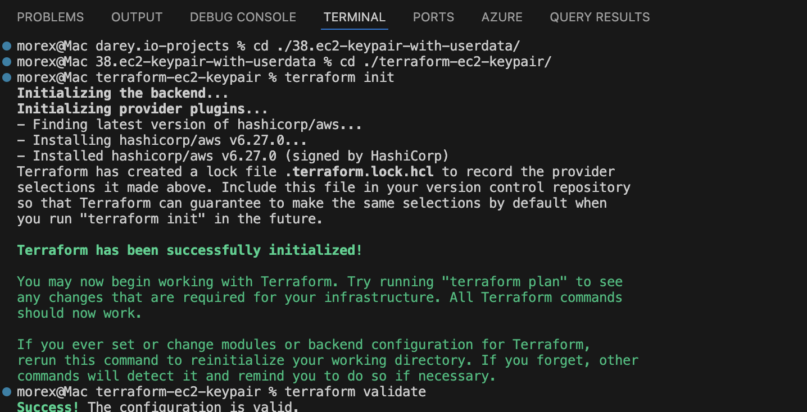
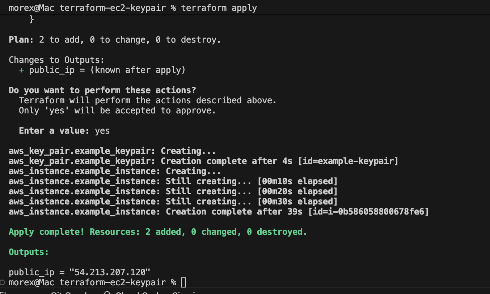
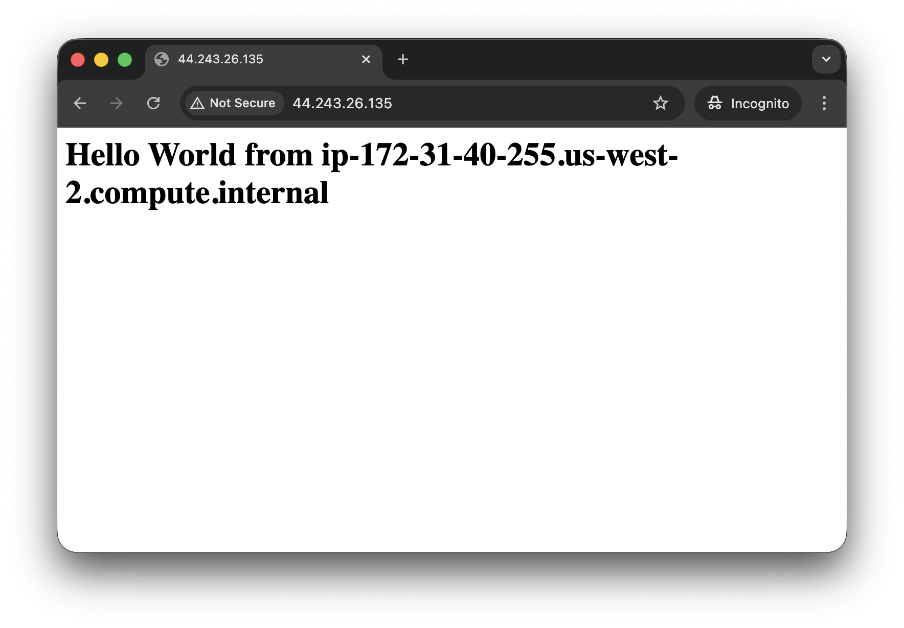

# Terraform EC2 Instance with Key Pair and User Data
Purpose:

In this mini project, you will use Terraform to automate the launch of an EC2 instance on AWS. The project includes the generation of a downloadable key pair for the instance and the execution of a user data script to install and configure Apache HTTP Server

### Objectives:

1. Terraform Configuration:
    - Learn how to write Terraform code to launch an EC2 instance with specified configurations.

2. Key Pair Generation:
    - Generate a key pair and make it downloadable after EC2 instance creation.

3. User Data Execution:
    - Use Terraform to execute a user data script on the EC2 instance during launch.

### Project Tasks:

### Task 1: Terraform Configuration for EC2 Instance
1. Create a new directory for your Terraform project (e.g., `terraform-ec2-keypair`).
2. Inside the project directory, create a Terraform configuration file (e.g., `main.tf`).
3. Write Terraform code to create an EC2 instance with the following specifications:
    - Instance type: `t2.micro`
    - Key pair: Generate a new key pair and make it downloadable.
    - Security group: Allow incoming traffic on port 80.
4. Initialize the Terraform project using the command: `terraform init`.
5. Apply the Terraform configuration to create the EC2 instance using the command: `terraform apply`.

### Task 2: User Data Script Execution
1. Extend your Terraform configuration to include the execution of the provided user data script.
2. Modify the user data script to install and configure Apache HTTP server.
3. Apply the updated Terraform configuration to launch the EC2 instance with the user data script using the command: `terraform apply`

### Task 3: Accessing the Web Server
1. After the EC2 instance is created and running, access the Apache web server by using its public IP address.
2. Verify that the web server displays the `Hello World` message generated by the user data script.

#### Instructions:

1. Create a new directory for your Terraform project using a terminal (`mkdir terraform-ec2-keypair`).
2. Change into the project directory (`cd terraform-ec2-keypair`).
3. Create a Terraform configuration file (`nano main.tf`).
4. Copy and paste the sample Terraform configuration template into your file.

```hcl
provider "aws" {
  region = "us-east-1"  # Change this to your desired AWS region
}

resource "aws_key_pair" "example_keypair" {
  key_name   = "example-keypair"
  public_key = file("~/.ssh/id_rsa.pub")  # Replace with the path to your public key file
}

resource "aws_instance" "example_instance" {
  ami           = "ami-0c55b159cbfafe1f0"  # Specify your desired AMI ID
  instance_type = "t2.micro"
  key_name      = aws_key_pair.example_keypair.key_name

  vpc_security_group_ids = ["sg-0123456789abcdef0"]  # Specify your security group ID

  user_data = <<-EOF
              #!/bin/bash
              yum update -y
              yum install -y httpd
              systemctl start httpd
              systemctl enable httpd
              echo "<h1>Hello World from $(hostname -f)</h1>" > /var/www/html/index.html
              EOF
}

output "public_ip" {
  value = aws_instance.example_instance.public_ip
}
```

5. Save the file and initialize the Terraform project using `terraform init`


6. Apply the Terraform configuration using `terraform apply` and confirm the creation of the EC2 instance.


7. Access the Apache web server on the created EC2 instance using its public IP address.



## Learning Summary

- Key takeaways:
  - Terraform automates EC2 provisioning, key-pair creation, security group configuration, and user-data execution.
  - User data runs at first boot to bootstrap instances (install packages, start services, write content).

- Hands-on skills:
  - terraform init / plan / apply / destroy; create aws_key_pair and aws_instance; output instance public IP.
  - Verify web server via public IP and inspect cloud-init logs on the instance.

- Challenges:
  - Package manager mismatch: sample used yum (Amazon/RedHat). On Ubuntu images use apt (apt-get update && apt-get install -y apache2). Adjust user_data to match the AMI OS.
  - Ensure correct AMI per region; avoid hard-coded AMI IDs.
