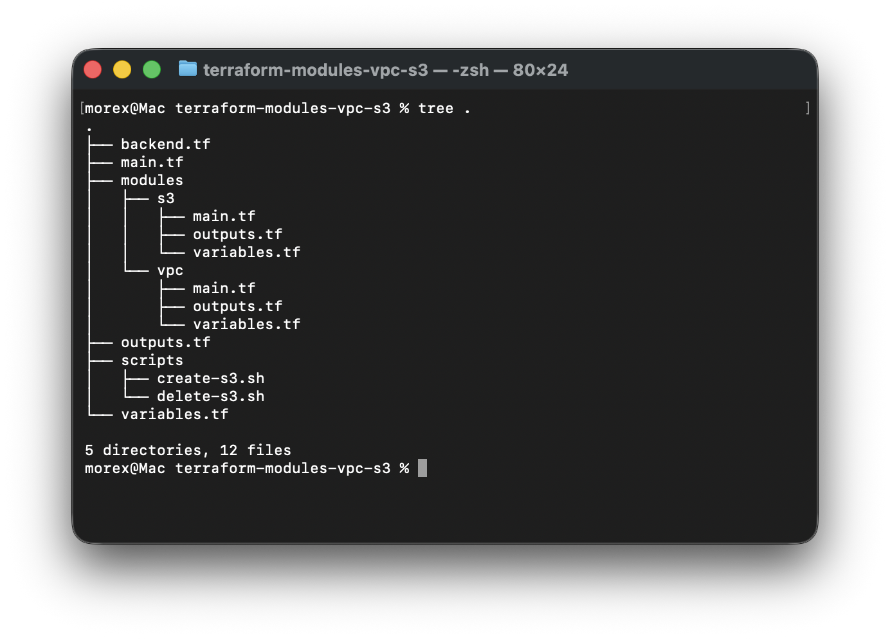
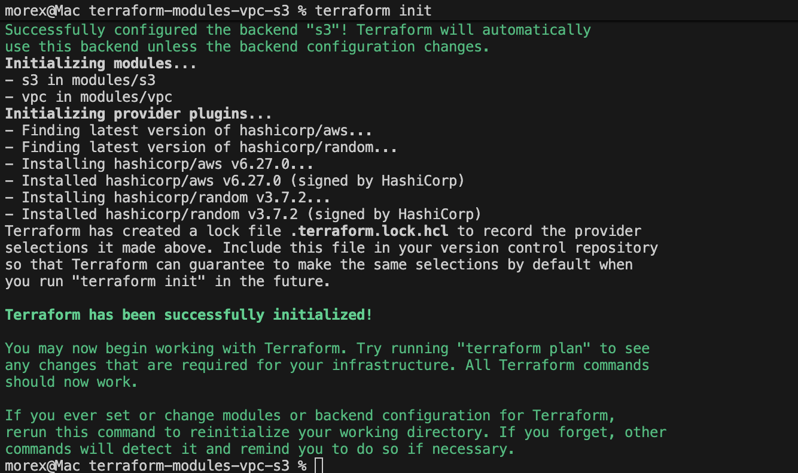
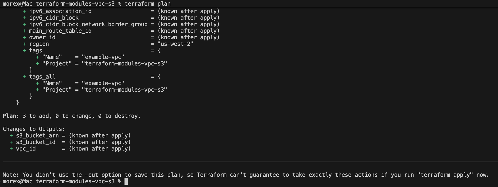
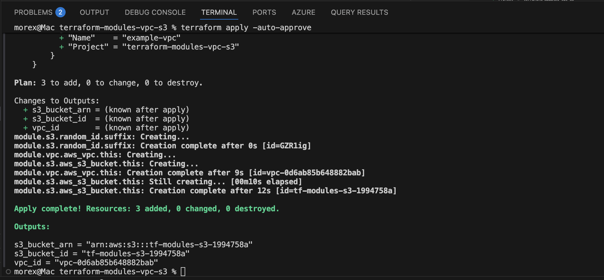
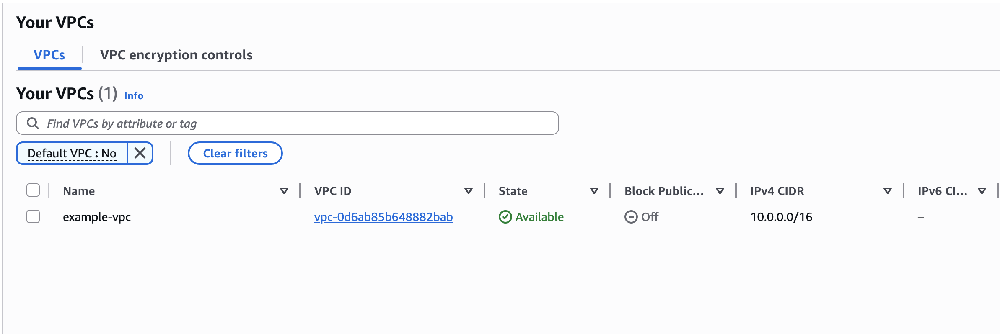
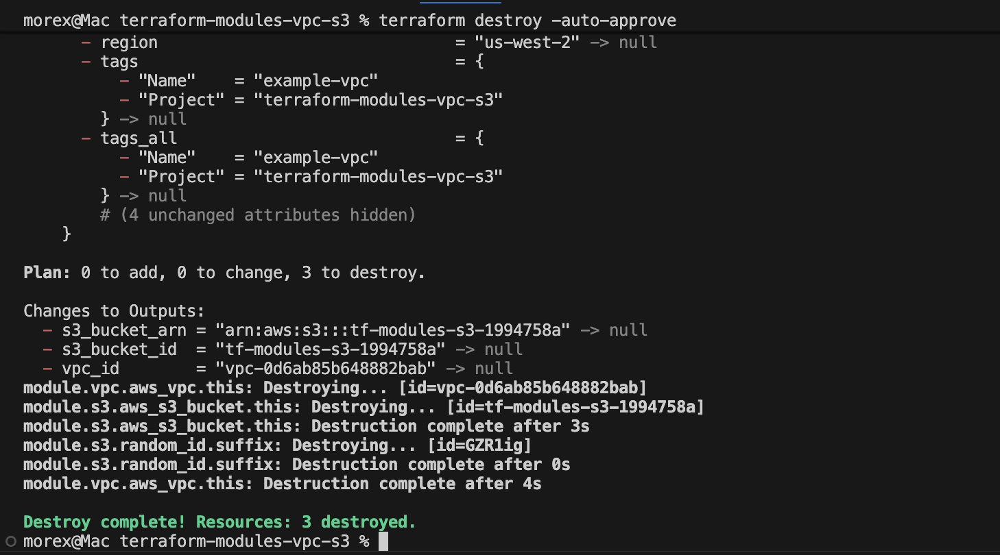
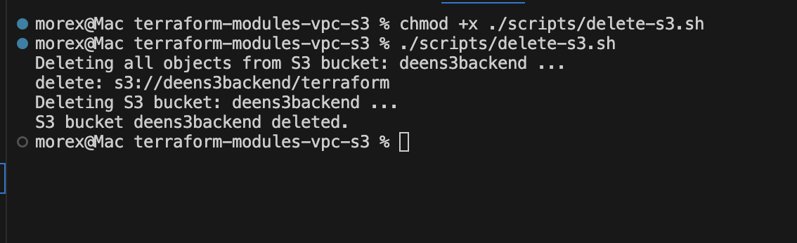

# Terraform Modules - VPC and S3 Bucket with Backend Storage
### Purpose:

In this mini project, you will use Terraform to create modularized configurations for building an Amazon Virtual Private Cloud (VPC) and an Amazon S3 bucket. Additionally, you will configure Terraform to use Amazon S3 as the backend storage for storing the terraform state file

#### Objectives:
1. Terraform Modules:
    - Learn how to create and use Terraform modules for modular infrastructure provisioning.
2. VPC Creation:
    - Build a reusable Terraform module for creating a VPC with specified configurations.
3. S3 Bucket Creation:
    - Develop a Terraform module for creating an S3 bucket with customizable settings.
4. Backend Storage Configuration:
    - Configure Terraform to use Amazon S3 as the backend storage for storing the Terraform state file.

## Project Tasks:

### Task 1: VPC Module
1. Create a new directory for your Terraform project (e.g., `terraform-modules-vpc-s3`).
2. Inside the project directory, create a directory for the VPC module (e.g., `modules/vpc`).
3. Write a Terraform module (`modules/vpc/main.tf`) for creating a VPC with customizable configurations such as CIDR block, subnets, etc.
4. Create a main Terraform configuration file (`main. tf`) in the project directory, and use the VPC module to create a VPC.

### Task 2: S3 Bucket Module
1. Inside the project directory, create a directory for the S3 bucket module (e.g., `modules/s3`).
2. Write a Terraform module (`modules/s3/main.tf`) for creating an S3 bucket with customizable configurations such as bucket name, ACL, etc.
3. Modify the main Terraform configuration file (`main. tf`) to use the S3 module and create an S3 bucket.

### Task 3: Backend Storage Configuration
1. Configure Terraform to use Amazon S3 as the backend storage for storing the Terraform state file.
2. Create a backend configuration file (e.g., `backend. tf`) specifying the S3 bucket and key for storing the state.
3. Initialize the Terraform project using the command: `terraform init`
4. Apply the Terraform configuration to create the VPC and S3 bucket using the command: `terraform apply`

### Instructions:
1. Create a new directory for your Terraform project using a terminal (`mkdir terraform-modules-vpc-s3`).
2. Change into the project directory (`cd terraform-modules-vpc-s3`).
3. Create directories for the VPC and S3 modules (`mkdir -p modules/vpc` and `mkdir -p modules/s3`).
4. Write the VPC module configuration (`nano modules/vpc/main.tf`) and the S3 module configuration (`nano modules/s3/main.tf`).

5. Create the variables and outputs files for each module configuration as well as root module
```bash
nano variables.tf
nano outputs.tf
```

Example variables.tf:
```terraform
variable "region" {
  type    = string
  default = "us-east-1"
}

variable "vpc_name" {
  type    = string
  default = "example-vpc"
}

# for s3 buckets
variable "s3_bucket_name" {
  type    = string
  default = ""
}
```

Example outputs.tf:
```terraform
output "vpc_id" {
  value = module.vpc.vpc_id
}
output "s3_bucket_id" {
  value = module.s3.bucket_id
}

output "s3_bucket_arn" {
  value = module.s3.bucket_arn
}
```

6. Create the main Terraform configuration file (`nano main.tf`) and use the VPC and S3 modules.




```terraform
module "vpc" {
  source = "./modules/vpc"
  // Add variables for customizing the VPC module if needed
}

module "s3_bucket" {
  source = "./modules/s3"
  // Add variables for customizing the S3 bucket module if needed
}

provider "aws" {
  region = "us-east-1"  # Change this to your desired AWS region
}

```

7. Create the backend configuration file (`nano backend.tf`) to specify the backend storage.

```terraform
terraform {
  backend "s3" {
    bucket         = "your-terraform-state-bucket"
    key            = "terraform.tfstate"
    region         = "us-east-1"  # Change this to your desired AWS region
    encrypt        = true
    dynamodb_table = "your-lock-table"
  }
}
```

8. create the s3 bucket for terraform backend. You can use [script](./terraform-modules-vpc-s3/scripts/create-s3.sh) for quick creation
```bash
#!/bin/bash

S3_BUCKET_NAME="deens3backend"

# Create S3 bucket with region configuration

Echo "Creating S3 bucket: $S3_BUCKET_NAME ..."
aws s3api create-bucket \
  --bucket $S3_BUCKET_NAME \
  --region us-west-2 \
  --create-bucket-configuration LocationConstraint=us-west-2 
Echo "S3 bucket $S3_BUCKET_NAME created."
```


9. Initialize the Terraform project using `terraform init`.


10. Confirm the configuation is correct with `terraform validate`


11. Run `terraform plan` to confirm resources that will be created


12. Apply the Terraform configuration using `terraform apply` 


13. confirm the creation of the VPC and S3 bucket on the console



14. Delete the resources with `terraform destroy`


15. delete the backend s3 bucket as well. you can also use a [script](./terraform-modules-vpc-s3/scripts/delete-s3.sh) for quik deletion
```bash
# Delete all objects from S3 bucket before deleting the bucket itself
Echo "Deleting all objects from S3 bucket: $S3_BUCKET_NAME ..."

aws s3 rm s3://$S3_BUCKET_NAME --recursive


# delete S3 bucket
Echo "Deleting S3 bucket: $S3_BUCKET_NAME ..."
aws s3api delete-bucket \
  --bucket $S3_BUCKET_NAME \
  --region us-west-1
```


# LEARNING SUMMARY

- Key takeaways:
  - Modules enable reusable, composable infrastructure (separate VPC and S3 concerns).
  - Use an S3 backend + DynamoDB for remote state and locking in team environments.
  - Parameterize region, names, and settings via variables to avoid hard-coded, region-specific failures.

- Hands-on skills:
  - Create module files: modules/*/{variables.tf,main.tf,outputs.tf} and consume them from root main.tf.
  - Configure and bootstrap a remote backend (backend.tf), and run terraform init/validate/plan/apply/destroy.
  - Write simple shell scripts to create the backend S3 bucket and DynamoDB lock table before initializing Terraform.

- Challenges faced:
  - Backend bootstrap: S3 bucket (and DynamoDB lock table) must exist before terraform init — required manual/scripted creation.

