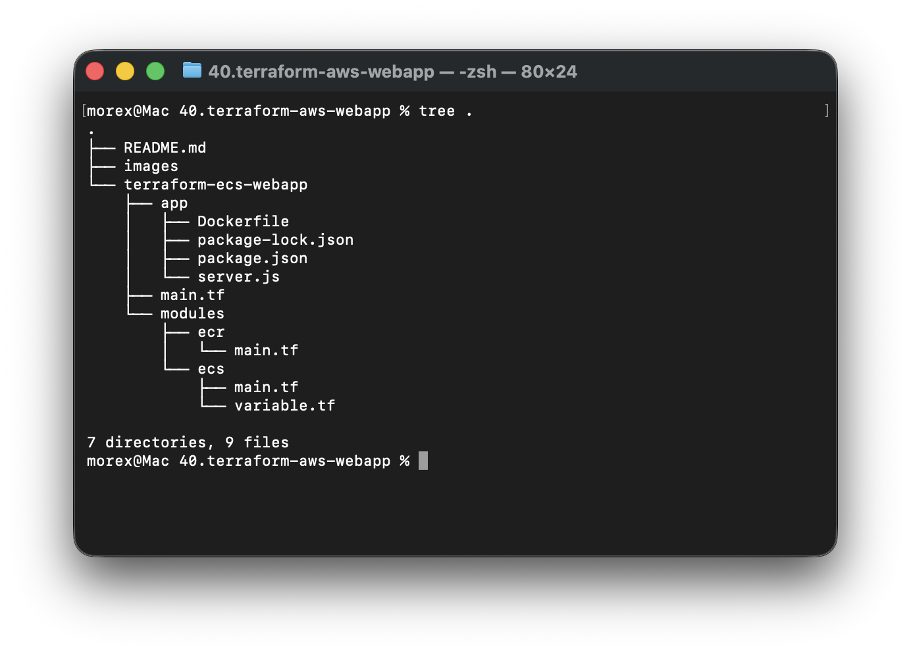
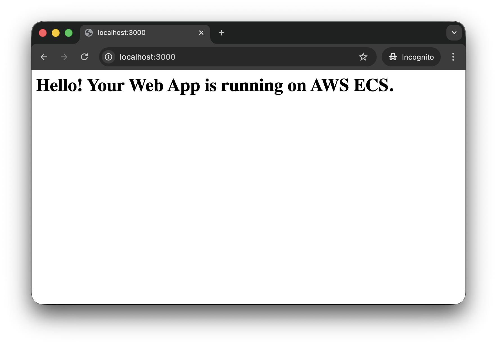
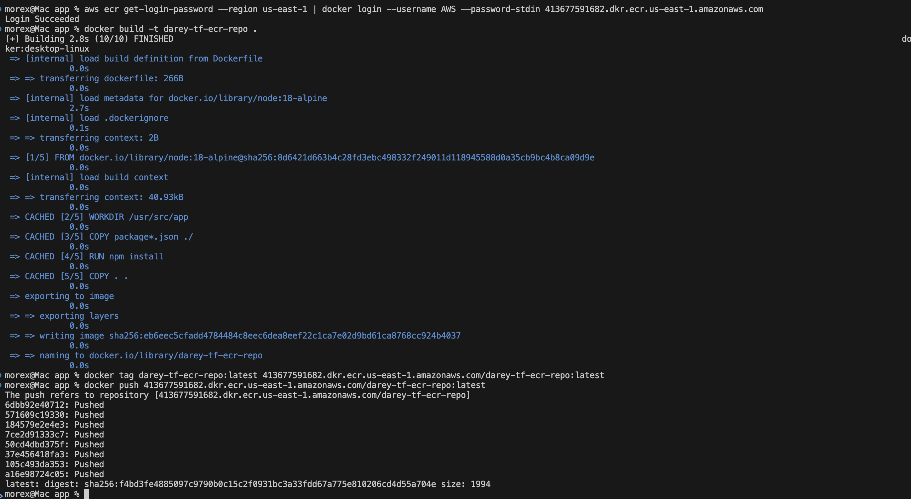
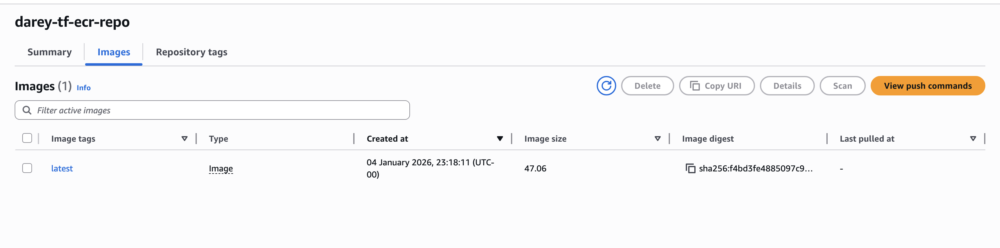
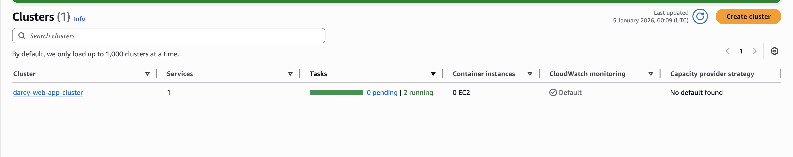
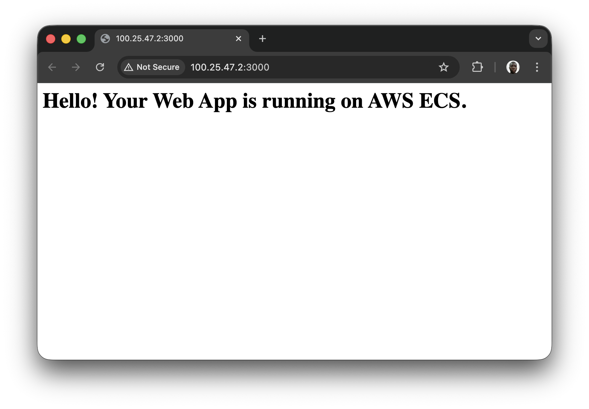

# Hosting a Dynamic Web App on AWS with Terraform Module, Docker, Amazon ECR, and ECS

#### Purpose:

In this mini project, you will use Terraform to create a modular infrastructure for hosting a dynamic web application on Amazon ECS (Elastic Container Service). The project involves containerizing the web app using Docker, pushing the Docker image to Amazon ECR (Elastic Container Registry), and deploying the app on ECS.

#### Objectives:

1. Terraform Module Creation:
    - Learn how to create Terraform modules for modular infrastructure provisioning.
2. Dockerization:
    - Containerize a dynamic web application using Docker.
3. Amazon ECR Configuration:
    - Configure Terraform to create an Amazon ECR repository for storing Docker images.
4. Amazon ECS Deployment:
    - Use Terraform to provision an ECS cluster and deploy the Dockerized web app.  

### Instructions:

1. Create a new directory for your Terraform project using a terminal (`mkdir terraform-ecs-webapp`).


2. Change into the project directory (`cd terraform-ecs-webapp`).
3. Create directories for the ECR and ECS modules (`mkdir -p modules/ecr` and `mkdir -p modules/ecs`).
4. Write the ECR module configuration (`nano modules/ecr/main.tf`) to create an ECR repository.
5. Write the ECS module configuration (`nano modules/ecs/main.tf`) to provision an ECS cluster and deploy the Dockerized web app.
6. Create the main Terraform configuration file (`nano main.tf`) and use the ECR and ECS modules.
7. Build the Docker image of your web app and push it to the ECR repository.
8. Run `terraform init` and `terraform apply` to deploy the ECS cluster and the web app.
9. Access the web app through the public IP or DNS of the ECS service.

## Project Tasks:

### Task 1: Dockerization of Web App
1. 1. Create the App (app/server.js) A simple Node.js app that responds with "Hello from ECS!".
```javascript
const express = require('express');
const app = express();
const PORT = 3000;

app.get('/', (req, res) => {
  res.send('<h1>Hello! Your Web App is running on AWS ECS.</h1>');
});

app.listen(PORT, () => {
  console.log(`App running on port ${PORT}`);
});
```

2. Create Package Config (app/package.json)
```json
{
  "name": "terraform-web-app",
  "version": "1.0.0",
  "main": "server.js",
  "scripts": {
    "start": "node server.js"
  },
  "dependencies": {
    "express": "^4.18.2"
  }
}
```

3. Write a `Dockerfile` to containerize the web application.
```Dockerfile
FROM node:18-alpine

# Create app directory
WORKDIR /usr/src/app

# Install dependencies
COPY package*.json ./
RUN npm install

# Bundle app source
COPY . .

# Expose the port
EXPOSE 3000

# Start command
CMD [ "npm", "start" ]
```

3. Test the Docker image locally to ensure the web app runs successfully within a container.
```bash
# Change to the app directory if you aren't already there
cd app

# Build the image
docker build -t terraform-web-app:local .
# Run the container in detached mode (-d) so it runs in the background
docker run -d -p 3000:3000 --name test-webapp terraform-web-app:local
```



### Task 2: Terraform Module for Amazon ECR
1. Create a new directory for your Terraform project (e.g., `terraform-ecs-webapp`).
2. Inside the project directory, create a directory for the Amazon ECR module (e.g., `modules/ecr`).
3. Write a Terraform module (`modules/ecr/main.tf`) to create an Amazon ECR repository for storing Docker images.
```terraform
variable "repository_name" {
  description = "darey-tf-ecr-repo"
  type        = string
}

resource "aws_ecr_repository" "app_repo" {
  name                 = var.repository_name
  image_tag_mutability = "MUTABLE"
  force_delete         = true # Allows destroying repo even if it contains images

  image_scanning_configuration {
    scan_on_push = true
  }
}

output "repository_url" {
  value       = aws_ecr_repository.app_repo.repository_url
  description = "The URL of the ECR repository"
}
```

### Task 3: Terraform Module for ECS
1. Inside the project directory, create a directory for the ECS module (e.g., `modules/ecs`).
2. Write a Terraform module (`modules/ecs/main.tf`) to provision an ECS cluster and deploy the Dockerized web app.
```terraform
# --- IAM ROLE (Task Execution Role) ---
resource "aws_iam_role" "ecs_task_execution_role" {
  name = "${var.app_name}-execution-role"

  assume_role_policy = jsonencode({
    Version = "2012-10-17"
    Statement = [{
      Action = "sts:AssumeRole"
      Effect = "Allow"
      Principal = { Service = "ecs-tasks.amazonaws.com" }
    }]
  })
}

resource "aws_iam_role_policy_attachment" "ecs_task_execution_role_policy" {
  role       = aws_iam_role.ecs_task_execution_role.name
  policy_arn = "arn:aws:iam::aws:policy/service-role/AmazonECSTaskExecutionRolePolicy"
}

# --- ECS CLUSTER ---
resource "aws_ecs_cluster" "main" {
  name = "${var.app_name}-cluster"
}

# --- TASK DEFINITION ---
resource "aws_ecs_task_definition" "app" {
  family                   = var.app_name
  network_mode             = "awsvpc"
  requires_compatibilities = ["FARGATE"]
  cpu                      = "256"
  memory                   = "512"
  execution_role_arn       = aws_iam_role.ecs_task_execution_role.arn

  container_definitions = jsonencode([{
    name      = var.app_name
    image     = "${var.ecr_repository_url}:latest"
    essential = true
    portMappings = [{
      containerPort = 3000
      hostPort      = 3000
    }]
  }])
}

# --- ECS SERVICE ---
resource "aws_ecs_service" "main" {
  name            = "${var.app_name}-service"
  cluster         = aws_ecs_cluster.main.id
  task_definition = aws_ecs_task_definition.app.arn
  desired_count   = 1
  launch_type     = "FARGATE"

  network_configuration {
    subnets          = [aws_subnet.main.id]
    security_groups  = [aws_security_group.allow_web.id]
    assign_public_ip = true
  }
}

data "aws_vpc" "default" {
  default = true
}

data "aws_subnets" "default" {
  filter {
    name   = "vpc-id"
    values = [data.aws_vpc.default.id]
  }
}

resource "aws_security_group" "ecs" {
  vpc_id = data.aws_vpc.default.id

  ingress {
    from_port   = 3000
    to_port     = 3000
    protocol    = "tcp"
    cidr_blocks = ["0.0.0.0/0"]
  }

  egress {
    from_port   = 0
    to_port     = 0
    protocol    = "-1"
    cidr_blocks = ["0.0.0.0/0"]
  }
}
```
3. Create `modules/ecs/variables.tf`
```terraform
variable "ecr_repository_url" {
  description = "The URL of the ECR repository to pull the image from"
  type        = string
}

variable "app_name" {
  description = "Name of the application"
  type        = string
  default     = "darey-web-app"
}
```

### Task 4: Main Terraform Configuration
1. Create the main Terraform configuration file (`main. tf`) in the project directory.
2. Use the ECR and ECS modules to create the necessary infrastructure for hosting the web app.
```terraform
provider "aws" {
  region = "us-east-1" # Change to your preferred region
}

module "ecr" {
  source          = "./modules/ecr"
  repository_name = "darey-tf-ecr-repo"
}

module "ecs" {
  source             = "./modules/ecs"
  ecr_repository_url = module.ecr.repository_url
  app_name           = "darey-web-app"
}
```

### Task 5: Deployment
1. Initialize and Create ECR.
    - First, we need to create the infrastructure so the ECR repository exists before we push the Docker image
  ```bash
  # Initialize Terraform
  terraform init

  # Apply only the ECR module first (optional, but safer to ensure repo exists)
  terraform apply -target=module.ecr -auto-approve
  ```
  

2. Build and Push Docker Image
    - Retrieve the repository URL from the Terraform state or AWS Console.
```bash
# 1. Login to ECR (Replace <region> and <account-id>)
aws ecr get-login-password --region us-east-1 | docker login --username AWS --password-stdin <account-id>.dkr.ecr.us-east-1.amazonaws.com

# 2. Build the image
cd app
docker build -t my-webapp-repo .

# 3. Tag the image (Replace <ecr-repo-url> with the URL from Step 1)
docker tag my-webapp-repo:latest <ecr-repo-url>:latest

# 4. Push the image
docker push <ecr-repo-url>:latest
cd ..
```


Confirm the image from the console
  

3. Deploy ECS Infrastructure
    - Now that the image is in the repository, deploy the rest of the infrastructure.
    ```bash
    terraform apply -auto-approve
    ```


4. Access the App
Since we did not set up a Load Balancer (to keep costs/complexity low), you will access the app via the Task Public IP:

    1. Go to the AWS Console > ECS > node-web-app-cluster.

    2. Click on the Services tab > node-web-app-service.

    3. Click the Tasks tab and select the running task.

    4. Find the Public IP address in the Network section.

    5. Open your browser and visit: http://<PUBLIC-IP>:3000

    

## Key Learning Outcomes

Containerization Fundamentals: Gained hands-on experience using Docker to package a Node.js web application with its dependencies (express), ensuring consistent behavior across different environments.

Infrastructure as Code (IaC): Learned how to use Terraform to provision complex AWS resources (VPC, ECR, ECS) programmatically rather than manually using the AWS Console ("ClickOps").

Decoupled Infrastructure: Implemented a modular Terraform design, separating the Container Registry (ECR) from the Orchestration (ECS), which allows for independent scaling and management.

Cloud Orchestration: Understood the hierarchy of Amazon ECS, moving from a simple Docker image to a Task Definition (the blueprint), then to a Service (the manager), and finally a Cluster (the home).

## Observations & Challenges Faced
Challenge 1: The Architecture Mismatch (The "Mac Trap")
Observation: The Docker image ran perfectly on the local machine but entered a crash loop (Status: STOPPED) immediately upon deployment to ECS Fargate.

Challenge: Modern MacBooks use ARM64 architecture, while default ECS Fargate tasks often expect x86_64.

Resolution: Re-built the Docker image using the --platform linux/amd64 flag to ensure compatibility with the AWS infrastructure.