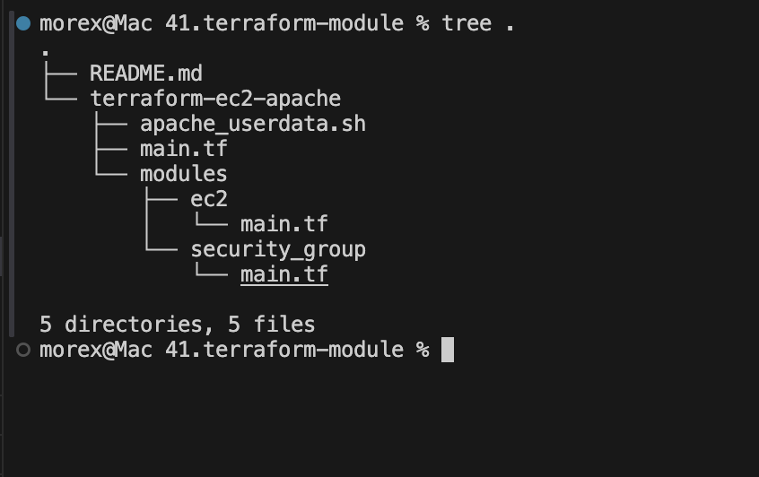
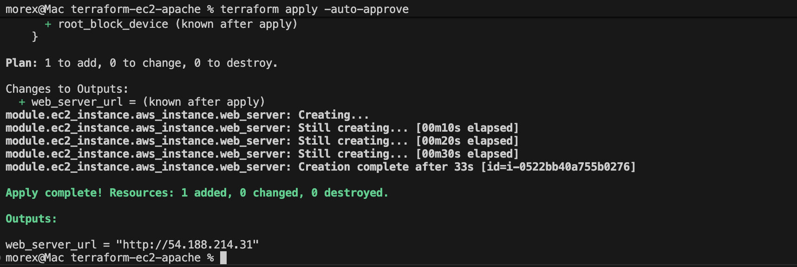
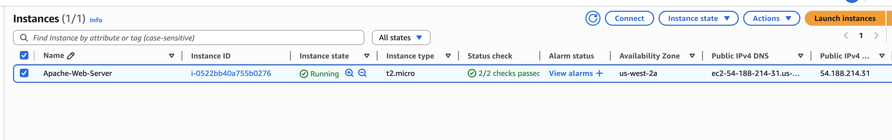
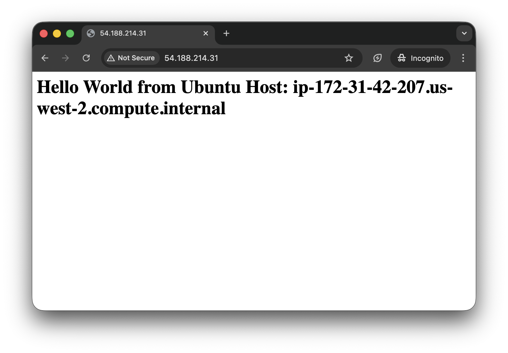

# EC2 Module and Security Group Module with Apache2 UserData

### Purpose:

In this mini project, you will use Terraform to create modularized configurations for deploying an EC2 instance with a specified Security Group and Apache2 installed using UserData.

### Objectives:
1. Terraform Module Creation:
    - Learn how to create Terraform modules for modular infrastructure provisioning.
2. EC2 Instance Configuration:
    - Configure Terraform to create an EC2 instance.
3. Security Group Configuration:
    - Create a separate module for the Security Group associated with the EC2 instance.
4. UserData Script:
    - Utilize UserData to install and configure Apache2 on the EC2 instance.


## Instructions:
1. Create a new directory for your Terraform project using a terminal (`mkdir terraform-ec2-apache`).

2. Change into the project directory (`cd terraform-ec2-apache`).

3. Create irectories for the EC2 and Security Group modules (`mkdir -p modules/ecz` and `mkdir -p modules/security_group`).

4. Write the EC2 module configuration (`nano modules/ec2/main.tf`) to create an EC2 instance.

5. Write the Security Group module configuration (`nano modules/security_group/main.tf`) to create a Security Group.

6. Write the UserData script (`nano apache_userdata.sh`) to install and configure Apache2.

7. Make the UserData script executable (` chmod +x apache_userdata.sh`).

8. Create the main Terraform configuration file (`nano main.tf`) and use the EC2 and Security Group modules.

9. Run `terraform init` and `terraform apply` to deploy the EC2 instance with Apache2.
10. Access the EC2 instance using its public IP and verify that Apache2 is installed and running.


## Project Tasks:
### Task 1: EC2 Module
1. Create a new directory for your Terraform project (e.g.,
`terraform-ec2-apache`).


2. Inside the project directory, create a directory for the [EC2 module](./terraform-ec2-apache/modules/ec2/) 

```hcl
variable "security_group_id" {}
variable "user_data" {}

data "aws_ami" "ubuntu" {
  most_recent = true

  filter {
    name   = "name"
    values = ["ubuntu/images/hvm-ssd/ubuntu-jammy-22.04-amd64-server-*"]
  }

  filter {
    name   = "virtualization-type"
    values = ["hvm"]
  }

  owners = ["099720109477"] # Canonical
}

resource "aws_instance" "web_server" {
  ami                    = data.aws_ami.ubuntu.id  # Specify your desired AMI ID
  instance_type          = "t2.micro"
  vpc_security_group_ids = [var.security_group_id]
  user_data              = var.user_data

  tags = {
    Name = "Apache-Web-Server"
  }
}

output "public_ip" {
  value = aws_instance.web_server.public_ip
}
```


### Task 2: Security Group Module
1. Inside the project directory, create a directory for the [Security Group module](./terraform-ec2-apache/modules/security_group/)
2. Write a Terraform module [modules/security_group/main.tf](./terraform-ec2-apache/modules/security_group/main.tf) to create a Security Group for the EC2 instance.

```hcl
resource "aws_security_group" "web_sg" {
  name        = "apache-access-sg"
  description = "Allow HTTP and SSH traffic"

  ingress {
    from_port   = 80
    to_port     = 80
    protocol    = "tcp"
    cidr_blocks = ["0.0.0.0/0"]
  }

  ingress {
    from_port   = 22
    to_port     = 22
    protocol    = "tcp"
    cidr_blocks = ["0.0.0.0/0"] # In production, limit this to your IP
  }

  egress {
    from_port   = 0
    to_port     = 0
    protocol    = "-1"
    cidr_blocks = ["0.0.0.0/0"]
  }
}

output "security_group_id" {
  value = aws_security_group.web_sg.id
}
```

### Task 3: UserData Script

1. Write a UserData script to install and configure Apache2 on the EC2 instance. Save it as a separate file [apache_userdata.sh](./terraform-ec2-apache/apache_userdata.sh)
```bash
#!/bin/bash
sudo yum update -y
sudo yum install -y httpd
sudo systemctl start httpd
sudo systemctl enable httpd
echo "<h1>Hello World from $(hostname -f)</h1>" | sudo tee /var/www/html/index.html
```

2. Ensure that the UserData script is executable (`chmod +x apache_userdata.sh`).

### Task 4: Main Terraform Configuration

1. Create the main Terraform configuration file [main.tf](./terraform-ec2-apache/main.tf) in the project directory.
```hcl
provider "aws" {
  region = "us-east-1"
}

module "security_group" {
  source = "./modules/security_group"
}

module "ec2_instance" {
  source            = "./modules/ec2"
  security_group_id = module.security_group.security_group_id
  user_data         = file("apache_userdata.sh")
}

output "web_server_url" {
  value = "http://${module.ec2_instance.public_ip}"
}
```

2. Use the EC2 and Security Group modules to create the necessary infrastructure for the EC2 instance.

Task 5: Deployment
1. Run `terraform init` and `terraform apply` to deploy the EC2 instance with Apache2.


2. Access the EC2 instance.


3. verify that Apache2 is installed and running


11. Document your observations and any challenges faced during the project.