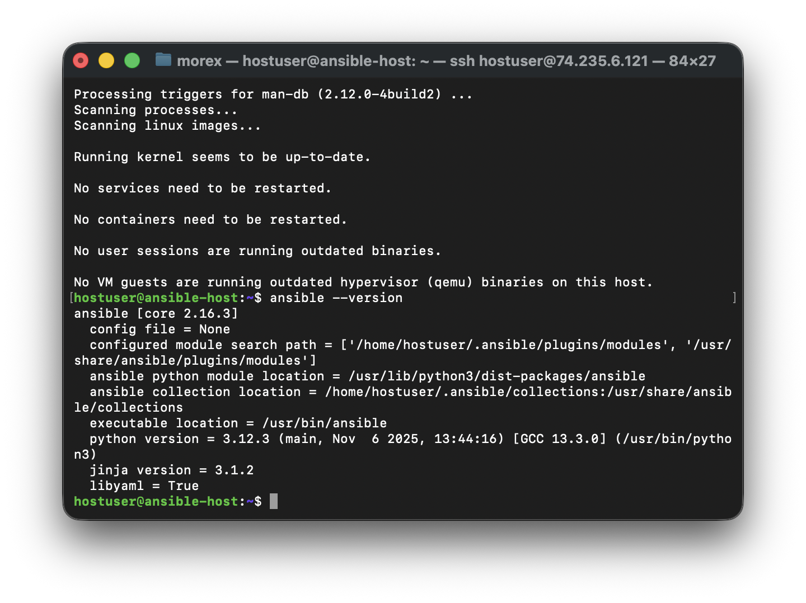
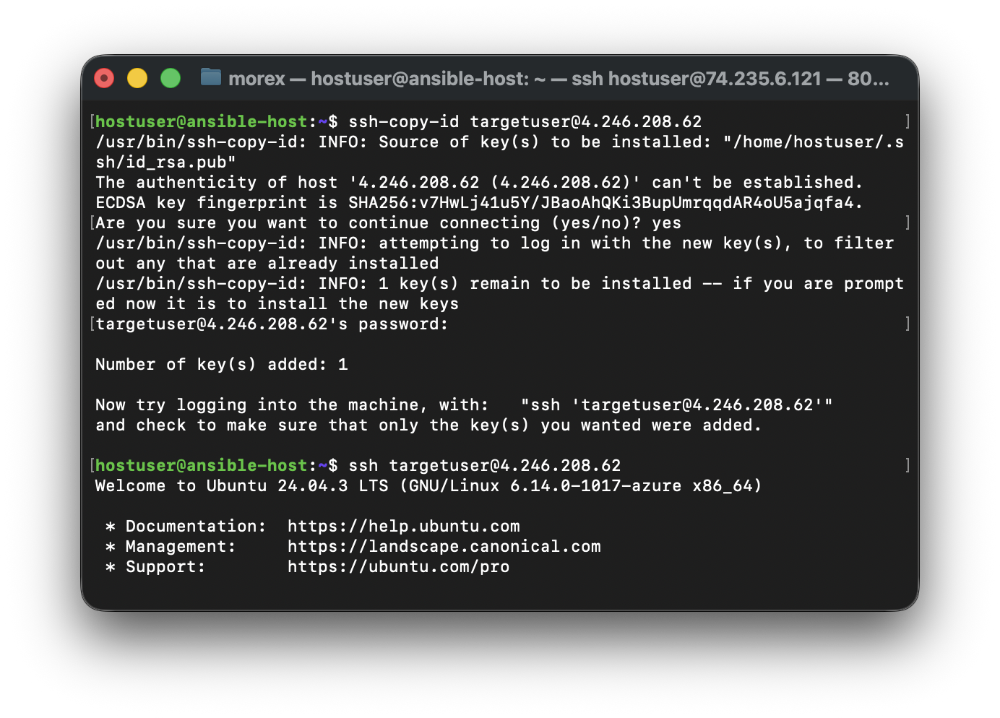
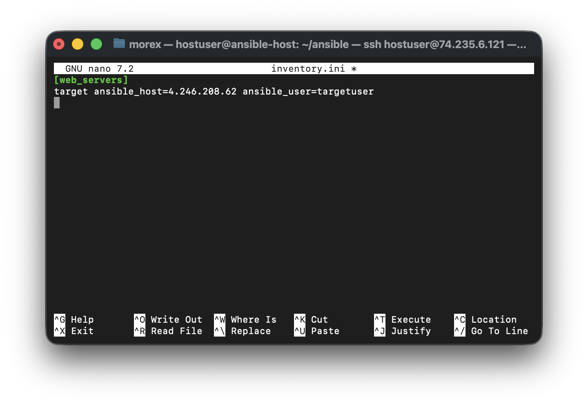
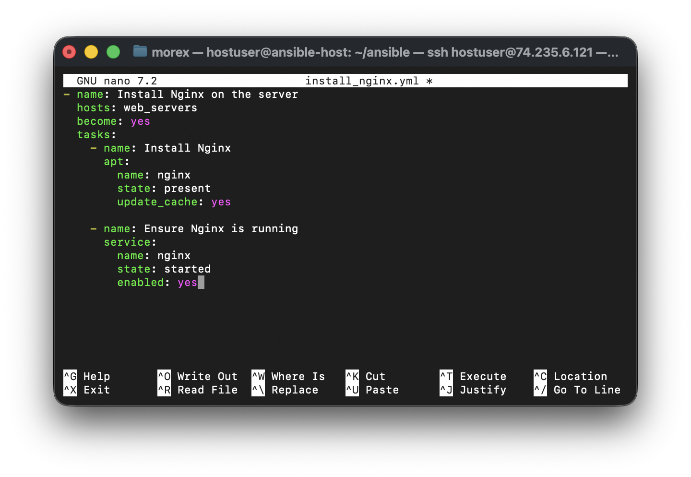
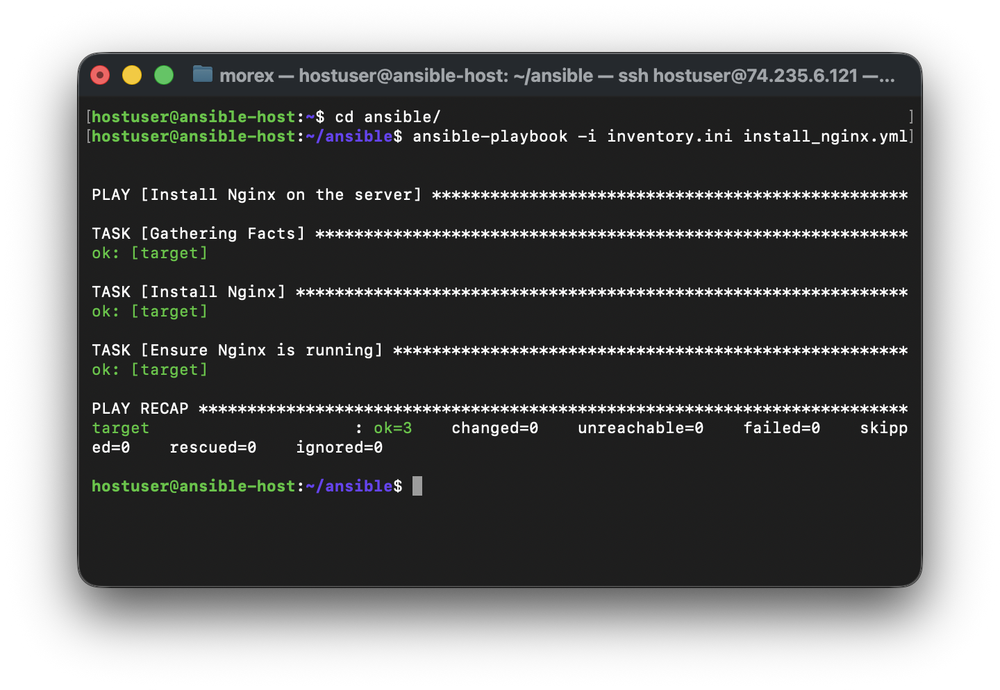
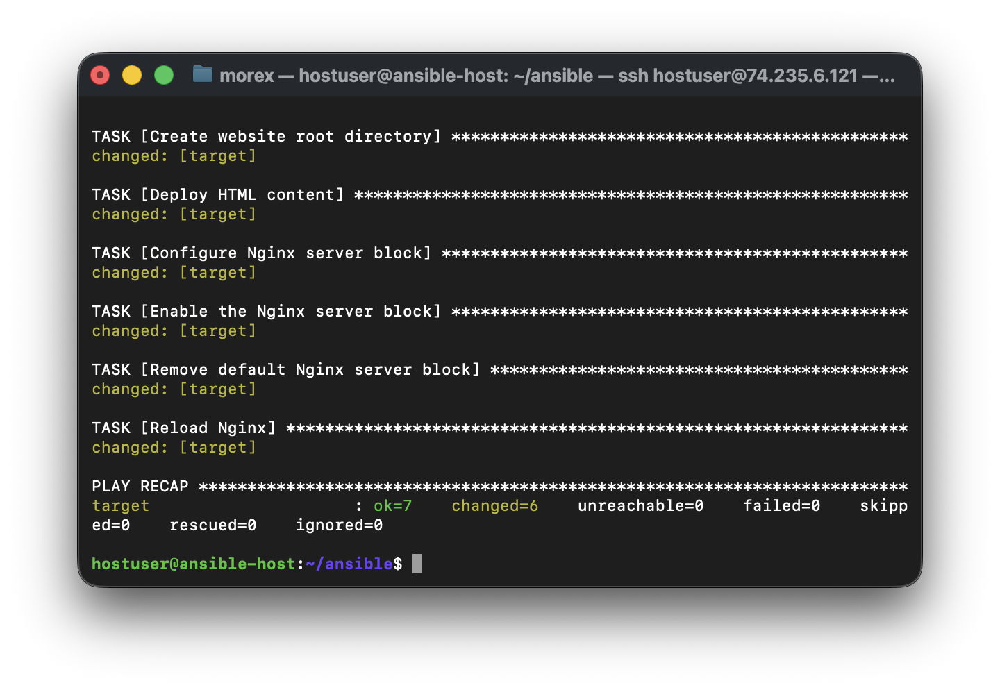
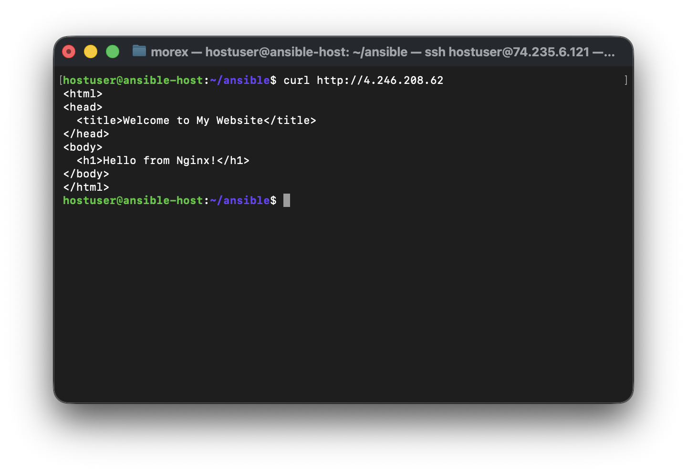
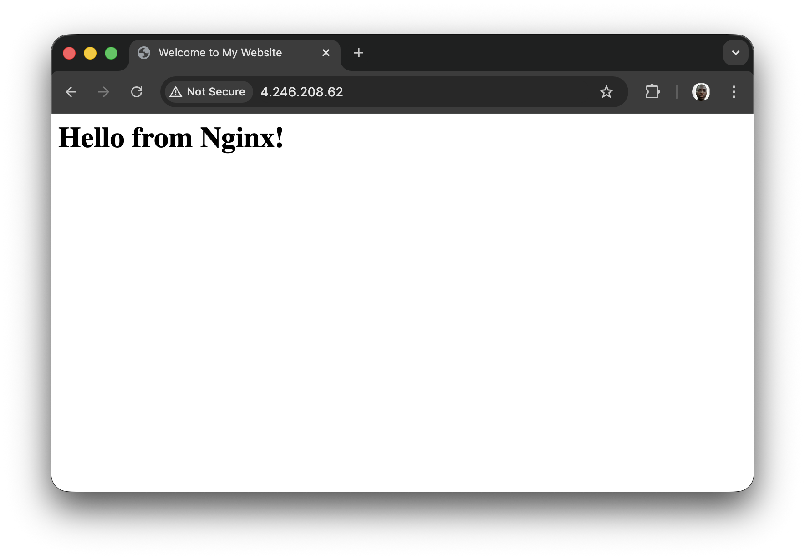

# Deploy and Configure Nginx Web Server using Ansible

### Introduction

Nginx is a powerful and widely used web server known for its performance and flexibility. Deploying and configuring Nginx manually on multiple servers can be time-consuming, but with Ansible, this process becomes automated and efficient. This project will teach you how to use Ansible to deploy and configure an Nginx web server on a Linux machine.

### Objectives

1. Understand how Ansible simplifies the deployment and configuration of applications.
2. Set up an Ansible environment for managing Linux servers.
3. Create and execute an Ansible playbook to install Nginx.
4. Configure a basic Nginx website using Ansible.
5. Verify the Nginx deployment.

### Prerequisites
1. **Linux Servers**: At least one server to act as the target machine and another control machine for Ansible.
2. **Ansible Installed**: Ansible installed on the control machine. (Refer to the [Ansible installation guide](../43.setting-up-ansible/README.md) if needed.)
3. **SSH Access**: SSH access between the control machine and target servers with public key authentication.
4. **Tools**: A text editor to create and edit Ansible playbooks.

### Tasks Outline
1. Install and configure Ansible on the control machine.
2. Set up an inventory file for the target Linux server.
3. Create an Ansible playbook to install Nginx.
4. Configure a custom Nginx website using Ansible.
5. Verify the Nginx deployment and access the website.

## Project Tasks

### Task 1 - Install and Configure Ansible
1. Install Ansible on the control machine (Ubuntu example):
```bash
sudo apt update
sudo apt install ansible -y
```
2. Verify the installation:
```bash
ansible -version
```


3. Set up SSH key-based authentication between the control machine and target server:
```bash
ssh-keygen -t rsa
ssh-copy-id user@<target-server-ip>
```


### Task 2 - Set Up the Ansible Inventory File

1. Create an inventory file to define the target server:
```bash
nano inventory.ini
```
2. Add the target server details:
```ini
[web_servers]
target ansible_host=<target-server-ip> ansible_user=<user>
```


### Task 3 - Create an Ansible Playbook to Install Nginx
1. Create a playbook file for installing Nginx:
```bash
nano install_nginx.yml
```
2. Add the following playbook content:

```yaml
- name: Install Nginx on the server
  hosts: web_servers
  become: yes
  tasks:
    - name: Install Nginx
      apt:
        name: nginx
        state: present
        update_cache: yes

    - name: Ensure Nginx is running
      service:
        name: nginx
        state: started
        enabled: yes
```
3. Save the file.


### Task 4 - Configure a Custom Nginx Website Using Ansible
1. Create a playbook for Nginx website configuration:
```bash
nano configure_nginx.yml
```
2. Add the following playbook content:

```yaml
- name: Configure Nginx website
  hosts: web_servers
  become: yes

  tasks:
    - name: Create website root directory
      file:
        path: /var/www/mywebsite
        state: directory
        mode: '0755'

    - name: Deploy HTML content
      copy:
        dest: /var/www/mywebsite/index.html
        content: |
          <html>
          <head>
            <title>Welcome to My Website</title>
          </head>
          <body>
            <h1>Hello from Nginx!</h1>
          </body>
          </html>

    - name: Configure Nginx server block
      copy:
        dest: /etc/nginx/sites-available/mywebsite
        content: |
          server {
              listen 80;
              server_name _;
              root /var/www/mywebsite;
              index index.html;

              location / {
                  try_files $uri $uri/ =404;
              }
          }

    - name: Enable the Nginx server block
      file:
        src: /etc/nginx/sites-available/mywebsite
        dest: /etc/nginx/sites-enabled/mywebsite
        state: link

    - name: Remove default Nginx server block
      file:
        path: /etc/nginx/sites-enabled/default
        state: absent

    - name: Reload Nginx
      service:
        name: nginx
        state: reloaded
```

### Task 5 - Verify the Nginx Deployment
1. Run the playbooks to install and configure Nginx:
```bash
ansible-playbook -i inventory.ini install_nginx.yml 
ansible-playbook -i inventory.ini configure_nginx.yml
```



2. Verify Nginx is running on the target server:
```bash
curl http://<target-server-ip>
```


3. Open the target server's IP address in a web browser to access the custom website.



> Ensure port 80 is open on the VM NSG if using A Cloud VM

## Conclusion
In this project, you used Ansible to automate the deployment and configuration of the Nginx web server on a Linux machine. You created reusable playbooks for installing Nginx and deploying a custom website. With these skills, you can manage multiple web servers efficiently, customize configurations further and scale your deployment processes.


