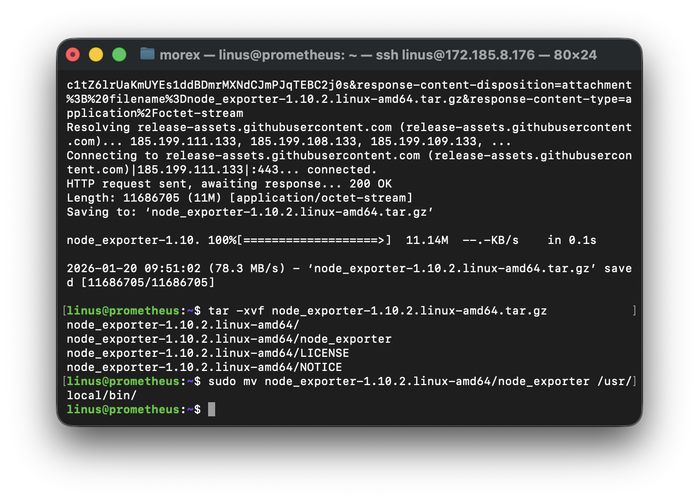
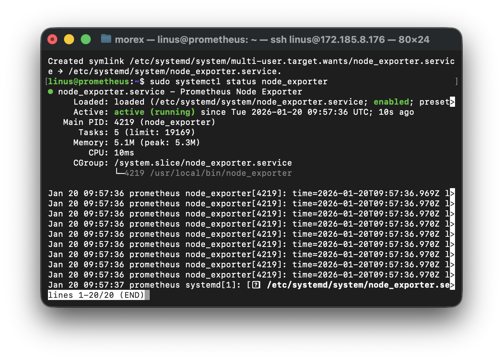
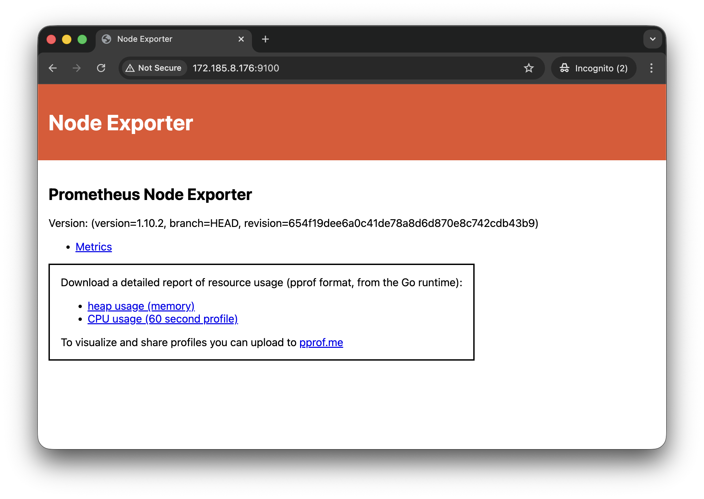
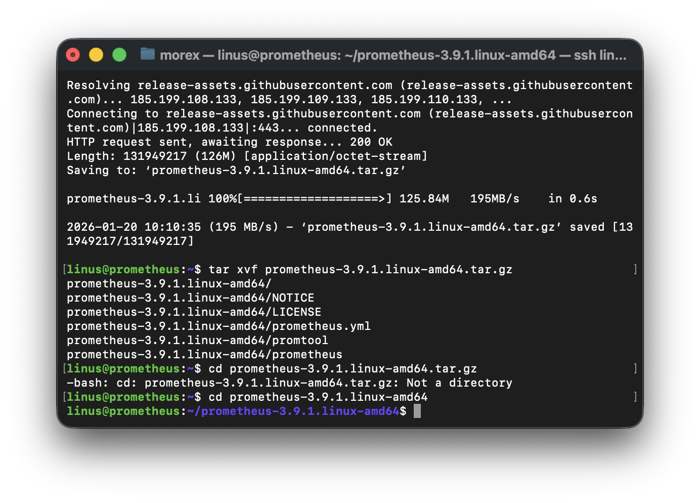
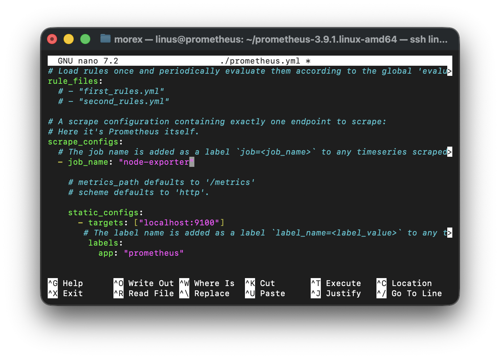
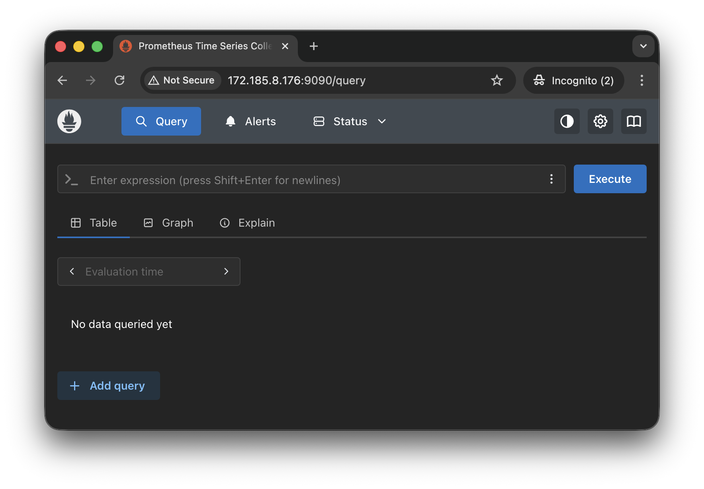
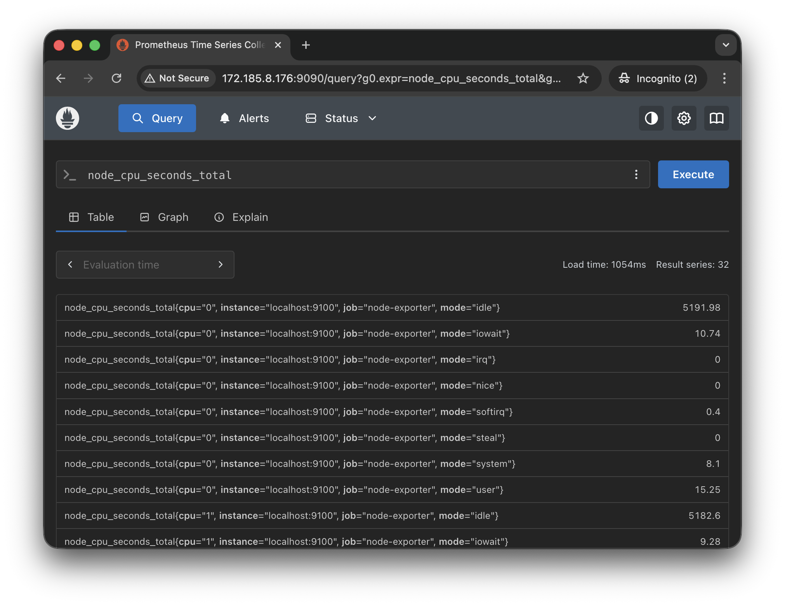
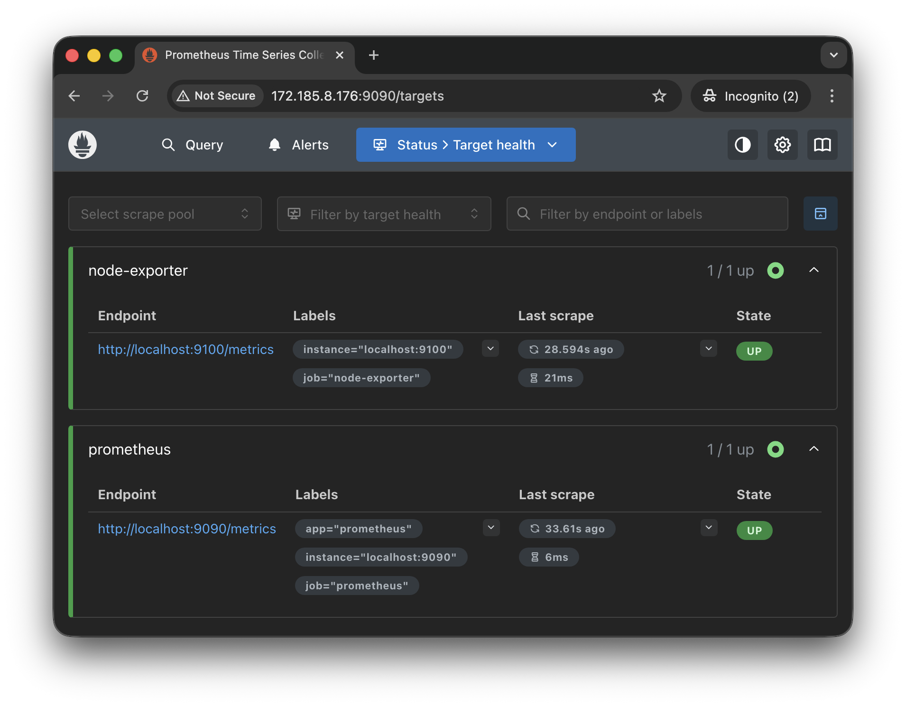
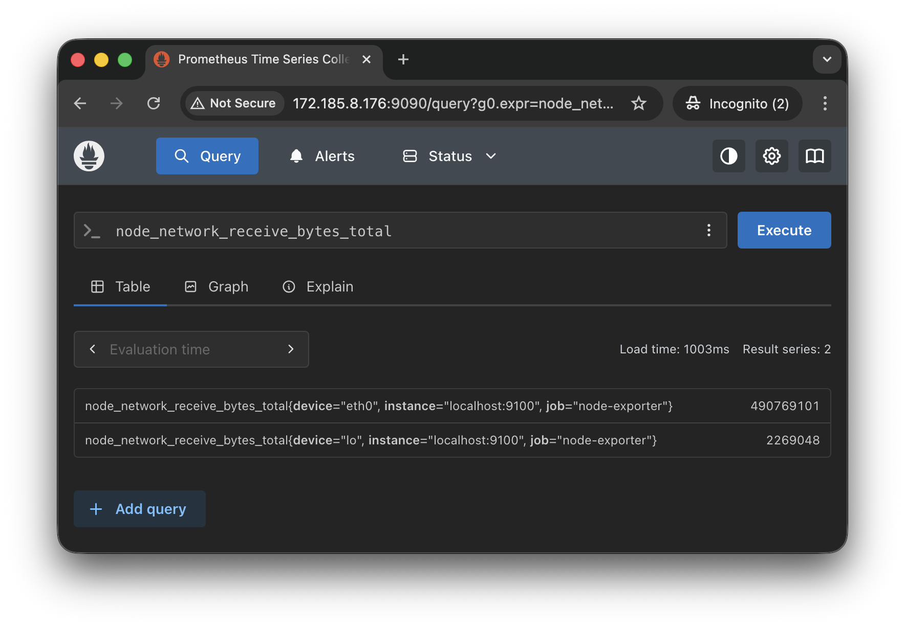
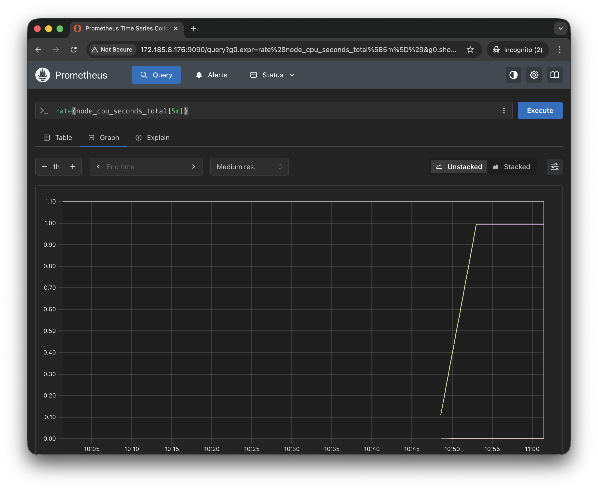

# Monitor Linux Server using Prometheus Node Exporter

### Introduction
Monitoring a Linux server is essential for ensuring system health and performance. Prometheus Node Exporter is a powerful tool that collects hardware and perating system metric, providing deep insights into your server's state per time. This project will guide you through installing and configuring Prometheus Node Exporter on a Linux server and monitoring it with Prometheus.

### Objectives

1. Install and configure Prometheus Node Exporter on a Linux server.
2. Integrate Node Exporter with Prometheus for metric collection.
3. Explore system metrics collected by Node Exporter.
4. Set up basic queries in Prometheus for real-time monitoring.
5. Optionally configure alerts for key metrics.

### Prerequisites

1. Linux Server: A running Linux server with 'sudo" privileges.
2. Prometheus Instance: A working Prometheus setup (local or remote).
3. Network Access: Ensure Prometheus can connect to the Linux server on port 9100.
4. Tools: Terminal access to the Linux server, Prometheus Ul access, and a text editor for authoring configuration files.

### Tasks Outline

1. Install Prometheus Node Exporter on the Linux server.
2. Start and enable Node Exporter as a service. |
3. Configure Prometheus to scrape metrics from Node Exporter.
4. Verify and query Node Exporter metrics in Prometheus.
5. Explore and analyze the collected metrics on the Prometheus Ul.

## Project Tasks

### Task 1 - Install Prometheus Node Exporter
1. Download the latest Node Exporter binary from the Prometheus GitHub releases page:
```bash
wget https://github.com/prometheus/node_exporter/releases/download/v1.10.2/node_exporter-1.10.2.linux-amd64.tar.gz
```
2. Extract the downloaded tarball:
```bash
tar -xvf node_exporter-1.10.2.linux-amd64.tar.gz
```
3. Move the binary to a directory in your PATH:
```bash
sudo mv node_exporter-1.10.2.linux-amd64/node_exporter /usr/local/bin/
```


### Task 2 - Start and Enable Node Exporter as a Service

1. Create a systemd service file for Node Exporter by running the command below:
```bash
sudo nano /etc/systemd/system/node_exporter.service
```
2. Add the following content to the file:
```ini
[Unit]
Description=Prometheus Node Exporter
After=network.target

[Service]
User=nobody
ExecStart=/usr/local/bin/node_exporter
Restart=always

[Install]
WantedBy=multi-user.target
```
3. Reload systemd and start the Node Exporter service using the following commands:
```bash
sudo systemctl daemon-reload 
sudo systemctl start node_exporter 
sudo systemctl enable node_exporter
```
4. Verify that Node Exporter is running with this command:
```bash
sudo systemctl status node_exporter
```


5. Confirm Node Exporter is accessible by visiting `http://<your-server-ip>:9100/metrics` in a web browser. If you are using your computer, `‹your-server-ip›` is `localhost`


### Task 3 - Configure Prometheus to Scrape Metrics from Node Exporter

1. Install prometheus
```bash
sudo apt update
sudo mkdir /etc/prometheus
sudo mkdir /var/lib/prometheus
wget https://github.com/prometheus/prometheus/releases/download/v3.9.1/prometheus-3.9.1.linux-amd64.tar.gz
tar xvf prometheus-3.9.1.linux-amd64.tar.gz
cd prometheus-3.9.1.linux-amd64
sudo mv prometheus.yml /etc/prometheus
sudo chown prometheus:prometheus /etc/prometheus
```


> For a comprehensive Prometheus installation guide, Check out this [resource](https://www.cherryservers.com/blog/install-prometheus-ubuntu)

2. Open the Prometheus configuration file (`prometheus.yml`):
```bash
sudo nano /etc/prometheus/prometheus.yml
```
3. Add a new scrape job for Node Exporter:
```yml
scrape_configs:
  - job_name: 'node-exporter'
    static_configs:
      - targets: ['172.185.8.176:9100']
```


4. Save the file and start Prometheus to apply the changes:
```bash
sudo systemctl start prometheus
```

5. Verify Prometheus is running


### Task 4 - Verify and Query Node Exporter Metrics in Prometheus

1. Access the Prometheus web interface (e.g., `http://<prometheus-server-ip>:9090`).
2. Run a test query to verify Node Exporter metrics:
    - Example: `node_cpu_seconds_total` to view CPU usage.
    

3. Check the "Targets" page in Prometheus to confirm the Node Exporter target is listed and "UP."



### Task 5 - Explore and Analyze Metrics
1. Use the Prometheus query interface to explore key Node Exporter metrics:
    - `node_memory_MemAvailable_bytes` for Available Memory.
    - `node_filesystem_avail_bytes` for Available Disk Space.
    - `node_network_receive_bytes_total`: Network Bytes Received.
    

2. Create basic time-series graphs using Prometheus expressions (PromQL):
Example: `rate(node_cpu_seconds_total[5m])` to analyze CPU usage over the last 5 minutes.
3. Optionally, set up alert rules for critical metrics like high CPU usage or low disk space.


## Conclusion
In this project, you installed and configured Prometheus Node Exporter on a Linux server, integrated it with Prometheus, and explored collected metrics. These skills provide a strong foundation for monitoring server health and performance, and you can now extend this setup by adding advanced visualization tool like Grafana.