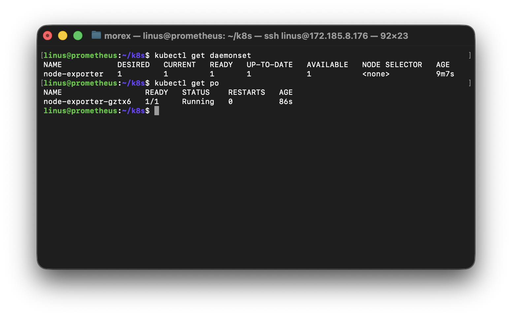
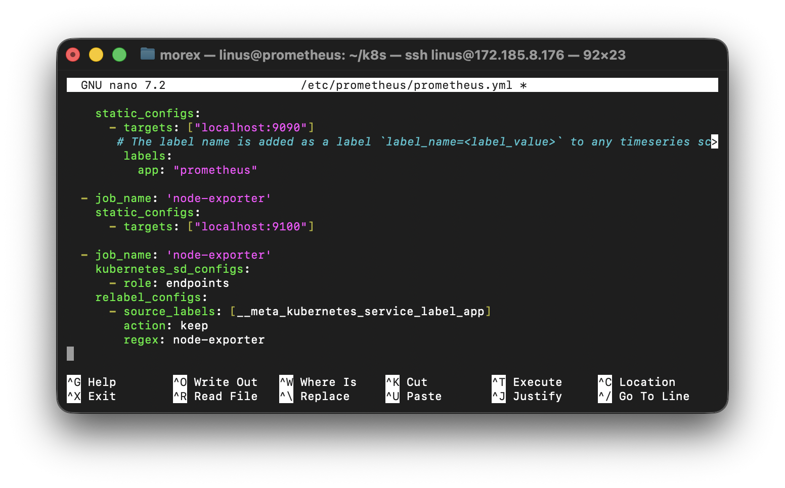
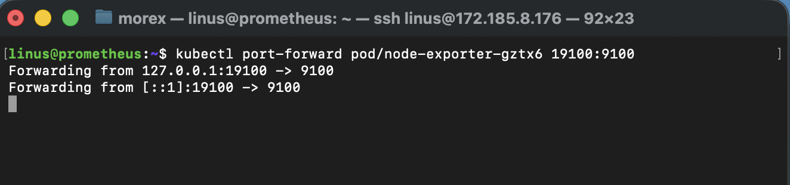
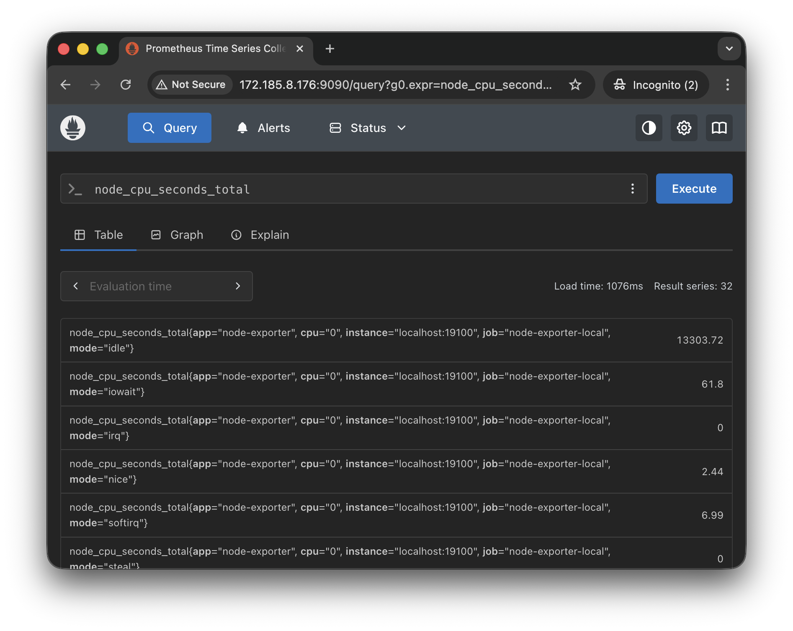
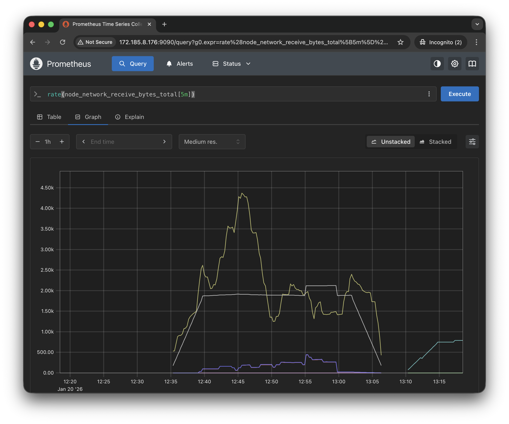

# Setup Prometheus Node Exporter on Kubernetes

### Introduction
Prometheus is a widely-used monitoring system that collects and processes metrics from various sources. The Node Exporter is a Prometheus exporter that collects hardware and operating system metrics from a system. By deploying Node Exporter on Kubernetes, you can monitor the nodes in your Kubernetes cluster and gain insights into their performance.

### Objectives
1. Understand the purpose of Prometheus Node Exporter.
2. Deploy Node Exporter as a DaemonSet in a Kubernetes cluster.
3. Configure Prometheus to scrape metrics from Node Exporter.
4. Visualize metrics using Prometheus UI.
5. Explore metrics available through Node Exporter.

### Prerequisites
1. **Kubernetes Cluster**: A working Kubernetes cluster (e.g., Minikube, Kind, or a managed kubernetes service like EKS or AKS or GKE).
2. **Kubernetes CLI**: 'kubectl' installed and configured for your cluster.
3. **Prometheus Setup**: Basic Prometheus installation running in the Kubernetes cluster.
4. **Tools**: A text editor to modify YAML files.

### Tasks Outline
1. Understand how Node Exporter works and its purpose.
2. Deploy Node Exporter as a Daemonset.
3. Configure Prometheus to scrape metrics from Node Exporter.
4. Verify the metrics in Prometheus.
5. Explore the metrics provided by Node Exporter.

## Project Tasks

### Task 1 - Understand How Node Exporter Works
1. Node Exporter is a lightweight application that runs on a node and exposes metrics about the node's hardware and operating system.
2. Key metrics include:
    - CPU and memory usage
    - Disk I/O
    - Network statistics
    - Filesystem usage
3. Node Exporter runs as a containerized application in Kubernetes to collect metrics from each node.

### Task 2 - Deploy Node Exporter as a DaemonSet
1. Create a YAML file for the Node Exporter Daemonset: `nano node-exporter-daemonset.yaml`

```yaml
apiVersion: apps/v1
kind: DaemonSet
metadata:
  name: node-exporter
  namespace: monitoring
spec:
  selector:
    matchLabels:
      app: node-exporter
  template:
    metadata:
      labels:
        app: node-exporter
    spec:
      containers:
        - name: node-exporter
          image: prom/node-exporter:latest
          ports:
            - containerPort: 9100
              name: metrics
          securityContext:
            runAsUser: 65534
            runAsGroup: 65534
            runAsNonRoot: true
            allowPrivilegeEscalation: false
          resources:
            limits:
              memory: "100Mi"
              cpu: "100m"
            requests:
              memory: "50Mi"
              cpu: "50m"
```

2. Apply the YAML file using `kubectl`:
```bash
kubectl apply -f node-exporter-daemonset.yaml
```
3. Verify the deployment:
```bash
kubectl get daemonset -n monitoring
```



### Task 3 - Configure Prometheus to Scrape Metrics from Node Exporter

1. Edit the Prometheus configuration to add a scrape job for Node Exporter:
```bash
sudo nano /etc/prometheus/prometheus.yml
```
```yaml
scrape_configs:
    # Scrape node-exporter via port-forward
  - job_name: "node-exporter-local"
    static_configs:
      - targets: ["localhost:19100"]
        labels:
          app: "node-exporter"

# Scrape all node-exporter pods in Kubernetes
  - job_name: 'node-exporter'
    kubernetes_sd_configs:
      - role: endpoints
    relabel_configs:
      - source_labels: [__meta_kubernetes_service_label_app]
        action: keep
        regex: node-exporter
```

2. Apply the updated Prometheus configuration.
3. Restart the Prometheus deployment to load the new configuration.
```bash
sudo systemctl daemon-reload
sudo systemctl restart prometheus
```

### Task 4 - Verify Metrics in Prometheus
1. Access the Prometheus Ul (e.g., by port-forwarding):
```bash
kubectl port-forward pod/node-exporter-55wbc 19100:9100
```


2. In the Prometheus Ul, run a query to view Node Exporter metrics:
    - Example: `node_cpu_seconds_total`
3. Ensure metrics are being collected for all cluster nodes.


### Task 5 - Explore Metrics Provided by Node Exporter
1. List and understand key metrics:
    - `node_memory_MemAvailable_bytes`: Available memory on the node.
    - `node_filesystem_avail_bytes`: Free space on filesystems.
    - `node_network_receive_bytes_total`: Total network bytes received.
2. Use Prometheus expressions to analyze data, e.g.:
`rate(node_network_receive_bytes_total[5m])`


3. Optionally, set up alerts for critical metrics in Prometheus.


## Conclusion
By completing this project, you've set up Prometheus Node Exporter on Kubernetes, enabling comprehensive monitoring of node-level metrics. You've also integrated Node Exporter with Prometheus, learned to query metrics, and explored the data it provides. This setup can now be extended with dashboards (e.g., Grafana) or alerts for advanced monitoring needs.