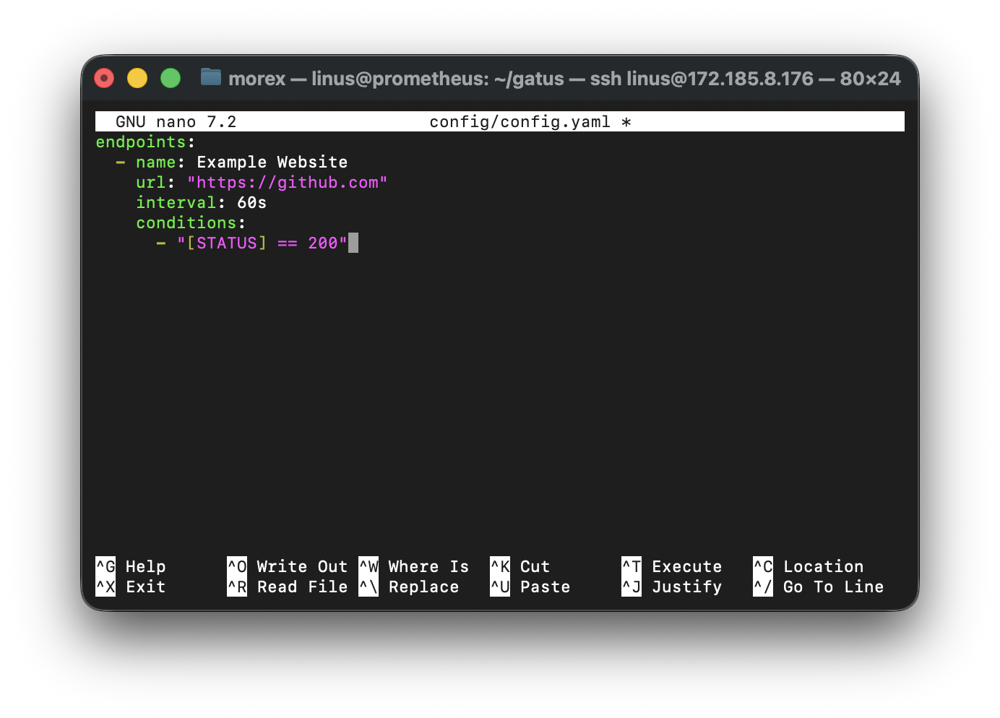
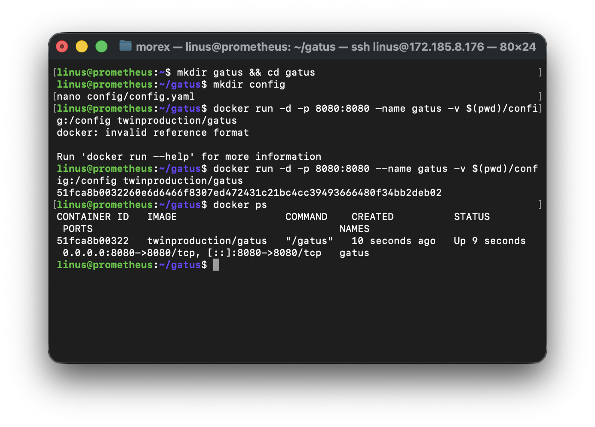
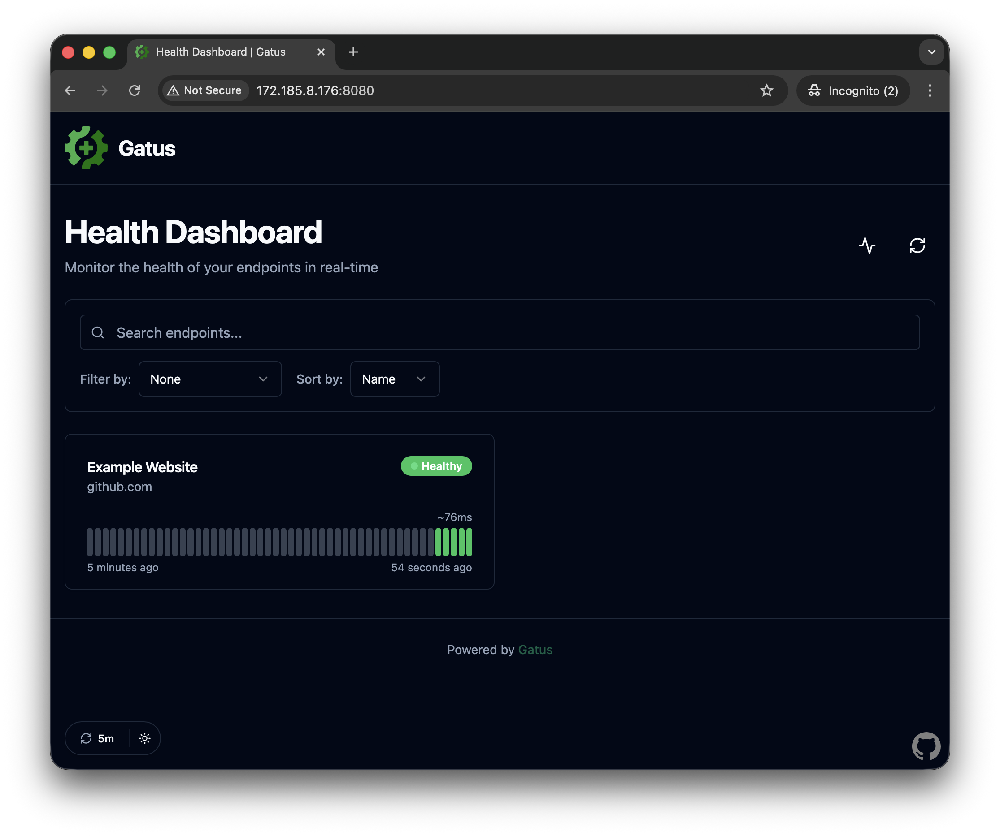
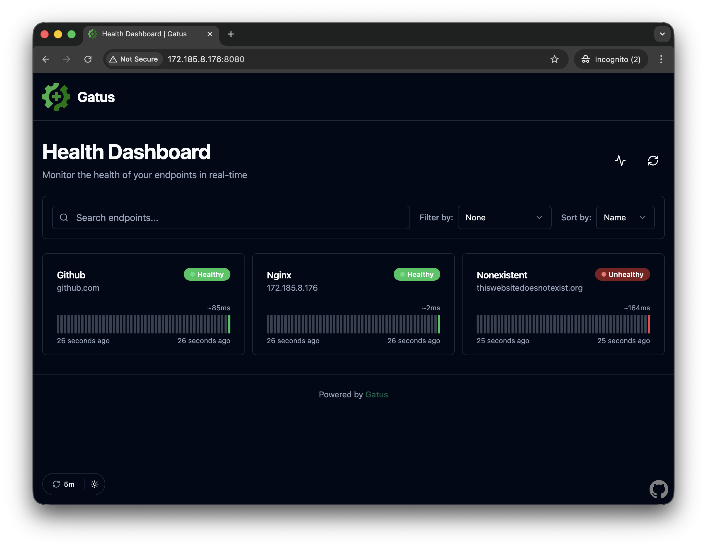
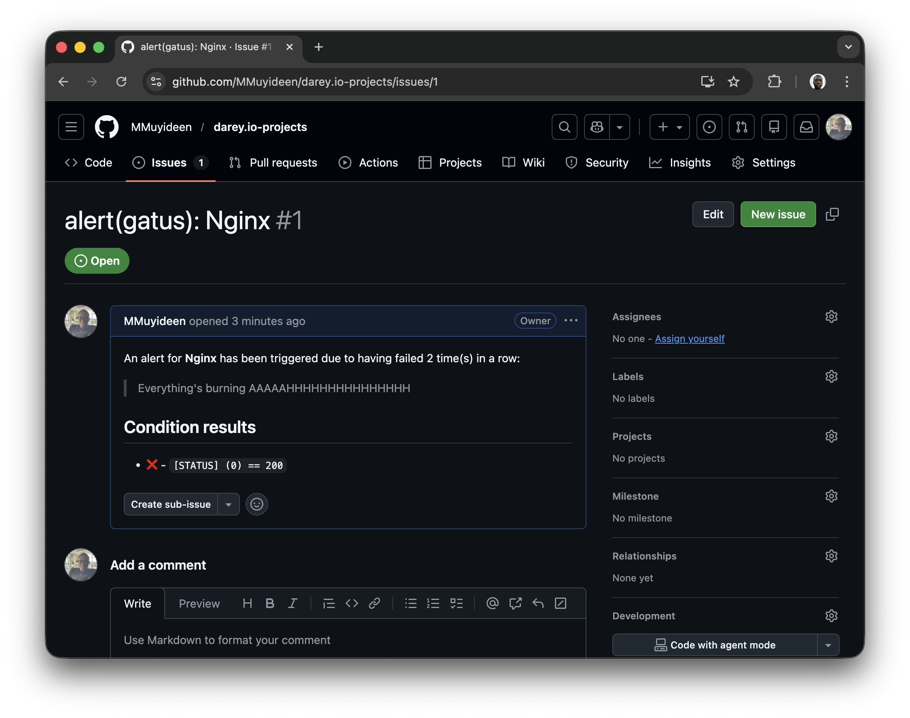
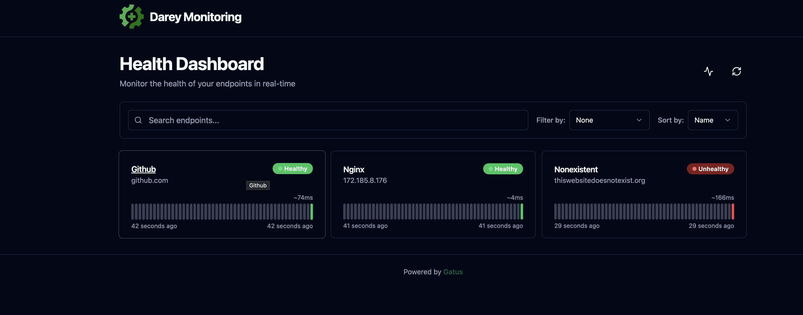

# Configuring Uptime Monitoring using Gatus

Ensuring that your services and websites are available and performing as expected is crucial for maintaining user satisfaction and trust. Gatus is a simple yet powerful tool for monitoring the uptime of services and websites. This project will guide you through setting up Gatus to monitor the availability of a website or API endpoint and receive alerts when it becomes unavailable.

### Objectives
1. Understand what Gatus is and its role in uptime monitoring.
2. Set up Gatus on your local machine or server.
3. Configure Gatus to monitor one or more endpoints.
4. Set up alerting for downtime events.
5. Visualize monitoring results through the Gatus dashboard.

### Prerequisites
1. Basic Knowledge: Familiarity with HTTP services, APIs, and configuration files (YAML).
2. Tools Required:
    - A machine with Docker installed (recommended for ease of setup).
    - A text editor for editing configuration files.
    - Internet access for testing live endpoints.

## Project Tasks

### Task 1 - Install and Set Up Gatus Locally
1. Install Docker if it's not already installed: 
    - [Follow the official Docker installation guide.](https://docs.docker.com/engine/install/ubuntu/)
2. Create a directory for Gatus configuration:
```bash
mkdir gatus && cd gatus
```

3. Create the config file
```bash
mkdir config
nano config/config.yaml
```
4. Add a single endpoint for a public website
```yaml
endpoints:
  - name: Example Website
    url: "https://github.com"
    interval: 60s
    conditions:
      - "[STATUS] == 200"
```



5. Start Gatus using Docker with a basic setup:
```bash
docker run -d -p 8080:8080 --name gatus -v $(pwd)/config:/config twinproduction/gatus
```

5. Access the Gatus dashboard in your browser at `http://localhost:8080`.



### Task 2 - Test the Setup with Live Endpoints

1. Run a sample nginx container on the server
```bash
docker run -d --name web -p 80:80 nginx
```
2. Add the endpoint to the `config. yaml` file for monitoring:
```yaml
- name: Nginx
  url: "http://172.185.8.176:80"
  interval: 60s
  con2ditions:
    - "[STATUS] == 200"
```

3. Simulate a failure by adding a non-existent endpoint and observe the behavior:
```yaml
- name: Nonexistent
  url: "https://thiswebsitedoesnotexist.com"
  interval: 60s
  conditions:
    - "[STATUS] == 200"
```

4. Restart Gatus and verify the new endpoint appears on the dashboard.
```bash
docker restart gatus
```


### Task 3 - Configure Alerts for Downtime
1. Choose an alerting method, such as Slack or email. For example, for Slack:
    - Create a Slack webhook URL in your workspace.

2. Add an alert configuration to `config-yaml`:
```yaml
endpoints:
  - name: Github
    url: "https://github.com"
    interval: 60s
    conditions:
      - "[STATUS] == 200"

  - name: Nginx
    url: "http://172.185.8.176:80"
    interval: 60s
    conditions:
      - "[STATUS] == 200"
    alerts:
      - type: github
        failure-threshold: 2
        success-threshold: 3
        send-on-resolved: true
        description: "Everything's burning AAAAAHHHHHHHHHHHHHHH"

  - name: Nonexistent
    url: "https://thiswebsitedoesnotexist.org"
    interval: 60s
    conditions:
      - "[STATUS] == 200"

alerting:
  github:
    repository-url: "https://github.com/MMuyideen/darey.io-projects"
    token: "${GITHUB_TOKEN}"

```
3. Test the alerting by taking down stopping the nginx container

> Since We are using Github fas the alerting service, it creates a new issue in the specified repository. Yopu can find more information [here](https://github.com/TwiN/gatus?tab=readme-ov-file#configuring-github-alerts) as well as [other alerting service](https://github.com/TwiN/gatus?tab=readme-ov-file#alerting).



### Task 5 - Explore and Customize the Gatus Dashboard
1. Access the Gatus dashboard to view uptime statistics for each endpoint.
2. Customize the dashboard appearance (e.g., themes, logos) by modifying the configuration file.
3. Adjust monitoring intervals and conditions to optimize performance.

```yaml
ui:
  title: "Infrastructure Status"
  header: "Darey Monitoring"
  theme: dark
```


## Conclusion
In this project, you learned how to set up and configure Gatus for monitoring uptime and performance of services and websites. You explored essential features like endpoint monitoring, alerting, and dashboard visualization. With this knowledge, you can expand your configuration to monitor multiple services, integrate
with advanced alerting tools, and deploy Gatus in production environments.
